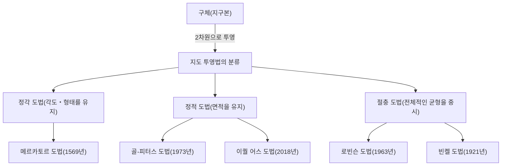

우리가 일상적으로 접하는 '세계 지도'. 스마트폰 화면에 표시되는 디지털 지도부터 교실 벽에 붙어 있는 커다란 포스터까지, 지도는 우리 생활에 깊이 뿌리내리고 있습니다. 하지만 평면에 그려진 세계 지도가 사실은 '정확한 지구의 모습'이 아니라는 사실에 대해 깊이 생각해 본 적이 있으신가요?

지구는 3차원의 구체에 가까운 형태(엄밀히 말하면 회전타원체)를 하고 있지만, 우리가 사용하는 지도 대부분은 2차원 평면입니다. 이 '3차원의 표면을 2차원으로 펼치는' 행위에는 피할 수 없는 중대한 수학적 역설이 존재합니다. 본 기사에서는 대항해 시대를 이끈 메르카토르 도법부터 정치적 파문을 일으킨 피터스 도법, 그리고 현대의 이퀄 어스 도법에 이르기까지, 인류가 지구라는 거대한 공간을 어떻게 이해하고 평면 위에 어떻게 표현해왔는지, 그 알려지지 않은 역사와 갈등을 풀어보겠습니다.

## 1. 구체를 평면에 그리는 것의 수학적 딜레마

지도 투영법의 역사를 논할 때 먼저 이해해야 할 것은 '[카를 프리드리히 가우스](/ko/p/gauss/)'가 증명한 수학적 대전제입니다. 19세기의 위대한 수학자 가우스는 '경이로운 정리([Theorema Egregium](/ko/p/theorema-egregium/))'라고 불리는 미분기하학의 정리를 도출해 냈습니다. 이 정리에 따르면 곡면에서의 가우스 곡률은 그 곡면을 구부려도 변하지 않는 성질을 가지고 있습니다.

지구와 같은 구면의 가우스 곡률은 양수이지만, 평면의 가우스 곡률은 0입니다. 따라서 가우스 곡률이 다른 면끼리 늘어나거나 줄어들거나 찢어짐 없이 매핑하는 것은 수학적으로 불가능합니다. 귤껍질을 벗겨서 하나의 평평한 직사각형으로 빈틈없이 늘릴 수 없는 것과 같은 원리입니다.

이 수학적 딜레마로 인해, 어떤 세계 지도라 할지라도 다음 4가지 요소를 동시에 모두 정확하게 유지할 수는 없습니다.

1. **면적** (정적성): 실제 육지나 바다의 면적 비율이 유지되고 있는가
2. **각도・형태** (정각성): 실제 지형의 윤곽이나 교차하는 선의 각도가 유지되고 있는가
3. **거리** (정거성): 특정 지점으로부터의 거리 비율이 유지되고 있는가
4. **방위** (정방위성): 특정 지점으로부터의 방위가 바르게 유지되고 있는가

이 모든 것을 충족하는 것은 '지구본'밖에 없습니다. 평면 지도를 제작할 때 지도 제작자는 목적을 위해 무언가를 희생하고 무언가를 우선시하는 '타협'을 강요받습니다. 이 선택이야말로 지도 투영법의 역사 그 자체라고 할 수 있습니다.

## 2. 대항해 시대를 지탱한 혁신: 메르카토르 도법

현대의 우리에게 가장 친숙한 세계 지도라면 단연 '메르카토르 도법'일 것입니다. 1569년 플랑드르(현재의 벨기에)의 지리학자 게라르두스 메르카토르가 발표한 이 지도는 인류의 역사를 크게 바꾼 획기적인 발명품이었습니다.

당시 유럽은 미지의 대륙과 해양으로 나아가는 '대항해 시대'의 한가운데 있었습니다. 하지만 넓은 바다 위에서는 이정표가 될 만한 것이 없었고, 선원들은 항상 조난의 위험과 이웃하고 있었습니다. 그들이 원했던 것은 '목적지에 확실하게 도달할 수 있는 해도'였습니다.

메르카토르 도법의 가장 큰 특징은 '정각성'입니다. 경선과 위선이 항상 직각으로 교차하며, 임의의 두 지점을 연결한 직선(항정선)이 실제 나침반이 가리키는 방향과 일치합니다. 즉, 선원은 출발지와 목적지를 지도상에서 직선으로 연결하고, 그 선과 경선이 이루는 각도(방위)를 측정하여 나침반을 그 각도로 유지하며 나아가기만 하면 확실하게 목적지에 도착할 수 있었던 것입니다.

이 기능적이고 획기적인 지도는 항해사들에게 그야말로 마법의 도구였습니다. 하지만 이 편리함 이면에는 거대한 희생이 있었습니다. 바로 '면적의 극단적인 왜곡'입니다.
메르카토르 도법에서는 고위도로 갈수록 동서와 남북 모두 확대되기 때문에, 극지방에 가까워질수록 실제 면적보다 훨씬 더 거대하게 그려지게 됩니다.

예를 들어, 메르카토르 도법에서 보면 그린란드는 아프리카 대륙과 비슷하거나 그 이상으로 커 보입니다. 하지만 실제 면적을 비교해 보면 아프리카 대륙은 그린란드의 약 14배 크기에 달합니다. 마찬가지로 러시아나 캐나다와 같은 고위도 국가들은 실제 면적 이상으로 광활한 영역으로 강조되어 버립니다.

메르카토르 자신은 이 지도가 어디까지나 '항해용'임을 의도했습니다. 하지만 그 직선적이고 깔끔한 외관의 아름다움 때문에 항해용 이외의 일반 대중을 위한 지도나 학교 교육에도 널리 채택되었고, 결과적으로 수 세기에 걸쳐 사람들의 '세계에 대한 공간 인지'를 왜곡하게 되었습니다.

## 3. 정치와 이데올로기의 투영: 피터스 도법 논쟁

20세기에 들어서면서 메르카토르 도법이 계속해서 일반적으로 사용되는 것에 대한 비판이 고조되기 시작했습니다. 그 배경에는 단순한 지리적 정확성 추구뿐만 아니라 정치적, 사회적 이데올로기가 깊이 얽혀 있었습니다.

1973년 독일의 역사가 아르노 피터스는 "메르카토르 도법은 유럽을 중심으로 한 선진국(북반구 고위도에 위치)을 부당하게 크게 그리고, 개발도상국이 많은 적도 부근(아프리카나 남미, 동남아시아 등)을 작게 보이게 한다. 이는 식민주의적인 백인 우월주의의 표상이다"라고 통렬하게 비판했습니다.

그리고 그가 '보다 평등하고 올바른 세계 지도'라며 대대적으로 발표한 것이 '피터스 도법(정식으로는 골-피터스 도법)'입니다. 이 지도는 '정적 도법', 즉 전 세계 모든 지역에서 실제 면적 비율을 정확하게 반영하는 데 특화되어 있었습니다.

피터스 도법을 보면 우리가 친숙하게 느끼는 세계와는 크게 다른 모습이 떠오릅니다. 유럽은 매우 작게 그려진 반면, 아프리카 대륙이나 남아메리카 대륙은 세로로 길게 뻗어 그 거대함이 두드러집니다. 이는 제3세계 국가들이 자국의 존재감을 정당하게 어필할 수 있는 강력한 시각적 무기가 되었습니다. 유네스코(유엔교육과학문화기구)나 많은 국제 NGO들이 공평성의 관점에서 이 지도를 지지하고 채택했습니다.

하지만 지도학 전문가들로부터는 강한 반발이 일어났습니다. 면적을 정확하게 하기 위해 피터스 도법에서는 대륙의 '형태(윤곽)'가 극단적으로 왜곡되어 버렸기 때문입니다. 적도 부근의 국가들은 세로로 늘어난 것처럼 보이고, 고위도 지역은 가로로 찌그러진 것처럼 보입니다. "형태가 부자연스러워 실용적이지 못하다", "피터스의 주장은 정치적인 프로파간다에 불과하다"와 같은 격렬한 논쟁이 벌어졌습니다.

이 '피터스 도법 논쟁'은 지도가 단순한 지리 정보의 표현에 그치지 않고, 그것을 보는 사람들의 세계관이나 역학 관계, 정치적 이데올로기를 형성하는 미디어라는 점을 부각시킨 역사적 사건이었습니다.

## 4. 아름다움과 실용성의 타협점을 찾다: 절충 도법

메르카토르 도법의 '면적의 거짓'과 피터스 도법의 '형태의 왜곡'. 두 도법 모두 극단적인 요소를 가지고 있었기 때문에, 지도학자들은 "면적도 형태도 완벽하지는 않지만, 보기에 가장 자연스럽고 균형 잡힌 지도"를 모색하기 시작했습니다. 이것이 '절충 도법'의 탄생입니다.

절충 도법의 대표주자가 1963년 미국의 지리학자 아서 H. 로빈슨이 발표한 '로빈슨 도법'입니다. 로빈슨은 수학적 공식에서 지도를 도출해 내는 것이 아니라, '인간의 눈에 어떻게 보이는가'라는 시각적이고 예술적인 직관을 출발점으로 삼았습니다. 그는 여러 차례 시뮬레이션을 거듭하며, 육지의 형태가 극단적으로 왜곡되지 않고 면적 비율도 크게 어긋나지 않는 타협점을 수작업으로 찾아냈고, 나중에 그것을 수학적 좌표로 옮겼습니다.

로빈슨 도법은 전체적으로 둥글스름한 아름다운 타원형을 띠고 있어 우리 눈에 매우 자연스럽게 보입니다. 1988년 유명한 내셔널 지오그래픽 협회가 공식 세계 지도로 로빈슨 도법을 채택하면서 세계적인 표준 중 하나가 되었습니다.

또한 이후 내셔널 지오그래픽 협회는 1998년에 '빈켈 도법(빈켈-트리펠 도법)'으로 전환했습니다. 오스발트 빈켈이 고안한 이 도법은 면적, 각도, 거리의 세 가지 왜곡을 최소화하는(트리펠은 독일어로 '3'을 의미함) 접근 방식을 취하고 있어 로빈슨 도법보다 왜곡이 더 적고 균형이 잡혀 있다는 평가를 받고 있습니다. 현재 많은 교과서나 일반적인 세계 지도에서는 이 빈켈 도법이나 로빈슨 도법과 유사한 절충 도법이 주류를 이루고 있습니다.

## 5. 현대의 도전과 새로운 표현: 오사그래프와 이퀄 어스 도법

21세기에 들어서도 지도 투영법의 진화는 멈추지 않습니다. 지구 환경 문제나 세계화가 진행되는 현대에 우리는 새로운 시각으로 지구를 다시 파악해야 할 필요성에 직면해 있습니다.

그 하나의 시도가 일본인 건축가 나루카와 하지메 등이 고안한 '오사그래프 세계 지도'입니다. 이 지도는 지구의 표면을 96등분하여 정사면체에 투영한 뒤, 그것을 전개하여 직사각형의 평면도로 만드는 독창적인 기법을 사용하고 있습니다. 가장 큰 장점은 면적 비율을 유지하면서 어느 부분을 중심으로 하든 지도를 무한히 나란히 연결할 수 있다는 점입니다. 해로나 항로의 네트워크, 기후 변화의 영향 등 중심이 없는 글로벌한 시각으로 세계를 조망하는 데 적합하여, 2016년에는 굿 디자인 대상을 수상하기도 했습니다.

그리고 최근 가장 주목받고 있는 새로운 투영법이 2018년 보얀 사브리치(Bojan Šavrič), 톰 패터슨(Tom Patterson), 베른하르트 제니(Bernhard Jenny) 3명의 지도 제작자가 발표한 '이퀄 어스 도법'입니다.

이퀄 어스 도법은 피터스 도법이 안고 있던 '형태의 극단적인 부자연스러움'을 극복하기 위해 개발된 새로운 '정적 도법(면적이 정확한 지도)'입니다. 그들은 로빈슨 도법처럼 눈에 편안하고 둥근 외관을 유지하면서 동시에 각 대륙이나 국가의 면적 비율이 완벽하게 정확한 지도를 목표로 했습니다.

개발의 동기 중 하나는 기후 변화나 환경 문제의 데이터를 시각화할 때 면적이 정확하지 않으면 오해를 불러일으킬 수 있다는 강한 위기감이었습니다. 예를 들어, 산림 벌채나 해수면 상승의 영향을 보여줄 때 메르카토르 도법에서는 고위도 지방의 영향이 과대평가되어 버립니다. 이퀄 어스 도법은 컴퓨터 기술의 발전으로 고도의 계산이 가능해진 현대이기에 실현할 수 있었던, 아름다움과 과학적 정확성을 겸비한 혁신적인 디자인입니다. 현재 NASA(미국항공우주국)나 GISS(고다드 우주 비행 센터)의 기후 데이터 지도 등에도 채택이 확대되고 있습니다.

## 맺음말: 지도는 세계관 그 자체이다

메르카토르 도법에서 이퀄 어스 도법까지 지도 투영법의 역사를 되돌아보면, 그 속에는 단순한 측량 기술이나 수학의 발전뿐만 아니라 각 시대 사람들의 '지구를 어떻게 보고 싶은가, 어떻게 사용해야 하는가'라는 강한 의지가 반영되어 있음을 알 수 있습니다.

항해사들의 목숨을 구하고 세계적인 교역을 가능하게 한 정각성.
남북 문제와 불평등에 파문을 던지고 다양한 시각을 가져다준 정적성.
그리고 전체의 조화를 추구하며 복잡한 현대 사회의 문제 해결에 기여하는 새로운 표현.

우리가 바라보는 세계 지도는 결코 절대적인 '진실의 모습'이 아닙니다. 그것은 인간이 무한한 확장을 가진 3차원의 지구를 자신들의 목적이나 가치관에 맞게 2차원으로 번역한 '해석' 중 하나인 것입니다. 다음에 세계 지도를 바라볼 때는 그 한 장의 종이(혹은 화면)에 담긴 수백 년에 걸친 지도 제작자들의 시행착오와 갈등의 역사에 꼭 마음을 기울여 보시기 바랍니다. 우리가 세계를 어떻게 파악하는지는 어떤 지도를 선택하느냐에 따라 형성되는 것입니다.
