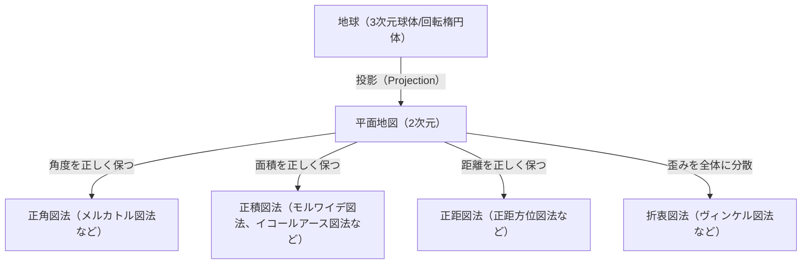
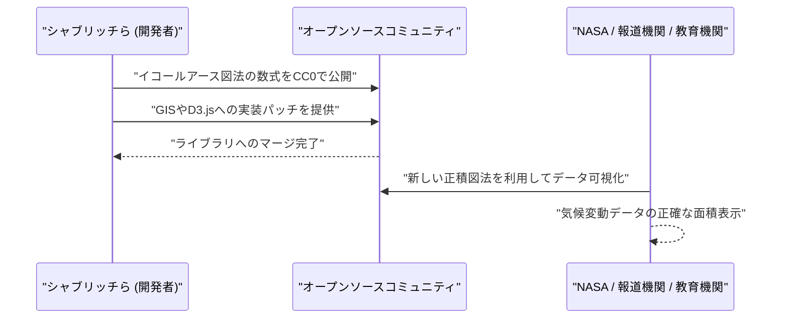

# 序論：球体を平面に描くという究極のパラドックス

人類は古来より、自分たちが住む世界を理解し、記録するために地図を描いてきました。しかし、そこには常に一つの巨大なパラドックスが存在しました。「3次元の球体（地球）を、歪みなく2次元の平面（地図）に展開することは数学的に不可能である」という事実です。これは、カール・フリードリヒ・ガウスが「驚異の定理（Theorema Egregium）」で証明したように、曲率の異なる曲面同士を等長に写像することはできないという数学的真理に基づいています。

みかんの皮を平らに広げようとすると必ず裂けたりシワが寄ったりするように、地球を平面の地図にする際にも必ず何らかの「歪み」が生じます。地図投影法（Map Projection）の歴史とは、この避けられない「歪み」と人類がどう向き合い、どの要素（面積、角度、距離、方位）を犠牲にして、どの要素を守るかという、妥協と選択の歴史に他なりません。

本記事では、16世紀のメルカトル図法の誕生から、21世紀の最新のイコールアース図法に至るまでの地図投影法の進化を、数学的・歴史的・社会的背景を交えながら深く掘り下げていきます。



## 第1章：大航海時代とメルカトル図法の誕生

### 1.1 航海者たちの苦悩

15世紀末から16世紀にかけての大航海時代、ヨーロッパの航海者たちは未知の海へと漕ぎ出しました。コロンブスのアメリカ到達、マゼランの地球一周など、世界が劇的に拡大していく中で、正確な海図の需要は爆発的に高まりました。

当時の海図は、ポルトラノ海図と呼ばれる、中心から放射状に引かれた方位線（羅針線）を頼りに進むものでした。しかし、長距離の航海、特に大洋を横断する航海において、地球が球体であることによる誤差が無視できなくなってきました。航海者たちは、「コンパスの指し示す一定の方位（等角航路）を直進すれば、目的地に到達できる地図」を強く求めていました。

### 1.2 ゲラルドゥス・メルカトルの革新

1569年、フランドル（現在のベルギー）の地理学者ゲラルドゥス・メルカトル（Gerardus Mercator）は、この航海者たちの切実な願いに応える画期的な世界地図を発表しました。それが「メルカトル図法」です。

メルカトル図法の最大の特徴は、「任意の2点間を結ぶ直線が、常に一定のコンパス方位を示す（等角航路が直線で表される）」という点です。これにより、航海者は地図上に定規を当てて直線を引くだけで、目的地までの羅針盤の方位を知ることができました。

### 1.3 メルカトル図法の数学的裏付け

メルカトル図法は、円筒投影法の一種と見なすことができます。地球の赤道に円筒を巻き付け、地球の中心から光源を当てて円筒の内側に地図を投影するイメージです。しかし、メルカトルは単純な投影ではなく、数学的な計算によって緯線の間隔を調整しました。

経度を $\lambda$、緯度を $\phi$ とし、地図上の座標を $(x, y)$ とすると、メルカトル図法の投影式は以下のようになります（地球を真球とし、半径を $R$ とする）。

$$ x = R(\lambda - \lambda_0) $$
$$ y = R \ln \left( \tan\left(\frac{\pi}{4} + \frac{\phi}{2}\right) \right) $$

ここで、$\lambda_0$ は基準となる中央経線です。この式が示す通り、高緯度になればなるほど $y$ の値は急激に大きくなり、極（$\phi = \pm \pi/2$）では無限大（$\infty$）に発散します。

以下は、Pythonを使用してメルカトル図法の座標変換を行う簡単なコードスニペットです。

```python
import math

def latlon_to_mercator(lat, lon, R=6378137.0):
    """
    緯度経度からメルカトル図法のXY座標（メートル）に変換する関数
    EPSG:3857 (Web Mercator) の計算に相当
    """
    # 緯度経度をラジアンに変換
    lat_rad = math.radians(lat)
    lon_rad = math.radians(lon)
    
    # X座標の計算
    x = R * lon_rad
    
    # Y座標の計算（グーデルマン関数の逆関数）
    y = R * math.log(math.tan(math.pi / 4.0 + lat_rad / 2.0))
    
    return x, y

# 例：東京（緯度35.6812, 経度139.7671）の計算
x, y = latlon_to_mercator(35.6812, 139.7671)
print(f"Tokyo (Mercator): X={x:.2f}, Y={y:.2f}")
```

### 1.4 メルカトル図法の光と影

メルカトル図法は「正角性（角度が正しく保たれる）」を持つため、局所的な形状は現実と一致します。しかし、代償として「面積」が極端に歪むという致命的な欠点を抱えています。高緯度地方ほど拡大されるため、グリーンランドはアフリカ大陸とほぼ同じ大きさに描かれますが、実際にはアフリカ大陸はグリーンランドの約14倍の面積があります。

この面積の歪みは、後に政治的・社会的な問題を引き起こすことになります。ヨーロッパや北米などの北半球高緯度地域が過大に表現される一方で、赤道付近の開発途上国が小さく描かれるため、「欧米中心主義的な世界観を植え付ける」という批判を浴びることになるのです。

## 第2章：面積の正確さを求めて：正積図法の系譜

メルカトル図法の面積の歪みに対する批判から、面積比が正しく保たれる「正積図法」が数多く考案されました。

### 2.1 サンソン図法とモルワイデ図法

17世紀には、フランスのニコラ・サンソンらが用いた「サンソン図法（Sanson-Flamsteed projection）」が普及しました。これは緯線が等間隔の平行線で、経線が正弦曲線（サインカーブ）で描かれる正積図法です。中央経線付近の歪みは少ないものの、周辺部（特に高緯度地方）での形状の歪みが激しいという欠点がありました。

これを改良したのが、1805年にドイツの数学者カール・モルワイデが発表した「モルワイデ図法（Mollweide projection）」です。モルワイデ図法は、地球全体を一つの楕円形に収め、高緯度地方の形状の歪みをサンソン図法よりも和らげました。

### 2.2 グードのホモロサイン図法（断裂図法）

20世紀に入ると、さらに形状の歪みを減らしつつ正積性を保つ試みが行われました。1923年、アメリカの地理学者ジョン・ポール・グードは「グード図法（ホモロサイン図法）」を発表しました。

これは、低緯度地域にサンソン図法を、高緯度地域にモルワイデ図法を繋ぎ合わせ、さらに海洋部分（または大陸部分）を裂いて表現する「断裂図法」という奇抜なアプローチをとりました。これにより、各大陸の形状の歪みを最小限に抑えつつ、正しい面積比で世界を俯瞰することができるようになりました。しかし、海が切り裂かれているため、連続的な地球の姿を直感的に把握しづらいという難点がありました。

## 第3章：冷戦とピーターズ図法の論争

地図投影法が単なる数学や地理学の問題にとどまらず、イデオロギーの対立を巻き込んだ大論争に発展したのが、1970年代の「ピーターズ図法（Peters projection）」を巡る騒動です。

### 3.1 ガルの正積円筒図法とアルノ・ピーターズの主張

1973年、ドイツの歴史家アルノ・ピーターズは、「メルカトル図法はヨーロッパ中心主義の傲慢な地図であり、第三世界を意図的に小さく見せている」と激しく批判し、独自の「ピーターズ図法」を発表しました。彼はこれを「すべての人々を平等に描く、真に公平で新しい世界地図」として大々的にプロモーションしました。

ピーターズ図法は正積図法であり、メルカトル図法のように高緯度地方が極端に拡大されることはありませんでした。そのため、国連機関や多くのNGO、宗教団体などがこの地図を支持し、啓蒙ポスターとして広く採用しました。

### 3.2 地図学界からの猛反発

しかし、このピーターズの発表に対し、プロの地図学者たちは激しく反発しました。その理由は以下の通りです。

1. **盗作の疑惑**: ピーターズ図法は数学的には、1855年にイギリスのジェームズ・ガルが発表した「ガル正積円筒図法」と全く同じものでした。地図学界では既知の図法であり、ピーターズのオリジナルではありませんでした。
2. **形状の激しい歪み**: 正積性を保つために円筒図法を用いた結果、低緯度地域（アフリカや南米）は縦に極端に引き伸ばされ、高緯度地域（ヨーロッパやカナダ）は横に押しつぶされたような、非常に不格好な形状になっていました。
3. **プロパガンダとしての利用**: 地図学者たちは、ピーターズが地図投影法の数学的トレードオフ（面積を保てば形状が歪む）を無視し、メルカトル図法を不当に悪者扱いすることで、イデオロギー的なプロパガンダを行っていると非難しました。

この論争は、地図が単なる客観的な現実の模写ではなく、それを見る人々の世界観や政治意識に強い影響を与えるメディアであることを、世界中に再認識させる結果となりました。

## 第4章：妥協の芸術：折衷図法の隆盛

面積も形状も、どちらか一方を完璧に保とうとすれば、もう一方が極端に犠牲になります。そこで、厳密な正積性や正角性を捨て、「見た目の自然さ」や「全体の歪みの少なさ」を追求する「折衷図法（Compromise projection）」が、20世紀後半の一般用世界地図の主流となっていきました。

### 4.1 ロビンソン図法

1963年、アメリカの地図学者アーサー・H・ロビンソンによって考案された「ロビンソン図法（Robinson projection）」は、数学的な公式から出発するのではなく、「見た目が美しいこと」を最優先して、緯線の長さと間隔を経験的に決定するというユニークなアプローチをとりました。

この図法は、ナショナル・ジオグラフィック協会が1988年に公式の世界地図として採用したことで、世界中で広く認知されるようになりました。

### 4.2 ヴィンケル第3図法

その後、ナショナル・ジオグラフィック協会は1998年に、ロビンソン図法に代わって「ヴィンケル第3図法（Winkel Tripel projection）」を採用しました。1921年にドイツのオズヴァルト・ヴィンケルが考案したこの図法は、エイトフ図法と正距円筒図法を算術平均したものです。「Tripel」とはドイツ語で「3つ」を意味し、面積、角度、距離の3つの歪みを最小化しようとしたことを示しています。現在でも、多くの学習帳やアトラスで標準的な世界地図として使用されています。

## 第5章：デジタル時代の新たな挑戦：イコールアース図法の誕生

21世紀に入り、私たちの地図との関わり方は劇的に変化しました。Google MapsをはじめとするWeb地図サービスの普及です。これらのWeb地図では、ズーム操作をスムーズに行うために、皮肉なことに再び「メルカトル図法（Webメルカトル）」が採用されています（近年はズームアウトすると3Dの地球儀モデルに切り替わるよう改善されています）。

しかし、気候変動や世界的な格差問題など、地球規模の課題を議論する場において、「正確な面積比」で世界を可視化する重要性は依然として高く、新しい正積図法が求められていました。

### 5.1 ボヤン・シャブリッチらの挑戦

2018年、ボヤン・シャブリッチ（Bojan Šavrič）、トム・パターソン（Tom Patterson）、ベルンハルト・ジェニー（Bernhard Jenny）の3人の地図学者によって、全く新しい正積図法である「イコールアース図法（Equal Earth projection）」が発表されました。

彼らの目標は明確でした。
「ピーターズ図法のような形状の激しい歪みがなく、ロビンソン図法のように見た目が自然で美しく、かつ厳密な正積性を持つ世界地図を作ること」です。

### 5.2 イコールアース図法の数学的革新

イコールアース図法は、ロビンソン図法の外形に酷似していますが、高度な多項式を用いて厳密な正積性を実現しています。その投影式は以下の通りです。

緯度を $\phi$、経度を $\lambda$（中央経線からの差）とし、$ \theta $ を $ \sin \theta = \frac{\sqrt{3}}{2} \sin \phi $ を満たす角とします。

$$ x = \frac{2\sqrt{3} \lambda \cos \theta}{3 (9 A_4 \theta^8 + 7 A_3 \theta^6 + 3 A_2 \theta^2 + A_1)} $$
$$ y = A_4 \theta^9 + A_3 \theta^7 + A_2 \theta^3 + A_1 \theta $$

ここで、係数は以下の通りです。
$ A_1 = 1.340264 $
$ A_2 = -0.081106 $
$ A_3 = 0.000893 $
$ A_4 = 0.003796 $

この複雑な数式により、イコールアース図法は、赤道付近が引き伸ばされることも、高緯度が極端に押しつぶされることもなく、大陸の形状を自然に保ったまま正しい面積比を表現することに成功しました。

### 5.3 オープンソースとしての普及

イコールアース図法が画期的だったのは、その設計だけでなく、普及へのアプローチです。開発者たちは、この図法の数式をパブリックドメイン（CC0）で公開し、QGISなどのオープンソースGISソフトウェアや、D3.jsなどのデータ可視化ライブラリに迅速に実装されるよう働きかけました。

その結果、NASA（アメリカ航空宇宙局）による世界の気温異常のマップなどで採用されるなど、瞬く間に世界中の科学者やメディアに受け入れられました。



## 結論：地図は世界を創り出す

メルカトル図法からイコールアース図法に至るまでの歴史は、人類が「自分たちの住む世界をどう捉え、どう伝えたいか」という思想の変遷の歴史でもあります。

大航海時代には「目的地へ確実に到達すること」が最優先され（正角性）、植民地支配の時代には自国の広大さを誇示する地図が好まれました。そして冷戦期には南北問題の是正を訴える地図が議論を呼び、現代では気候変動などの地球規模の課題をフラットに捉えるための地図（正積性＋自然な形状）が求められています。

**「地図は世界を映す鏡であると同時に、世界を創り出すレンズでもある」**。

私たちは地図を見る時、それがどのような数学的妥協の上に成り立ち、どのような意図を持って描かれたものなのかを常に意識する必要があります。イコールアース図法は、現代の私たちが世界をどう見つめ直そうとしているのかを示す、最も新しい「レンズ」の一つと言えるでしょう。
