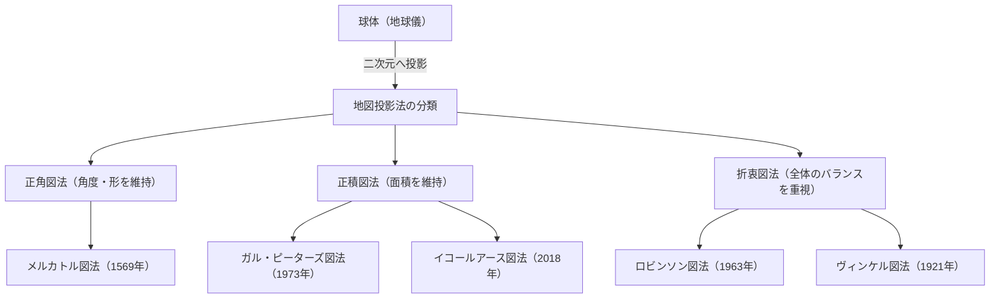

私たちが日常的に目にする「世界地図」。スマートフォンの画面に表示されるデジタルマップから、教室の壁に貼られた大きなポスターまで、地図は私たちの生活に深く根付いています。しかし、平面に描かれた世界地図が、実は「正確な地球の姿」ではないという事実について、深く考えたことはあるでしょうか。

地球は三次元の球体に近い形（厳密には回転楕円体）をしていますが、私たちが用いる地図の多くは二次元の平面です。この「三次元の表面を二次元に展開する」という行為には、避けては通れない重大な数学的パラドックスが存在します。本記事では、大航海時代を牽引したメルカトル図法から、政治的な波紋を呼んだピーターズ図法、そして現代のイコールアース図法に至るまで、人類が地球という巨大な空間をどのように捉え、どのように平面上に表現してきたのか、その知られざる歴史と葛藤を紐解いていきます。

## 1. 球体を平面に描くことの数学的ジレンマ

地図投影法の歴史を語る上で、まず理解しなければならないのは「カール・フリードリヒ・ガウス」が証明した数学的な大前提です。19世紀の偉大な数学者ガウスは、「驚異の定理（Theorema Egregium）」と呼ばれる微分幾何学の定理を導き出しました。この定理によれば、曲面におけるガウス曲率は、その曲面を曲げても変わらないという性質を持っています。

地球のような球面のガウス曲率は正ですが、平面のガウス曲率はゼロです。したがって、ガウス曲率が異なる面同士を、伸び縮みや破れなしにマッピングすることは数学的に不可能です。みかんの皮を剥いて、それを一枚の平らな長方形に隙間なく伸ばすことができないのと同じ原理です。

この数学的ジレンマにより、どんな世界地図であっても以下の4つの要素を同時にすべて正確に保つことはできません。

1. **面積**（正積性）：実際の陸地や海の面積の比率が保たれているか
2. **角度・形**（正角性）：実際の地形の輪郭や、交わる線の角度が保たれているか
3. **距離**（正距性）：特定の点からの距離の比率が保たれているか
4. **方位**（正方位性）：特定の点からの方位が正しく保たれているか

これら全てを満たすのは「地球儀」しかありません。平面地図を作成する際、地図製作者は目的のために何かを犠牲にし、何かを優先するという「妥協」を強いられます。この選択こそが、地図投影法の歴史そのものと言えます。

## 2. 大航海時代を支えた革新：メルカトル図法

現代の私たちにとって最も馴染み深い世界地図といえば、「メルカトル図法」でしょう。1569年、フランドル（現在のベルギー）の地理学者ゲラルドゥス・メルカトルによって発表されたこの地図は、人類の歴史を大きく変える画期的な発明でした。

当時のヨーロッパは、未知の大陸や海洋へと乗り出していく「大航海時代」の真っ只中にありました。しかし、広大な海の上では目印となるものがなく、船乗りたちは常に遭難のリスクと隣り合わせでした。彼らが求めていたのは、「目的地に確実にたどり着ける海図」です。

メルカトル図法の最大の特徴は「正角性」です。経線と緯線が常に直角に交わり、任意の2点間を結んだ直線（等角航路）が、実際の羅針盤の指し示す方角と一致します。つまり、船乗りは出発地と目的地を地図上で直線で結び、その線と経線のなす角度（方位）を測って、羅針盤をその角度に保ちながら進みさえすれば、確実に目的地に到着できたのです。

この機能的で画期的な地図は、航海士たちにとってまさに魔法のツールでした。しかし、この利便性の裏には巨大な犠牲がありました。それが「面積の極端な歪み」です。
メルカトル図法では、高緯度になればなるほど東西と南北の両方に拡大されるため、極地に近づくほど実際の面積よりもはるかに巨大に描かれてしまいます。

例えば、メルカトル図法上で見るとグリーンランドはアフリカ大陸と同じくらい、あるいはそれ以上に大きく見えます。しかし実際の面積を比較すると、アフリカ大陸はグリーンランドの約14倍もの大きさがあります。同様に、ロシアやカナダといった高緯度の国々は、実際の面積以上に広大な領域として強調されてしまいます。

メルカトル自身は、この地図があくまで「航海用」であることを意図していました。しかし、その直線的ですっきりとした見た目の美しさから、航海用以外の一般向けの地図や学校教育にも広く採用されるようになり、結果として数世紀にわたって人々の「世界に対する空間認知」を歪めることになりました。

## 3. 政治とイデオロギーの投影：ピーターズ図法の論争

20世紀に入ると、メルカトル図法が一般的に使われ続けることに対する批判が高まり始めました。その背景には、単なる地理的な正確さの追求だけでなく、政治的・社会的なイデオロギーが深く絡んでいました。

1973年、ドイツの歴史家アルノ・ピーターズは、「メルカトル図法はヨーロッパを中心とする先進国（北半球の高緯度に位置する）を不当に大きく描き、発展途上国が多い赤道付近（アフリカや南米、東南アジアなど）を小さく見せている。これは植民地主義的な白人至上主義の表れだ」と痛烈に批判しました。

そして、彼が「より平等で正しい世界地図」として大々的に発表したのが、「ピーターズ図法（正式にはガル・ピーターズ図法）」です。この地図は「正積図法」、すなわち世界中のすべての地域において実際の面積比を正確に反映することに特化していました。

ピーターズ図法を見ると、私たちが慣れ親しんだ世界とは大きく異なる姿が浮かび上がります。ヨーロッパは非常に小さく描かれ、逆にアフリカ大陸や南アメリカ大陸は縦に長く、その巨大さが際立ちます。これは、第三世界の国々にとって自国の存在感を正当にアピールする強力な視覚的武器となりました。ユネスコ（国連教育科学文化機関）や多くの国際NGOが、公平性の観点からこの地図を支持し採用しました。

しかし、地図学の専門家たちからは強い反発が起きました。面積を正確にするために、ピーターズ図法では大陸の「形（輪郭）」が極端に歪んでしまっていたからです。赤道付近の国々は縦に引き伸ばされたように見え、高緯度の地域は横に潰されたように見えます。「形が不自然で実用に耐えない」「ピーターズの主張は政治的なプロパガンダに過ぎない」といった激しい論争が巻き起こりました。

この「ピーターズ図法論争」は、地図が単なる地理情報の表現にとどまらず、それを見る人々の世界観や力関係、政治的イデオロギーを形作るメディアであることを浮き彫りにした歴史的事件でした。

## 4. 美しさと実用性の妥協点を探る：折衷図法

メルカトル図法の「面積の嘘」と、ピーターズ図法の「形の歪み」。どちらも極端な要素を持っていたため、地図学者たちは「面積も形も、完全ではないが、見た目に最も自然でバランスの良い地図」を模索し始めました。これが「折衷図法」の誕生です。

折衷図法の代表格が、1963年にアメリカの地理学者アーサー・H・ロビンソンによって発表された「ロビンソン図法」です。ロビンソンは、数学的な公式から地図を導き出すのではなく、「人間の目にどう見えるか」という視覚的、芸術的な直感を出発点としました。彼は何度もシミュレーションを重ねて、陸地の形が極端に歪まず、かつ面積の比率もそこまで狂わない妥協点を手作業で探し出し、後からそれを数学的な座標に落とし込んだのです。

ロビンソン図法は、全体的に丸みを帯びた美しい楕円形をしており、私たちの目に非常に自然に映ります。1988年、著名なナショナル・ジオグラフィック協会が公式の世界地図としてロビンソン図法を採用したことで、世界的なスタンダードの一つとなりました。

さらにその後、ナショナル・ジオグラフィック協会は1998年に「ヴィンケル図法（ヴィンケル・トリペル図法）」へと移行しました。オズワルド・ヴィンケルが考案したこの図法は、面積、角度、距離の3つの歪みを最小限に抑える（トリペルはドイツ語で「3」を意味する）というアプローチを取っており、ロビンソン図法よりもさらに歪みが少なくバランスが取れていると評価されています。現在の多くの教科書や一般的な世界地図では、このヴィンケル図法やロビンソン図法に類する折衷図法が主流となっています。

## 5. 現代の挑戦と新たな表現：オーサグラフとイコールアース図法

21世紀に入っても、地図投影法の進化は止まりません。地球環境問題やグローバル化が進む現代において、私たちは新しい視点で地球を捉え直す必要に迫られています。

その一つの試みが、日本人の建築家・鳴川肇氏らが考案した「オーサグラフ世界地図」です。この地図は、地球の表面を96等分して正四面体に投影し、それを切り開いて長方形の平面図にするという独創的な手法を用いています。最大の利点は、面積の比率を保ちながら、どの部分を中心にしても地図を無限に並べて繋ぎ合わせることができる点です。海路や空路のネットワーク、気候変動の影響など、中心のないグローバルな視点で世界を見渡すのに適しており、2016年にはグッドデザイン大賞を受賞しました。

そして、近年最も注目を集めている新しい投影法が、2018年にボヤン・シャブリッチ、トム・パターソン、ベルンハルト・ジェニーの3人の地図製作者によって発表された「イコールアース図法」です。

イコールアース図法は、ピーターズ図法が抱えていた「形の極端な不自然さ」を克服するために開発された新しい「正積図法（面積が正しい地図）」です。彼らは、ロビンソン図法のような目に優しい丸みを帯びた外観を持ちながら、同時に各大陸や国の面積比率が完全に正確である地図を目指しました。

開発の動機の一つは、気候変動や環境問題のデータを視覚化する際、面積が正確でなければ誤解を招くという強い危機感でした。例えば、森林伐採や海面上昇の影響を示すとき、メルカトル図法では高緯度の影響が過大評価されてしまいます。イコールアース図法は、コンピューター技術の発展によって高度な計算が可能になった現代だからこそ実現できた、美しさと科学的正確性を兼ね備えた革新的なデザインです。現在、NASA（アメリカ航空宇宙局）やGISS（ゴダード宇宙飛行センター）の気候データマップなどにも採用が広がりつつあります。

## 終わりに：地図は世界観そのものである

メルカトル図法からイコールアース図法まで、地図投影法の歴史を振り返ると、そこには単なる測量技術や数学の発展だけでなく、各時代の人々の「地球をどう見たいか、どう使うべきか」という強い意志が反映されていることがわかります。

航海士たちの命を救い、世界規模の交易を可能にした正角性。
南北問題や不平等に一石を投じ、多様な視点をもたらした正積性。
そして、全体の調和を求め、複雑な現代社会の課題解決に貢献する新たな表現。

私たちが見つめている世界地図は、決して絶対的な「真実の姿」ではありません。それは、人間が無限の広がりを持つ三次元の地球を、自分たちの目的や価値観に合わせて二次元へと翻訳した「解釈」の一つなのです。次に世界地図を眺めるときは、その一枚の紙（あるいはスクリーン）に込められた、何百年にもわたる地図製作者たちの試行錯誤と葛藤の歴史に、ぜひ思いを馳せてみてください。私たちが世界をどう捉えるかは、どの地図を選ぶかによって形作られているのです。
