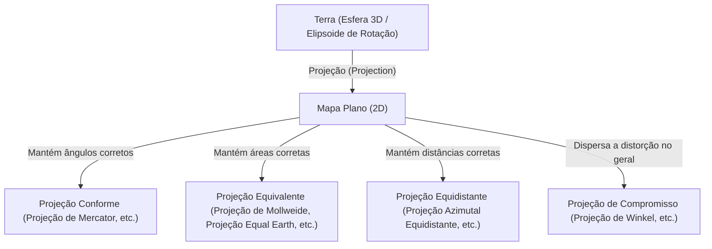
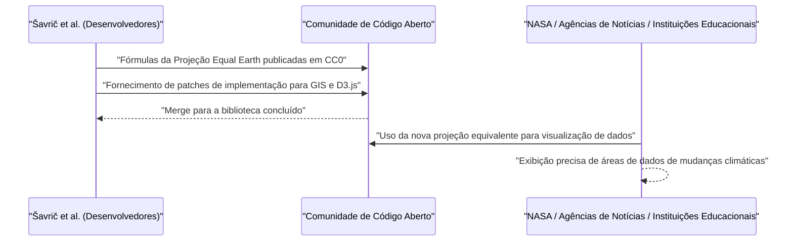

# Introdução: O Último Paradoxo de Desenhar uma Esfera em um Plano

A humanidade desenha mapas desde os tempos antigos para entender e registrar o mundo em que vive. No entanto, sempre existiu um enorme paradoxo: o fato de que "é matematicamente impossível desenvolver uma esfera tridimensional (a Terra) em um plano bidimensional (mapa) sem distorção". Isso se baseia na verdade matemática de que superfícies com curvaturas diferentes não podem ser mapeadas isometricamente umas nas outras, como provado por Carl Friedrich Gauss em seu "Theorema Egregium" (Teorema Notável).

Assim como a casca de uma tangerina invariavelmente rasga ou enruga quando se tenta achatá-la, alguma "distorção" inevitavelmente ocorre ao transformar a Terra em um mapa plano. A história das Projeções Cartográficas (Map Projection) nada mais é do que uma história de compromissos e escolhas: como a humanidade lidou com essa "distorção" inevitável e quais elementos (área, ângulo, distância, direção) sacrificar e quais preservar.

Neste artigo, aprofundaremos a evolução das projeções de mapas mundiais, desde o nascimento da projeção de Mercator no século XVI até a mais recente projeção Equal Earth no século XXI, explorando os contextos matemático, histórico e social.



## Capítulo 1: A Era dos Descobrimentos e o Nascimento da Projeção de Mercator

### 1.1 As Lutas dos Navegadores

Durante a Era dos Descobrimentos, do final do século XV ao XVI, os navegadores europeus navegaram em mares desconhecidos. Com a drástica expansão do mundo, como a chegada de Colombo às Américas e a circum-navegação da Terra por Magalhães, a demanda por cartas náuticas precisas explodiu.

As cartas náuticas da época, conhecidas como cartas portulanas, dependiam de linhas direcionais (linhas de rumo) traçadas radialmente a partir de um centro. No entanto, para viagens longas, especialmente a travessia de oceanos, os erros decorrentes da Terra ser esférica não podiam mais ser ignorados. Os navegadores desejavam fortemente um "mapa onde pudessem chegar ao seu destino navegando diretamente ao longo de um rumo constante de bússola (uma loxodromia)".

### 1.2 A Inovação de Gerardus Mercator

Em 1569, o geógrafo flamengo (atual Bélgica) Gerardus Mercator publicou um mapa mundi inovador que respondia a esse desejo desesperado dos navegadores. Essa foi a "Projeção de Mercator".

A maior característica da projeção de Mercator é que "uma linha reta conectando quaisquer dois pontos sempre indica um rumo de bússola constante (loxodromias são representadas como linhas retas)". Isso permitiu que os navegadores soubessem o rumo da bússola em direção ao seu destino, simplesmente colocando uma régua no mapa e traçando uma linha reta.

### 1.3 A Fundamentação Matemática da Projeção de Mercator

A projeção de Mercator pode ser considerada um tipo de projeção cilíndrica. Imagine enrolar um cilindro ao redor do equador da Terra e projetar um mapa no interior do cilindro com uma fonte de luz vinda do centro da Terra. No entanto, Mercator não fez uma projeção simples, mas ajustou o espaçamento dos paralelos por meio de cálculos matemáticos.

Se a longitude for $\lambda$, a latitude for $\phi$ e as coordenadas no mapa forem $(x, y)$, as fórmulas da projeção de Mercator são as seguintes (assumindo a Terra como uma esfera perfeita com raio $R$).

$$ x = R(\lambda - \lambda_0) $$
$$ y = R \ln \left( \tan\left(\frac{\pi}{4} + \frac{\phi}{2}\right) \right) $$

Aqui, $\lambda_0$ é o meridiano central de referência. Como essa equação mostra, quanto maior a latitude, mais o valor de $y$ aumenta rapidamente, divergindo ao infinito ($\infty$) nos polos ($\phi = \pm \pi/2$).

Abaixo está um snippet de código simples em Python para converter coordenadas na projeção de Mercator.

```python
import math

def latlon_to_mercator(lat, lon, R=6378137.0):
    """
    Função para converter latitude e longitude para coordenadas XY da Projeção de Mercator (em metros)
    Equivalente ao cálculo do EPSG:3857 (Web Mercator)
    """
    # Converte latitude e longitude para radianos
    lat_rad = math.radians(lat)
    lon_rad = math.radians(lon)
    
    # Cálculo da coordenada X
    x = R * lon_rad
    
    # Cálculo da coordenada Y (inverso da função de Gudermann)
    y = R * math.log(math.tan(math.pi / 4.0 + lat_rad / 2.0))
    
    return x, y

# Exemplo: Cálculo de Tóquio (Latitude 35.6812, Longitude 139.7671)
x, y = latlon_to_mercator(35.6812, 139.7671)
print(f"Tokyo (Mercator): X={x:.2f}, Y={y:.2f}")
```

### 1.4 A Luz e Sombra da Projeção de Mercator

Como a projeção de Mercator possui "conformidade (os ângulos são preservados corretamente)", as formas locais coincidem com a realidade. No entanto, como compensação, ela tem a falha fatal de "área" extremamente distorcida. Como as áreas de latitudes mais altas são muito ampliadas, a Groenlândia é desenhada quase do mesmo tamanho que o continente africano, embora, na realidade, o continente africano seja cerca de 14 vezes maior que a Groenlândia.

Essa distorção de área posteriormente causaria problemas políticos e sociais. Enquanto as regiões de altas latitudes do hemisfério norte, como a Europa e a América do Norte, são exageradas, os países em desenvolvimento perto do equador são desenhados em tamanho menor, o que a levou a ser criticada por "inculcar uma visão de mundo eurocêntrica".

## Capítulo 2: Em Busca da Precisão da Área: A Genealogia das Projeções Equivalentes

Em resposta às críticas à distorção de área da projeção de Mercator, inúmeras "projeções equivalentes", onde a proporção das áreas é preservada corretamente, foram criadas.

### 2.1 A Projeção de Sanson e a Projeção de Mollweide

No século XVII, a "projeção de Sanson-Flamsteed", usada pelo francês Nicolas Sanson e outros, tornou-se popular. Esta é uma projeção equivalente onde as latitudes são linhas paralelas igualmente espaçadas e as longitudes são desenhadas como curvas senoidais. Embora houvesse pouca distorção perto do meridiano central, ela tinha a desvantagem da distorção severa da forma nas periferias (especialmente em regiões de alta latitude).

Isso foi melhorado pela "projeção de Mollweide", publicada em 1805 pelo matemático alemão Karl Mollweide. A projeção de Mollweide enquadrou toda a Terra em uma única elipse e suavizou a distorção de forma nas altas latitudes mais do que a projeção de Sanson.

### 2.2 Projeção Homolosena de Goode (Projeção Interrompida)

No século XX, foram feitas tentativas de preservar a equivalência enquanto se reduzia ainda mais a distorção da forma. Em 1923, o geógrafo americano John Paul Goode publicou a "Projeção de Goode (Projeção Homolosena)".

Isso adotou uma abordagem bizarra chamada "projeção interrompida", conectando a projeção de Sanson nas regiões de baixa latitude e a projeção de Mollweide nas regiões de alta latitude, e dividindo as porções oceânicas (ou continentais). Isso tornou possível ter uma visão geral do mundo com a proporção correta das áreas, minimizando a distorção da forma de cada continente. No entanto, como o oceano é dilacerado, apresentava o problema de ser difícil compreender a forma contínua da Terra intuitivamente.

## Capítulo 3: A Guerra Fria e a Controvérsia da Projeção de Peters

A projeção de mapas evoluiu de um mero problema de matemática e geografia para uma grande controvérsia envolvendo ideologias conflitantes na confusão sobre a "Projeção de Peters" na década de 1970.

### 3.1 A Projeção Cilíndrica Equivalente de Gall e as Reivindicações de Arno Peters

Em 1973, o historiador alemão Arno Peters criticou fortemente a projeção de Mercator como "um mapa eurocêntrico arrogante que faz intencionalmente o Terceiro Mundo parecer pequeno" e publicou sua própria "Projeção de Peters". Ele a promoveu amplamente como "um mapa mundial novo e verdadeiramente justo, que retrata todas as pessoas de forma igual".

A projeção de Peters era uma projeção equivalente e, diferentemente da projeção de Mercator, as áreas de alta latitude não eram exageradas. Como resultado, as agências da ONU, muitas ONGs e organizações religiosas apoiaram este mapa e o adotaram amplamente como pôsteres educacionais.

### 3.2 A Forte Reação da Comunidade Cartográfica

No entanto, em resposta ao anúncio de Peters, cartógrafos profissionais reagiram fortemente. As razões foram as seguintes:

1. **Suspeita de plágio**: A projeção de Peters era matematicamente idêntica à "projeção cilíndrica equivalente de Gall", publicada pelo britânico James Gall em 1855. Era uma projeção já conhecida na comunidade cartográfica e não original de Peters.
2. **Distorção severa de forma**: Como resultado do uso de uma projeção cilíndrica para preservar a equivalência, as regiões de baixa latitude (África e América do Sul) foram esticadas verticalmente ao extremo, e as regiões de alta latitude (Europa e Canadá) foram horizontalmente achatadas, resultando em formas muito desajeitadas.
3. **Uso como propaganda**: Cartógrafos acusaram Peters de se envolver em propaganda ideológica ao ignorar o trade-off matemático das projeções de mapas (preservar a área distorce a forma) e demonizar injustamente a projeção de Mercator.

Essa controvérsia resultou em um reconhecimento mundial de que um mapa não é uma mera cópia objetiva da realidade, mas uma mídia que influencia fortemente a visão de mundo e a consciência política de quem o vê.

## Capítulo 4: A Arte do Compromisso: A Ascensão das Projeções de Compromisso

Se você tentar preservar a área ou a forma perfeitamente, a outra será extremamente sacrificada. Portanto, as "projeções de compromisso (Compromise projection)", que abandonaram a equivalência ou conformidade estritas e buscaram "aparência natural" e "menos distorção geral", tornaram-se populares nos mapas mundiais de uso geral na segunda metade do século XX.

### 4.1 A Projeção de Robinson

Inventada pelo cartógrafo americano Arthur H. Robinson em 1963, a "Projeção de Robinson" adotou uma abordagem única em que os comprimentos e espaçamentos dos paralelos foram determinados empiricamente para priorizar "uma aparência bonita", em vez de partir de fórmulas matemáticas.

Essa projeção tornou-se amplamente reconhecida em todo o mundo quando foi adotada como o mapa mundial oficial da National Geographic Society em 1988.

### 4.2 A Projeção Tripel de Winkel

Mais tarde, em 1998, a National Geographic Society substituiu a Projeção de Robinson pela "Projeção Tripel de Winkel (Winkel Tripel projection)". Inventada pelo alemão Oswald Winkel em 1921, essa projeção é a média aritmética da projeção de Aitoff e da projeção cilíndrica equidistante. "Tripel" significa "três" em alemão, indicando que ela tenta minimizar três distorções: área, ângulo e distância. Ela ainda é usada hoje como o mapa mundial padrão em muitos atlas educacionais e livros.

## Capítulo 5: Novos Desafios na Era Digital: O Nascimento da Projeção Equal Earth

No século XXI, a forma como interagimos com os mapas mudou drasticamente. É a popularização dos serviços de mapas na Web, como o Google Maps. Nesses mapas da Web, ironicamente, a "Projeção de Mercator (Web Mercator)" é novamente adotada para operações de zoom suaves (embora tenha sido melhorada recentemente para alternar para um modelo de globo 3D ao diminuir o zoom).

No entanto, em locais onde questões globais, como mudanças climáticas e desigualdade global, são discutidas, a importância de visualizar o mundo em uma "proporção de área precisa" permaneceu alta, e uma nova projeção equivalente era necessária.

### 5.1 O Desafio de Bojan Šavrič e Outros

Em 2018, uma projeção equivalente completamente nova, a "Projeção Equal Earth", foi anunciada por três cartógrafos: Bojan Šavrič, Tom Patterson e Bernhard Jenny.

O objetivo deles era claro.
"Criar um mapa mundial que não tivesse distorção de forma severa como a projeção de Peters, tivesse uma aparência natural e bela como a projeção de Robinson e possuísse equivalência estrita."

### 5.2 Inovação Matemática da Projeção Equal Earth

A projeção Equal Earth é muito parecida no contorno com a projeção de Robinson, mas alcança equivalência estrita por meio de um polinômio avançado. Suas fórmulas de projeção são as seguintes.

Seja a latitude $\phi$, a longitude $\lambda$ (diferença do meridiano central) e $\theta$ o ângulo que satisfaz $ \sin \theta = \frac{\sqrt{3}}{2} \sin \phi $.

$$ x = \frac{2\sqrt{3} \lambda \cos \theta}{3 (9 A_4 \theta^8 + 7 A_3 \theta^6 + 3 A_2 \theta^2 + A_1)} $$
$$ y = A_4 \theta^9 + A_3 \theta^7 + A_2 \theta^3 + A_1 \theta $$

Aqui, os coeficientes são:
$ A_1 = 1.340264 $
$ A_2 = -0.081106 $
$ A_3 = 0.000893 $
$ A_4 = 0.003796 $

Através dessas fórmulas complexas, a projeção Equal Earth consegue expressar as proporções de área corretas enquanto mantém a forma natural dos continentes, sem esticar a área equatorial nem achatar os polos.

### 5.3 Propagação como Código Aberto

O que tornou a projeção Equal Earth inovadora não foi apenas o seu design, mas sua abordagem de disseminação. Os desenvolvedores publicaram as fórmulas para esta projeção em domínio público (CC0) e pressionaram para que fossem rapidamente implementadas em software GIS de código aberto como QGIS e bibliotecas de visualização de dados como D3.js.

Como resultado, foi adotada instantaneamente por cientistas e pela mídia em todo o mundo, inclusive sendo usada pela NASA para mapas de anomalias de temperatura global.



## Conclusão: Os Mapas Criam o Mundo

A história da projeção de Mercator até a projeção Equal Earth é também uma história de como a humanidade mudou seu pensamento sobre "como percebemos o mundo em que vivemos e o que queremos transmitir".

Na Era dos Descobrimentos, a principal prioridade era "chegar ao destino com segurança" (conformidade), e na era do domínio colonial, mapas mostrando a vastidão do próprio país eram preferidos. Durante a Guerra Fria, mapas chamando a atenção para corrigir a divisão Norte-Sul causaram controvérsia, e hoje, mapas (equivalentes + forma natural) são necessários para visões imparciais de questões globais, como as mudanças climáticas.

**"O mapa não é apenas um espelho que reflete o mundo, mas também uma lente que cria o mundo"**.

Quando olhamos para um mapa, precisamos estar sempre cientes dos compromissos matemáticos sobre os quais ele é construído e as intenções com as quais foi desenhado. A projeção Equal Earth pode ser considerada uma das mais novas "lentes" nos mostrando como estamos tentando reexaminar o mundo hoje.
