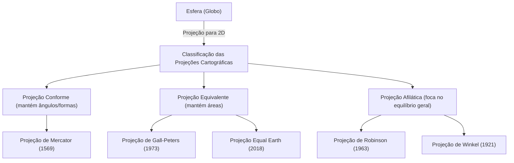

O "mapa-múndi" que vemos diariamente. Desde os mapas digitais exibidos nas telas dos smartphones até os grandes pôsteres colados nas paredes das salas de aula, os mapas estão profundamente enraizados em nossas vidas. No entanto, você já pensou profundamente sobre o fato de que o mapa-múndi desenhado em uma superfície plana, na verdade, não é a "figura exata da Terra"?

A Terra tem uma forma próxima à de uma esfera tridimensional (estritamente falando, um elipsoide de revolução), mas muitos dos mapas que usamos são planos bidimensionais. Neste ato de "desdobrar uma superfície tridimensional em duas dimensões", existe um paradoxo matemático significativo e inevitável. Neste artigo, desvendaremos a história desconhecida e os conflitos sobre como a humanidade capturou e expressou o vasto espaço da Terra em um plano, desde a projeção de Mercator que impulsionou a Era dos Descobrimentos, passando pela projeção de Peters que causou repercussões políticas, até a moderna projeção Equal Earth.

## 1. O dilema matemático de desenhar uma esfera em um plano

Ao discutir a história das projeções cartográficas, o que deve ser entendido primeiro é a grande premissa matemática provada por "Carl Friedrich Gauss". O grande matemático do século XIX, Gauss, derivou um teorema da geometria diferencial chamado "Teorema Egrégio" (Theorema Egregium). De acordo com este teorema, a curvatura gaussiana de uma superfície tem a propriedade de permanecer inalterada mesmo que a superfície seja dobrada.

A curvatura gaussiana de uma superfície esférica como a Terra é positiva, mas a curvatura gaussiana de um plano é zero. Portanto, mapear superfícies com diferentes curvaturas gaussianas umas nas outras sem esticar, encolher ou rasgar é matematicamente impossível. É o mesmo princípio pelo qual não se pode descascar uma tangerina e esticar a casca em um único retângulo plano e sem lacunas.

Devido a este dilema matemático, não importa o mapa-múndi, é impossível manter simultaneamente e com precisão todos os quatro elementos a seguir:

1. **Área** (Equivalência): A proporção da área real de terras e mares é mantida?
2. **Ângulo/Forma** (Conformalidade): Os contornos do terreno real e os ângulos das linhas que se cruzam são mantidos?
3. **Distância** (Equidistância): A proporção das distâncias a partir de um ponto específico é mantida?
4. **Direção** (Azimutalidade): A direção a partir de um ponto específico é mantida corretamente?

O único que satisfaz tudo isso é o "globo terrestre". Ao criar um mapa plano, os cartógrafos são forçados a fazer um "compromisso", sacrificando algo e priorizando outra coisa em prol do seu objetivo. Esta escolha é, sem dúvida, a própria história das projeções cartográficas.

## 2. A inovação que apoiou a Era dos Descobrimentos: Projeção de Mercator

Quando se fala no mapa-múndi mais familiar para nós, modernos, provavelmente é a "projeção de Mercator". Apresentado em 1569 pelo geógrafo flamengo (atual Bélgica) Gerardus Mercator, este mapa foi uma invenção revolucionária que mudou enormemente a história da humanidade.

A Europa da época estava no meio da "Era dos Descobrimentos", aventurando-se por continentes e oceanos desconhecidos. No entanto, no vasto mar não havia pontos de referência e os marinheiros estavam sempre lado a lado com o risco de naufrágio. O que eles procuravam eram "cartas náuticas que pudessem levá-los com certeza ao seu destino".

A maior característica da projeção de Mercator é a sua "conformalidade". Os meridianos e paralelos sempre se cruzam em ângulos retos e uma linha reta conectando quaisquer dois pontos (loxodrômia) coincide com a direção real indicada pela bússola. Em outras palavras, um marinheiro só precisava conectar o ponto de partida e o destino com uma linha reta no mapa, medir o ângulo (azimute) entre essa linha e um meridiano e navegar mantendo a bússola nesse ângulo para chegar ao seu destino com precisão.

Este mapa funcional e inovador foi verdadeiramente uma ferramenta mágica para os navegadores. Mas por trás dessa conveniência havia um enorme sacrifício. Esta era a "distorção extrema das áreas".

Na projeção de Mercator, quanto mais alta a latitude, mais o mapa é expandido tanto de leste a oeste quanto de norte a sul, de forma que quanto mais perto se chega dos polos, mais as terras são desenhadas de forma infinitamente mais gigantescas que sua área real.

Por exemplo, visto na projeção de Mercator, a Groenlândia parece ser quase tão grande quanto, ou até maior, que o continente africano. No entanto, comparando as áreas reais, o continente africano tem cerca de 14 vezes o tamanho da Groenlândia. Da mesma forma, países de alta latitude, como a Rússia e o Canadá, são enfatizados como territórios mais vastos do que suas áreas reais.

O próprio Mercator pretendia que este mapa fosse estritamente "para navegação". Contudo, devido à beleza de sua aparência linear e limpa, passou a ser amplamente adotado em mapas gerais e na educação escolar além da navegação e, como resultado, distorceu a "percepção espacial do mundo" das pessoas por séculos.

## 3. Projeção de política e ideologia: A controvérsia da projeção de Peters

Ao entrar no século XX, começaram a aumentar as críticas ao uso contínuo e geral da projeção de Mercator. Por trás disso, não havia apenas a busca pela precisão geográfica, mas ideologias políticas e sociais estavam profundamente entrelaçadas.

Em 1973, o historiador alemão Arno Peters criticou severamente: "A projeção de Mercator desenha países desenvolvidos, centrados na Europa (localizados em altas latitudes no hemisfério norte), injustamente grandes, e faz as proximidades do equador, onde há muitos países em desenvolvimento (África, América do Sul, Sudeste Asiático, etc.), parecerem menores. Esta é uma manifestação de supremacia branca colonialista."

E o que ele anunciou grandiosamente como um "mapa-múndi mais igualitário e correto" foi a "projeção de Peters (oficialmente projeção de Gall-Peters)". Este mapa era uma "projeção equivalente", ou seja, especializada em refletir com precisão a proporção da área real em todas as regiões do mundo.

Olhando para a projeção de Peters, surge uma figura muito diferente do mundo ao qual estamos acostumados. A Europa é desenhada muito pequena e, inversamente, o continente africano e o continente sul-americano são verticalmente alongados, destacando sua enormidade. Isso se tornou uma poderosa arma visual para os países do Terceiro Mundo afirmarem legitimamente a sua presença. A UNESCO (Organização das Nações Unidas para a Educação, a Ciência e a Cultura) e muitas ONGs internacionais apoiaram e adotaram este mapa a partir de uma perspectiva de equidade.

No entanto, houve forte oposição de especialistas em cartografia. Porque, a fim de tornar as áreas precisas, a "forma (contorno)" dos continentes na projeção de Peters foi extremamente distorcida. Os países próximos ao equador parecem esticados verticalmente e as regiões de alta latitude parecem esmagadas horizontalmente. Isso gerou intensos debates como "a forma é artificial e inutilizável" e "as afirmações de Peters não passam de propaganda política".

Esta "controvérsia da projeção de Peters" foi um evento histórico que destacou o fato de que os mapas não são meras representações de informações geográficas, mas sim mídias que moldam a visão de mundo, as relações de poder e a ideologia política das pessoas que os veem.

## 4. Buscando um meio-termo entre beleza e praticidade: Projeções Afiláticas

A "mentira das áreas" da projeção de Mercator e a "distorção das formas" da projeção de Peters. Como ambas tinham elementos extremos, os cartógrafos começaram a procurar "um mapa onde nem as áreas nem as formas são perfeitas, mas visualmente é mais natural e equilibrado". Este foi o nascimento das "projeções afiláticas".

O principal exemplo de projeção afilática é a "projeção de Robinson", anunciada em 1963 pelo geógrafo americano Arthur H. Robinson. Robinson não derivou o mapa de fórmulas matemáticas, mas usou a intuição visual e artística de "como parece aos olhos humanos" como ponto de partida. Ele repetidamente fez simulações para encontrar manualmente um compromisso onde a forma da massa de terra não fosse distorcida ao extremo, e a proporção da área também não divergisse tanto, inserindo isso mais tarde em coordenadas matemáticas.

A projeção de Robinson tem uma bela forma elíptica, com contornos arredondados, e parece muito natural aos nossos olhos. Em 1988, a renomada National Geographic Society adotou a projeção de Robinson como seu mapa-múndi oficial, tornando-a um dos padrões globais.

Depois disso, a National Geographic Society mudou para a "projeção de Winkel (projeção Winkel Tripel)" em 1998. Esta projeção, concebida por Oswald Winkel, adota a abordagem de minimizar as três distorções (Tripel significa "triplo" em alemão) de área, ângulo e distância, e é avaliada como tendo ainda menos distorção e sendo mais bem balanceada do que a projeção de Robinson. Em muitos dos livros didáticos atuais e mapas-múndi gerais, projeções afiláticas semelhantes à projeção de Winkel e à projeção de Robinson são a tendência principal.

## 5. Desafios contemporâneos e novas expressões: Authagraph e a Projeção Equal Earth

Mesmo no século XXI, a evolução das projeções cartográficas não para. Num mundo moderno onde os problemas ambientais globais e a globalização estão avançando, somos pressionados a reconsiderar a Terra a partir de uma nova perspectiva.

Uma dessas tentativas é o "Mapa-múndi Authagraph", idealizado pelo arquiteto japonês Hajime Narukawa e seus colegas. Este mapa usa um método único onde a superfície da Terra é dividida em 96 partes iguais, projetada num tetraedro regular e então desdobrada numa planta retangular. A maior vantagem é que, enquanto mantém a proporção das áreas, ele permite que o mapa seja enfileirado e conectado infinitamente com qualquer parte no centro. É adequado para observar o mundo através de uma perspectiva global sem um centro específico, como redes marítimas e aéreas, e os impactos das mudanças climáticas. Em 2016, ganhou o Grande Prêmio Good Design (Japão).

E a nova projeção que vem atraindo mais atenção nos últimos anos é a "Projeção Equal Earth", anunciada em 2018 pelos três cartógrafos Bojan Šavrič, Tom Patterson e Bernhard Jenny.

A Projeção Equal Earth é uma nova "projeção equivalente (mapa com área correta)" desenvolvida para superar a "extrema artificialidade da forma" com a qual a projeção de Peters sofria. Eles objetivaram um mapa que tivesse uma aparência visualmente agradável e arredondada, como a projeção de Robinson, e, ao mesmo tempo, onde a proporção das áreas de cada continente e país fosse totalmente precisa.

Uma das motivações para o seu desenvolvimento foi uma forte sensação de crise de que, ao visualizar dados de mudanças climáticas ou problemas ambientais, poderia causar mal-entendidos se a área não fosse precisa. Por exemplo, ao mostrar os impactos do desmatamento ou a elevação do nível do mar, a projeção de Mercator superestima os impactos em altas latitudes. A projeção Equal Earth é um design inovador que combina beleza visual e precisão científica, possível apenas na era moderna onde a evolução da tecnologia de computadores viabiliza cálculos avançados. Atualmente, a sua adoção está se expandindo para mapas de dados climáticos da NASA (Agência Espacial Americana) e do GISS (Instituto Goddard de Estudos Espaciais).

## Conclusão: Os mapas são a própria visão de mundo

Relembrando a história das projeções cartográficas, desde a projeção de Mercator até a projeção Equal Earth, pode-se perceber que reflete não apenas o desenvolvimento de técnicas de levantamento ou a matemática, mas também a forte vontade das pessoas de cada época sobre "como queremos ver a Terra e como devemos usá-la".

A conformalidade que salvou as vidas dos navegadores e permitiu o comércio global.
A equivalência que lançou luz sobre as questões Norte-Sul e a desigualdade, e trouxe uma diversidade de perspectivas.
E as novas expressões em busca da harmonia geral que contribuem para a resolução de problemas da complexa sociedade moderna.

O mapa-múndi que olhamos nunca é a "figura da verdade" absoluta. É apenas uma "interpretação" em que a humanidade traduziu a vasta Terra tridimensional infinita em bidimensional, adaptada aos seus próprios objetivos e valores. A próxima vez que olhar para um mapa-múndi, por favor, pense na história de centenas de anos de tentativa, erro e conflitos de cartógrafos que está embutida naquele pedaço de papel (ou tela). A forma como percebemos o mundo é moldada pelo mapa que escolhemos.
