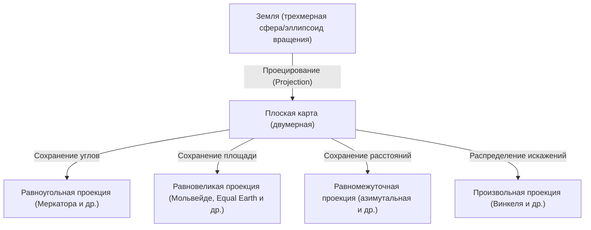
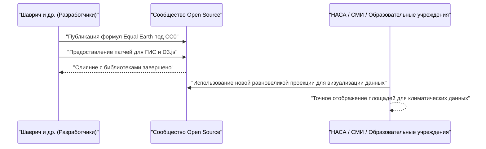

# Введение: Величайший парадокс проецирования сферы на плоскость

С древних времен человечество рисовало карты, чтобы понимать и записывать мир, в котором оно живет. Однако всегда существовал один огромный парадокс: "Математически невозможно развернуть трехмерную сферу (Землю) на двумерную плоскость (карту) без искажений". Это основано на математической истине, доказанной Карлом Фридрихом Гауссом в его "Theorema Egregium" (Замечательной теореме): невозможно изометрично отобразить друг на друга поверхности с разной кривизной.

Подобно тому, как попытка расплющить кожуру мандарина неизбежно приводит к разрывам или складкам, при создании плоской карты Земли всегда возникают определенные "искажения". История картографических проекций (Map Projection) — это не что иное, как история компромиссов и выбора: как человечество справлялось с этими неизбежными искажениями, какими элементами (площадью, углами, расстояниями, направлениями) оно жертвовало, а какие сохраняло.

В этой статье мы глубоко погрузимся в эволюцию картографических проекций, от создания проекции Меркатора в 16 веке до новейшей проекции Equal Earth 21 века, рассматривая их математический, исторический и социальный контекст.



## Глава 1: Эпоха Великих географических открытий и рождение проекции Меркатора

### 1.1 Страдания мореплавателей

В Эпоху Великих географических открытий, с конца 15 по 16 век, европейские мореплаватели отправлялись в неизведанные моря. С прибытием Колумба в Америку и кругосветным плаванием Магеллана мир стремительно расширялся, и спрос на точные морские карты резко возрос.

В то время мореплаватели полагались на портуланы — морские карты с радиально расходящимися от центра линиями румбов (направлений компаса). Однако при длительных плаваниях, особенно при пересечении океанов, погрешности, вызванные сферической формой Земли, стали слишком велики, чтобы их игнорировать. Мореплаватели отчаянно нуждались в карте, на которой «постоянный курс по компасу (локсодромия) представлял бы собой прямую линию, ведущую к пункту назначения».

### 1.2 Инновация Герарда Меркатора

В 1569 году фламандский (современная Бельгия) географ Герард Меркатор (Gerardus Mercator) представил революционную карту мира, отвечающую этим насущным потребностям мореплавателей. Это и была «проекция Меркатора».

Главной особенностью проекции Меркатора было то, что "прямая линия, соединяющая любые две точки, всегда показывает постоянное направление по компасу (локсодромии изображаются прямыми линиями)". Благодаря этому мореплавателям было достаточно приложить линейку к карте и провести прямую линию, чтобы узнать курс по компасу до пункта назначения.

### 1.3 Математическое обоснование проекции Меркатора

Проекцию Меркатора можно рассматривать как разновидность цилиндрической проекции. Представьте цилиндр, обернутый вокруг экватора Земли, на внутреннюю поверхность которого проецируется карта с помощью источника света из центра Земли. Однако Меркатор не просто спроецировал карту; он скорректировал расстояние между параллелями с помощью математических расчетов.

Если обозначить долготу как $\lambda$, широту как $\phi$, а координаты на карте как $(x, y)$, то формулы проекции Меркатора будут выглядеть следующим образом (считая Землю идеальной сферой с радиусом $R$):

$$ x = R(\lambda - \lambda_0) $$
$$ y = R \ln \left( \tan\left(\frac{\pi}{4} + \frac{\phi}{2}\right) \right) $$

Здесь $\lambda_0$ — это базовый центральный меридиан. Как показывает эта формула, чем выше широта, тем быстрее возрастает значение $y$, стремясь к бесконечности ($\infty$) на полюсах ($\phi = \pm \pi/2$).

Ниже приведен простой фрагмент кода на Python, выполняющий преобразование координат в проекции Меркатора.

```python
import math

def latlon_to_mercator(lat, lon, R=6378137.0):
    """
    Функция для преобразования широты и долготы в координаты XY (в метрах) проекции Меркатора
    Эквивалентно расчету EPSG:3857 (Web Mercator)
    """
    # Преобразование широты и долготы в радианы
    lat_rad = math.radians(lat)
    lon_rad = math.radians(lon)
    
    # Расчет координаты X
    x = R * lon_rad
    
    # Расчет координаты Y (обратная функция Гудермана)
    y = R * math.log(math.tan(math.pi / 4.0 + lat_rad / 2.0))
    
    return x, y

# Пример: расчет для Токио (широта 35.6812, долгота 139.7671)
x, y = latlon_to_mercator(35.6812, 139.7671)
print(f"Tokyo (Mercator): X={x:.2f}, Y={y:.2f}")
```

### 1.4 Свет и тень проекции Меркатора

Поскольку проекция Меркатора обладает "равноугольностью" (сохранением правильных углов), локальные формы на ней соответствуют реальности. Однако платой за это стал фатальный недостаток — экстремальное искажение "площади". Из-за сильного увеличения в высоких широтах Гренландия изображается примерно того же размера, что и Африка, хотя на самом деле Африка примерно в 14 раз больше Гренландии.

Это искажение площадей впоследствии вызвало политические и социальные проблемы. Поскольку регионы северного полушария в высоких широтах, такие как Европа и Северная Америка, сильно преувеличены, а развивающиеся страны вблизи экватора изображены меньшими, проекцию начали критиковать за "насаждение европоцентристского мировоззрения".

## Глава 2: В поисках точности площадей: генеалогия равновеликих проекций

В ответ на критику искажений площадей в проекции Меркатора было разработано множество "равновеликих проекций", в которых соотношение площадей сохранялось правильным.

### 2.1 Проекция Сансона и проекция Мольвейде

В 17 веке получила распространение "проекция Сансона" (Sanson-Flamsteed projection), использовавшаяся французским картографом Никола Сансоном и другими. Это равновеликая проекция, в которой параллели представляют собой равноотстоящие прямые линии, а меридианы — синусоиды. Хотя искажения вблизи центрального меридиана были невелики, ее недостатком были сильные искажения формы на периферии (особенно в высоких широтах).

Улучшенной версией стала "проекция Мольвейде" (Mollweide projection), представленная в 1805 году немецким математиком Карлом Мольвейде. Проекция Мольвейде помещает всю Землю в один эллипс, смягчая искажения форм в высоких широтах по сравнению с проекцией Сансона.

### 2.2 Гомолосинусоидальная проекция Гуда (прерывистая проекция)

В 20-м веке были предприняты попытки еще больше уменьшить искажение форм, сохраняя при этом равновеликость. В 1923 году американский географ Джон Пол Гуд представил "проекцию Гуда" (гомолосинусоидальную проекцию).

Она использовала новаторский подход "прерывистой проекции": проекция Сансона применялась для низких широт, проекция Мольвейде — для высоких, а затем карта "разрывалась" в океанах (или на континентах). Это позволило рассматривать мир в правильном соотношении площадей при минимизации искажений формы каждого континента. Однако из-за разрывов океанов интуитивно понять непрерывность Земли было сложно.

## Глава 3: Холодная война и споры вокруг проекции Петерса

Спор вокруг "проекции Петерса" (Peters projection) в 1970-х годах превратил вопрос картографических проекций из сугубо математического или географического в острую идеологическую дискуссию.

### 3.1 Равновеликая цилиндрическая проекция Галла и утверждения Арно Петерса

В 1973 году немецкий историк Арно Петерс выступил с резкой критикой: "Проекция Меркатора — это высокомерная европоцентристская карта, которая намеренно преуменьшает Третий мир", и представил свою собственную "проекцию Петерса". Он активно продвигал ее как "по-настоящему справедливую и новую карту мира, на которой все люди изображены равными".

Проекция Петерса была равновеликой, и, в отличие от проекции Меркатора, области в высоких широтах на ней не увеличивались. В результате учреждения ООН, многие НПО и религиозные организации поддержали эту карту и широко использовали ее на просветительских плакатах.

### 3.2 Резкая реакция картографического сообщества

Однако профессиональные картографы решительно выступили против заявления Петерса. Причины были следующими:

1. **Подозрения в плагиате**: Математически проекция Петерса была абсолютно идентична "равновеликой цилиндрической проекции Галла", представленной британцем Джеймсом Галлом в 1855 году. Для картографического сообщества эта проекция была уже известна и не являлась оригинальным творением Петерса.
2. **Сильное искажение форм**: Из-за использования цилиндрической проекции для сохранения равновеликости низкие широты (Африка и Южная Америка) были сильно вытянуты по вертикали, а высокие (Европа и Канада) — сплющены по горизонтали, что придавало им весьма неуклюжий вид.
3. **Использование в качестве пропаганды**: Картографы обвиняли Петерса в том, что он игнорировал математический компромисс картографических проекций (сохранение площади искажает форму) и несправедливо демонизировал проекцию Меркатора для ведения идеологической пропаганды.

В результате этих споров мир заново осознал, что карта — это не просто объективное отображение реальности, а медиа, которое оказывает сильное влияние на мировоззрение и политическое сознание людей.

## Глава 4: Искусство компромисса: расцвет произвольных проекций

Если попытаться идеально сохранить либо площадь, либо форму, то другая характеристика неизбежно будет сильно искажена. Поэтому во второй половине 20-го века в картах мира общего назначения стали доминировать "произвольные проекции" (Compromise projection), которые отказывались от строгой равновеликости или равноугольности в пользу "естественного вида" и "меньшего общего искажения".

### 4.1 Проекция Робинсона

Разработанная в 1963 году американским картографом Артуром Х. Робинсоном, "проекция Робинсона" (Robinson projection) использовала уникальный подход: она основывалась не на математических формулах, а на эмпирическом определении длины и интервала параллелей, где главным приоритетом был "красивый внешний вид".

Эта проекция получила широкое признание во всем мире после того, как в 1988 году Национальное географическое общество (National Geographic Society) приняло ее в качестве официальной карты мира.

### 4.2 Тройная проекция Винкеля

Позже, в 1998 году, Национальное географическое общество заменило проекцию Робинсона на "Тройную проекцию Винкеля" (Winkel Tripel projection). Разработанная немецким картографом Освальдом Винкелем в 1921 году, эта проекция представляет собой среднее арифметическое между проекцией Аитова и равномежуточной цилиндрической проекцией. Слово "Tripel" по-немецки означает "три", указывая на попытку минимизировать три искажения: площади, углов и расстояний. Даже сейчас она используется в качестве стандартной карты мира во многих учебниках и атласах.

## Глава 5: Новые вызовы цифровой эпохи: рождение проекции Equal Earth

В 21 веке то, как мы взаимодействуем с картами, кардинально изменилось. Появление веб-картографических сервисов, таких как Google Maps, способствовало этому. Иронично, но для обеспечения плавного масштабирования на этих веб-картах снова была принята "проекция Меркатора" (Web Mercator) (хотя в последние годы она была улучшена: при сильном уменьшении карта переключается на 3D-модель глобуса).

Однако при обсуждении глобальных проблем, таких как изменение климата или глобальное неравенство, важность визуализации мира с "правильным соотношением площадей" по-прежнему высока, поэтому требовалась новая равновеликая проекция.

### 5.1 Вызов Бояна Шаврича и его коллег

В 2018 году трое картографов — Боян Шаврич (Bojan Šavrič), Том Паттерсон (Tom Patterson) и Бернхард Дженни (Bernhard Jenny) — представили совершенно новую равновеликую проекцию: "Equal Earth projection" (проекцию Equal Earth).

Их цель была ясна:
"Создать карту мира, которая не имеет сильных искажений формы, как проекция Петерса, выглядит естественно и красиво, как проекция Робинсона, и при этом обладает строгой равновеликостью".

### 5.2 Математические инновации проекции Equal Earth

Проекция Equal Earth по внешним контурам очень похожа на проекцию Робинсона, но в ней используются сложные полиномы для достижения строгой равновеликости. Формулы проекции выглядят следующим образом:

Пусть широта равна $\phi$, а долгота $\lambda$ (отклонение от центрального меридиана), а $ \theta $ — угол, удовлетворяющий условию $ \sin \theta = \frac{\sqrt{3}}{2} \sin \phi $.

$$ x = \frac{2\sqrt{3} \lambda \cos \theta}{3 (9 A_4 \theta^8 + 7 A_3 \theta^6 + 3 A_2 \theta^2 + A_1)} $$
$$ y = A_4 \theta^9 + A_3 \theta^7 + A_2 \theta^3 + A_1 \theta $$

Где коэффициенты:
$ A_1 = 1.340264 $
$ A_2 = -0.081106 $
$ A_3 = 0.000893 $
$ A_4 = 0.003796 $

Благодаря этим сложным математическим формулам проекция Equal Earth смогла отобразить правильное соотношение площадей, сохраняя естественную форму континентов, без вытягивания экваториальных областей или экстремального сплющивания высоких широт.

### 5.3 Распространение как открытый исходный код

Проекция Equal Earth стала прорывом не только благодаря своему дизайну, но и благодаря подходу к ее распространению. Разработчики опубликовали математические формулы этой проекции в общественном достоянии (CC0) и активно содействовали ее быстрому внедрению в ГИС-программное обеспечение с открытым исходным кодом, такое как QGIS, а также в библиотеки визуализации данных, такие как D3.js.

В результате она была мгновенно принята учеными и средствами массовой информации по всему миру, например, использовалась в картах температурных аномалий НАСА (NASA).



## Заключение: Карты создают мир

История от проекции Меркатора до проекции Equal Earth — это еще и история эволюции мышления: как человечество "видит мир, в котором оно живет, и как оно хочет его передать".

В Эпоху Великих географических открытий высшим приоритетом было "гарантированное достижение пункта назначения" (равноугольность), а в эпоху колониального господства предпочтение отдавалось картам, демонстрирующим необъятность собственной страны. В период холодной войны карты, призывающие к исправлению проблем между Севером и Югом, вызывали споры, а в наше время требуются карты (равновеликие + с естественными формами) для объективного восприятия глобальных проблем, таких как изменение климата.

**"Карта — это не только зеркало, отражающее мир, но и линза, создающая его"**.

Когда мы смотрим на карту, мы должны всегда помнить, на каких математических компромиссах она основана и с какими намерениями была нарисована. Можно сказать, что проекция Equal Earth является одной из новейших "линз", показывающих, как мы сегодня пытаемся по-новому взглянуть на мир.
