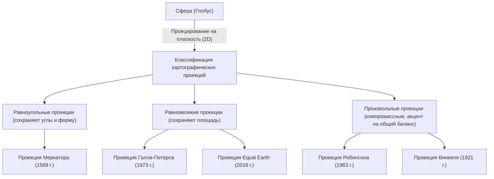

«Карта мира», которую мы видим каждый день. От цифровых карт на экранах смартфонов до больших плакатов на стенах классных комнат, карты глубоко укоренились в нашей жизни. Однако задумывались ли вы когда-нибудь о том, что карта мира, нарисованная на плоской поверхности, на самом деле не является «точным изображением Земли»?

Земля имеет форму, близкую к трехмерной сфере (строго говоря, эллипсоид вращения), но большинство карт, которые мы используем, — это двумерные плоскости. В этом процессе «развертывания трехмерной поверхности в двумерную» кроется неизбежный и серьезный математический парадокс. В этой статье мы расскажем о неизвестной истории и противоречиях того, как человечество воспринимало огромное пространство Земли и как оно отображало его на плоскости: от проекции Меркатора, которая стала двигателем Эпохи великих географических открытий, до проекции Петерса, вызвавшей политический резонанс, и до современной проекции Equal Earth.

## 1. Математическая дилемма изображения сферы на плоскости

При обсуждении истории картографических проекций первое, что необходимо понять, — это математическая предпосылка, доказанная Карлом Фридрихом Гауссом. Гаусс, великий математик 19-го века, вывел теорему дифференциальной геометрии, известную как «Замечательная теорема ([Theorema Egregium](/ru/p/theorema-egregium/))». Согласно этой теореме, гауссова кривизна поверхности обладает свойством оставаться неизменной при ее изгибании.

Гауссова кривизна сферической поверхности, такой как Земля, положительна, в то время как гауссова кривизна плоскости равна нулю. Следовательно, математически невозможно отобразить поверхности с разной гауссовой кривизной друг на друга без растяжения, сжатия или разрывов. Это тот же принцип, по которому невозможно очистить мандарин и растянуть его кожуру в плоский прямоугольник без зазоров.

Из-за этой математической дилеммы ни одна карта мира не может одновременно и точно сохранять все четыре следующих элемента:

1. **Площадь** (Равновеликость): сохраняется ли соотношение площадей реальной суши и океанов.
2. **Углы и форма** (Равноугольность): сохраняются ли контуры реального рельефа и углы пересекающихся линий.
3. **Расстояние** (Равнопромежуточность): сохраняется ли соотношение расстояний от определенной точки.
4. **Направление** (Азимутальность): сохраняется ли правильное направление от определенной точки.

Только «глобус» удовлетворяет всем этим условиям. При создании плоских карт картографы вынуждены идти на «компромисс», жертвуя чем-то одним ради другого в зависимости от своих целей. Этот выбор и есть сама история картографических проекций.

## 2. Инновация, поддержавшая Эпоху великих географических открытий: проекция Меркатора

Для нас сегодня самая знакомая карта мира — это, пожалуй, «проекция Меркатора». Эта карта, опубликованная в 1569 году фламандским (современная Бельгия) географом Герардом Меркатором, стала эпохальным изобретением, которое сильно изменило историю человечества.

В то время Европа находилась в самом разгаре «Эпохи великих географических открытий», отправляясь к неизведанным континентам и океанам. Однако в бескрайнем океане не было ориентиров, и моряки всегда подвергались риску кораблекрушения. Им нужны были «морские карты, которые могли бы гарантированно привести их в пункт назначения».

Главной особенностью проекции Меркатора является «равноугольность». Меридианы и параллели всегда пересекаются под прямым углом, и прямая линия, соединяющая любые две точки (локсодромия), совпадает с фактическим направлением, на которое указывает компас. Иными словами, моряку было достаточно соединить точку отправления и точку назначения на карте прямой линией, измерить угол (направление) между этой линией и меридианом, и, просто двигаясь, удерживая компас на этом угле, он гарантированно достигал места назначения.

Эта функциональная и революционная карта стала поистине волшебным инструментом для мореплавателей. Однако за это удобство пришлось заплатить огромную цену. Это «экстремальное искажение площадей».
В проекции Меркатора, чем выше широта, тем больше масштаб как с востока на запад, так и с севера на юг, поэтому по мере приближения к полюсам территории изображаются гораздо крупнее их реальной площади.

Например, на проекции Меркатора Гренландия выглядит такой же большой, как Африканский континент, или даже больше. Однако при сравнении реальных площадей Африканский континент примерно в 14 раз больше Гренландии. Аналогичным образом, страны высоких широт, такие как Россия и Канада, подчеркиваются как огромные территории, превышающие их реальный размер.

Сам Меркатор задумывал эту карту исключительно для «навигации». Однако из-за её прямолинейной и аккуратной эстетики она стала широко использоваться для общих карт и в школьном образовании, и в результате она на века исказила «пространственное восприятие мира» людьми.

## 3. Проекция политики и идеологии: споры вокруг проекции Петерса

В 20 веке стала нарастать критика продолжающегося широкого использования проекции Меркатора. На фоне этого было не просто стремление к географической точности, но и глубокая связь с политической и социальной идеологией.

В 1973 году немецкий историк Арно Петерс выступил с резкой критикой: «Проекция Меркатора несправедливо преувеличивает развитые страны с центром в Европе (расположенные в высоких широтах Северного полушария) и преуменьшает регионы вокруг экватора, где много развивающихся стран (таких как Африка, Южная Америка и Юго-Восточная Азия). Это проявление колониалистского превосходства белой расы».

В качестве «более справедливой и правильной карты мира» он широко представил «проекцию Петерса» (официально проекцию Галла-Петерса). Эта карта была «равновеликой проекцией», то есть она специализировалась на точном отражении реального соотношения площадей во всех регионах мира.

При взгляде на проекцию Петерса возникает образ, сильно отличающийся от привычного нам мира. Европа нарисована очень маленькой, а Африка и Южная Америка, наоборот, вытянуты по вертикали, и их огромные размеры бросаются в глаза. Это стало мощным визуальным оружием для стран третьего мира, чтобы справедливо заявить о своем присутствии. ЮНЕСКО (Организация Объединенных Наций по вопросам образования, науки и культуры) и многие международные НПО поддержали и приняли эту карту с точки зрения справедливости.

Однако со стороны экспертов в области картографии возникло сильное сопротивление. Чтобы сделать площади точными, на проекции Петерса «форма (контур)» континентов была сильно искажена. Страны у экватора казались вытянутыми по вертикали, а регионы в высоких широтах — сплющенными по горизонтали. Разгорелись жаркие дебаты: «Формы неестественны и непригодны для практического использования», «Утверждения Петерса — не более чем политическая пропаганда».

Этот «спор о проекции Петерса» стал историческим событием, подчеркнувшим, что карта — это не просто средство представления географической информации, но и средство массовой информации, формирующее мировоззрение, баланс сил и политическую идеологию тех, кто на нее смотрит.

## 4. Поиск компромисса между красотой и практичностью: компромиссные проекции

«Ложь о площади» проекции Меркатора и «искажение формы» проекции Петерса. Поскольку обе проекции имели экстремальные элементы, картографы начали искать «карту, которая хотя и не идеальна ни по площади, ни по форме, но визуально является наиболее естественной и сбалансированной». Так родились «компромиссные проекции» (произвольные проекции).

Ярким представителем компромиссных проекций является «проекция Робинсона», опубликованная в 1963 году американским географом Артуром Х. Робинсоном. Робинсон исходил не из математических формул, а из визуальной и художественной интуиции — «как это выглядит для человеческого глаза». Он проводил множество симуляций и вручную искал компромисс, при котором формы суши не сильно искажались бы, и соотношение площадей не слишком нарушалось, а затем уже перевел это в математические координаты.

Проекция Робинсона имеет в целом округлую, красивую эллиптическую форму, которая выглядит очень естественно для наших глаз. В 1988 году знаменитое Национальное географическое общество приняло проекцию Робинсона в качестве официальной карты мира, сделав её одним из мировых стандартов.

Впоследствии, в 1998 году, Национальное географическое общество перешло на «проекцию Винкеля» (проекция Винкеля Трипель). Этот метод, разработанный Освальдом Винкелем, использует подход к минимизации трех искажений: площади, угла и расстояния (слово "Трипель" в переводе с немецкого означает «три»), и считается, что он имеет еще меньше искажений и лучше сбалансирован, чем проекция Робинсона. В большинстве современных учебников и общих картах мира компромиссные проекции, подобные проекциям Винкеля и Робинсона, стали преобладающими.

## 5. Современные вызовы и новые представления: AuthaGraph и проекция Equal Earth

Даже в 21 веке эволюция картографических проекций не останавливается. В наше время, когда обостряются глобальные экологические проблемы и прогрессирует глобализация, мы вынуждены переосмыслить Землю с новой точки зрения.

Одной из таких попыток является «Карта мира AuthaGraph (Аутаграф)», разработанная японским архитектором Хадзиме Нарукава и его командой. В этой карте используется оригинальный метод, при котором поверхность Земли делится на 96 равных частей и проецируется на правильный тетраэдр, который затем разворачивается в прямоугольную плоскую карту. Ее главное преимущество в том, что сохраняя соотношение площадей, можно бесконечно стыковать карту в любом направлении, независимо от того, какая часть находится в центре. Она подходит для того, чтобы смотреть на мир с глобальной точки зрения без единого центра, например, для отображения сетей морских и воздушных путей или последствий изменения климата. В 2016 году эта карта получила премию Good Design Grand Award.

И новая проекция, привлекающая наибольшее внимание в последние годы, — это «проекция Equal Earth (Равная Земля)», опубликованная в 2018 году тремя картографами: Бояном Шавричем, Томом Паттерсоном и Бернхардом Дженни.

Проекция Equal Earth — это новая «равновеликая проекция (карта с правильными площадями)», разработанная для преодоления «экстремальной неестественности форм», присущей проекции Петерса. Они стремились создать карту, которая имела бы приятный для глаз округлый вид, подобный проекции Робинсона, при этом сохраняя абсолютно точное соотношение площадей каждого континента или страны.

Одним из мотивов разработки было сильное чувство тревоги из-за того, что при визуализации данных об изменении климата и экологических проблемах неточные площади могут вводить в заблуждение. Например, при отображении последствий вырубки лесов или повышения уровня моря проекция Меркатора переоценивает воздействие в высоких широтах. Проекция Equal Earth — это инновационный дизайн, сочетающий в себе красоту и научную точность, который стал возможен благодаря развитию компьютерных технологий, позволяющих выполнять сложные вычисления. В настоящее время она все шире используется в климатических картах данных NASA (Национального управления по аэронавтике и исследованию космического пространства) и GISS (Института космических исследований имени Годдарда).

## Заключение: Карта — это само мировоззрение

Оглядываясь на историю картографических проекций, от проекции Меркатора до проекции Equal Earth, мы видим, что в ней отражаются не только развитие геодезических технологий и математики, но и сильная воля людей каждой эпохи: «Как мы хотим видеть Землю и как мы должны ее использовать?».

Равноугольность, спасшая жизни моряков и сделавшая возможной мировую торговлю.
Равновеликость, которая обратила внимание на проблемы между Севером и Югом и неравенство, привнеся многообразие перспектив.
И новые формы представления, которые стремятся к общей гармонии и способствуют решению сложных проблем современного общества.

Карты мира, на которые мы смотрим, ни в коем случае не являются абсолютным «истинным образом». Это лишь одна из «интерпретаций», в которой люди перевели безграничную трехмерную Землю в два измерения в соответствии со своими целями и ценностями. В следующий раз, когда вы будете смотреть на карту мира, обязательно вспомните историю сотен лет проб и ошибок и противоречий картографов, скрытую в этом листе бумаги (или экране). То, как мы воспринимаем мир, формируется тем, какую карту мы выбираем.
