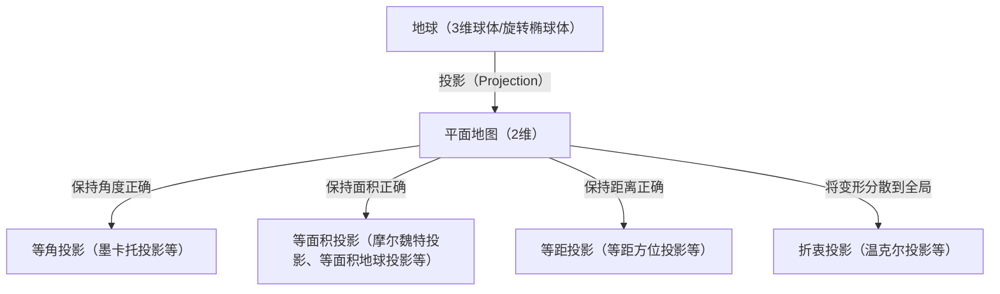
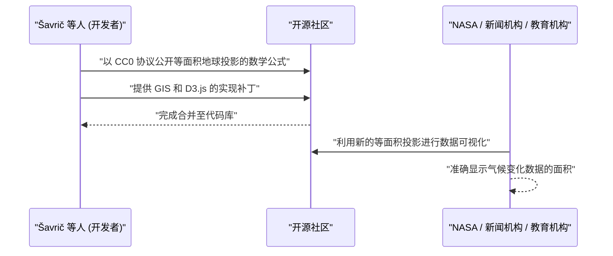

# 引言：将球体绘制在平面上的终极悖论

自古以来，人类为了理解和记录自己居住的世界，绘制了许多地图。然而，这其中始终存在着一个巨大的悖论：“将3维的球体（地球）毫无变形地展开为2维的平面（地图）在数学上是不可能的”。这基于一个数学真理，正如卡尔·弗里德里希·高斯（Carl Friedrich Gauss）在“绝妙定理（Theorema Egregium）”中所证明的：曲率不同的曲面之间无法进行等长映射。

就像试图将橘子皮铺平必然会导致撕裂或起皱一样，在将地球转换成平面地图时，也必然会产生某种“变形”。地图投影法（Map Projection）的历史，就是一部人类如何应对这种不可避免的“变形”，在牺牲和保留哪些要素（面积、角度、距离、方位）之间进行妥协与选择的历史。

本文将深入探讨从16世纪墨卡托投影的诞生，到21世纪最新的等面积地球投影的地图投影法演变，并结合数学、历史和社会背景进行剖析。



## 第1章：大航海时代与墨卡托投影的诞生

### 1.1 航海者们的苦恼

在15世纪末至16世纪的大航海时代，欧洲的航海者们驶向了未知的海洋。随着哥伦布抵达美洲、麦哲伦环球航行等，世界版图急剧扩大，对精确海图的需求呈爆炸性增长。

当时的海图主要依靠波特兰型海图（Portolan chart），航海者们沿着从中心呈放射状画出的方位线（罗盘线）航行。然而，在长距离航行中，尤其是横跨大洋的航行时，由于地球是球体而产生的误差变得无法忽视。航海者们强烈渴望一种“只要沿着指南针指示的固定方位（等角航线）直行，就能到达目的地的地图”。

### 1.2 杰拉杜斯·墨卡托的创新

1569年，佛兰德（今比利时）地理学家杰拉杜斯·墨卡托（Gerardus Mercator）发布了一幅划时代的世界地图，回应了航海者们的迫切愿望。这就是“墨卡托投影”。

墨卡托投影的最大特点是“连接任意两点的直线始终表示恒定的指南针方位（等角航线表现为直线）”。因此，航海者只需在地图上用尺子画一条直线，就能知道到达目的地的罗盘方位。

### 1.3 墨卡托投影的数学支撑

墨卡托投影可以被视为圆柱投影的一种。可以想象将一个圆柱体缠绕在地球赤道上，从地球中心打光，将地图投影到圆柱体内侧。但是，墨卡托并不是使用简单的投影，而是通过数学计算调整了纬线的间距。

设经度为 $\lambda$，纬度为 $\phi$，地图上的坐标为 $(x, y)$，则墨卡托投影的公式如下（假设地球为正球体，半径为 $R$）。

$$ x = R(\lambda - \lambda_0) $$
$$ y = R \ln \left( \tan\left(\frac{\pi}{4} + \frac{\phi}{2}\right) \right) $$

这里，$\lambda_0$ 是基准的中央经线。如该公式所示，纬度越高，$y$ 的值急剧增大，在极点（$\phi = \pm \pi/2$）处发散至无穷大（$\infty$）。

以下是使用 Python 进行墨卡托投影坐标转换的简单代码片段。

```python
import math

def latlon_to_mercator(lat, lon, R=6378137.0):
    """
    纬度经度到墨卡托投影XY坐标（米）的转换函数
    相当于 EPSG:3857 (Web Mercator) 的计算
    """
    # 将纬度经度转换为弧度
    lat_rad = math.radians(lat)
    lon_rad = math.radians(lon)
    
    # X坐标的计算
    x = R * lon_rad
    
    # Y坐标的计算（古德曼函数的逆函数）
    y = R * math.log(math.tan(math.pi / 4.0 + lat_rad / 2.0))
    
    return x, y

# 示例：东京（纬度35.6812, 经度139.7671）的计算
x, y = latlon_to_mercator(35.6812, 139.7671)
print(f"Tokyo (Mercator): X={x:.2f}, Y={y:.2f}")
```

### 1.4 墨卡托投影的光与影

墨卡托投影具有“等角性（角度保持正确）”，因此局部形状与现实一致。然而，代价是其带有“面积”极端变形的致命缺点。因为越靠近高纬度地区放大的比例越大，格陵兰岛在地图上被画得与非洲大陆几乎一样大，而实际上非洲大陆的面积大约是格陵兰岛的14倍。

这种面积上的变形在后来引发了政治和社会问题。由于欧洲和北美等北半球高纬度地区被夸大，而赤道附近的发展中国家被画得较小，它受到了“灌输以欧美为中心的世界观”的批评。

## 第2章：追求面积的准确性：等面积投影的谱系

由于人们对墨卡托投影中面积变形的批评，许多保持面积比例正确的“等面积投影”被相继提出。

### 2.1 桑逊投影与摩尔魏特投影

17世纪，由法国人尼古拉·桑逊（Nicolas Sanson）等人使用的“桑逊投影（Sanson-Flamsteed projection）”普及开来。这是一种纬线为等间距平行线，经线画成正弦曲线的等面积投影。虽然中央经线附近的变形较小，但其缺点是边缘部分（尤其是高纬度地区）的形状变形严重。

为了改善这一点，德国数学家卡尔·摩尔魏特（Carl Mollweide）在1805年提出了“摩尔魏特投影（Mollweide projection）”。摩尔魏特投影将整个地球收纳在一个椭圆形中，缓和了高纬度地区形状的变形，表现比桑逊投影更好。

### 2.2 古德霍莫罗辛投影（分瓣投影）

进入20世纪后，人们尝试在进一步减少形状变形的同时保持等面积性。1923年，美国地理学家约翰·保罗·古德（John Paul Goode）提出了“古德投影（霍莫罗辛投影，Goode homolosine projection）”。

这采用了一种奇特的方法，即“分瓣投影（Interrupted projection）”，在低纬度地区使用桑逊投影，在高纬度地区拼接摩尔魏特投影，并且将海洋部分（或大陆部分）撕裂以进行表现。通过这种方式，它能够在将各大陆形状的变形降至最低的同时，以正确的面积比例俯瞰世界。然而，由于海洋被撕裂，很难直观地把握连续的地球面貌是其难点。

## 第3章：冷战与彼得斯投影的争论

地图投影法不仅限于数学或地理学问题，还演变成了卷入意识形态对立的大争论，这就是1970年代围绕“彼得斯投影（Peters projection）”引发的风波。

### 3.1 高尔等面积圆柱投影与阿诺·彼得斯的主张

1973年，德国历史学家阿诺·彼得斯（Arno Peters）强烈批评说：“墨卡托投影是一种以欧洲为中心的傲慢地图，故意让第三世界显得很小”，并发表了他自己的“彼得斯投影”。他将此作为“平等描绘所有人，真正公平的全新世界地图”进行了大规模宣传。

彼得斯投影是等面积投影，不会像墨卡托投影那样将高纬度地区极端放大。因此，联合国机构及许多NGO、宗教团体等支持该地图，并将其广泛用作启蒙海报。

### 3.2 地图学界的强烈反对

然而，针对彼得斯的发表，专业地图学家们表达了强烈的反对。理由如下：

1. **抄袭嫌疑**: 在数学上，彼得斯投影与1855年英国人詹姆斯·高尔（James Gall）提出的“高尔等面积圆柱投影”完全相同。这在地图学界是已知的投影方法，并非彼得斯原创。
2. **形状严重变形**: 作为追求等面积性而使用圆柱投影的结果，低纬度地区（非洲和南美）在垂直方向被极端拉伸，而高纬度地区（欧洲和加拿大）则像被横向压扁一样，形状变得非常难看。
3. **被用作政治宣传**: 地图学家们指责彼得斯无视了地图投影法的数学权衡（保持面积就会使形状变形），不公平地将墨卡托投影视为反派，从而进行意识形态上的宣传。

这场争论让全世界重新认识到，地图并不仅仅是客观现实的临摹，更是对观看者的世界观和政治意识产生强烈影响的媒介。

## 第4章：妥协的艺术：折衷投影的兴盛

无论面积还是形状，如果想完美地保留其中之一，另一个就会极端受损。因此，放弃严格的等面积性或等角性，转而追求“视觉上的自然”和“整体变形小”的“折衷投影（Compromise projection）”，成为了20世纪下半叶大众用世界地图的主流。

### 4.1 罗宾逊投影

1963年，由美国地图学家亚瑟·H·罗宾逊（Arthur H. Robinson）设计的“罗宾逊投影（Robinson projection）”，并不是从数学公式出发，而是采取了极其独特的方法，将“外观美观”放在首位，凭经验确定了纬线的长度和间距。

1988年，美国国家地理学会将该投影法采用为官方世界地图，使其在世界范围内被广泛认知。

### 4.2 温克尔三重投影

随后，国家地理学会在1998年用“温克尔三重投影（Winkel Tripel projection）”取代了罗宾逊投影。这种投影由德国人奥斯瓦尔德·温克尔（Oswald Winkel）于1921年设计，是艾托夫投影（Aitoff projection）和等距圆柱投影的算术平均值。“Tripel”在德语中意为“三重”，表示它试图最小化面积、角度和距离这三种变形。直到现在，它仍然作为标准世界地图被广泛应用于许多学习笔记和地图集中。

## 第5章：数字时代的新挑战：等面积地球投影的诞生

进入21世纪，我们与地图的交互方式发生了剧烈变化。以 Google Maps 为首的 Web 地图服务普及开来。在这些 Web 地图中，为了流畅地进行缩放操作，讽刺的是它们再次采用了“墨卡托投影（Web 墨卡托）”（近年来已经改进为在缩小时切换到3D地球仪模型）。

然而，在讨论气候变化、全球贫富差距等全球性问题时，以“准确的面积比例”将世界可视化依然非常重要，因此人们需要一种新的等面积投影。

### 5.1 博扬·沙夫里奇等人的挑战

2018年，博扬·沙夫里奇（Bojan Šavrič）、汤姆·帕特森（Tom Patterson）和伯恩哈德·珍妮（Bernhard Jenny）三位地图学家发布了一种全新的等面积投影——“等面积地球投影（Equal Earth projection）”。

他们的目标很明确：
“制作一幅没有彼得斯投影那样严重的形状变形，像罗宾逊投影一样外观自然美观，并且具有严格等面积性的世界地图。”

### 5.2 等面积地球投影的数学创新

等面积地球投影在外观上与罗宾逊投影极其相似，但它通过使用高级多项式实现了严格的等面积性。其投影公式如下：

设纬度为 $\phi$，经度为 $\lambda$（与中央经线的差值），令 $ \theta $ 为满足 $ \sin \theta = \frac{\sqrt{3}}{2} \sin \phi $ 的角。

$$ x = \frac{2\sqrt{3} \lambda \cos \theta}{3 (9 A_4 \theta^8 + 7 A_3 \theta^6 + 3 A_2 \theta^2 + A_1)} $$
$$ y = A_4 \theta^9 + A_3 \theta^7 + A_2 \theta^3 + A_1 \theta $$

这里，系数如下：
$ A_1 = 1.340264 $
$ A_2 = -0.081106 $
$ A_3 = 0.000893 $
$ A_4 = 0.003796 $

凭借这个复杂的数学公式，等面积地球投影既没有拉伸赤道附近，也没有极端压扁高纬度地区，成功在保持大陆自然形状的同时展现了正确的面积比例。

### 5.3 作为开源的普及

等面积地球投影之所以具有划时代的意义，不仅在于它的设计，还在于它的推广方式。开发者们将该投影法的数学公式以公共领域（CC0）协议公开，并积极推动其在 QGIS 等开源 GIS 软件以及 D3.js 等数据可视化库中的快速实现。

结果，它被 NASA（美国国家航空航天局）的全球气温异常地图等采用，瞬间被全世界的科学家和媒体所接受。



## 结论：地图创造世界

从墨卡托投影到等面积地球投影的历史，同时也是人类“如何认知并希望如何传达自己居住的世界”这一思想变迁的历史。

在大航海时代，“确实抵达目的地”被置于首位（等角性）；在殖民统治时代，夸耀本国辽阔疆域的地图备受青睐。而在冷战时期，呼吁纠正南北问题的地图引发了争论；在现代，我们需要能够平视气候变化等全球性议题的地图（等面积性＋自然的形状）。

**“地图既是反映世界的镜子，也是创造世界的镜头”**。

我们在看地图时，必须时刻意识到它是建立在怎样的数学妥协之上，以及是带有何种意图被绘制出来的。等面积地球投影可以说是展示当代人试图如何重新审视世界的最新的“镜头”之一。
