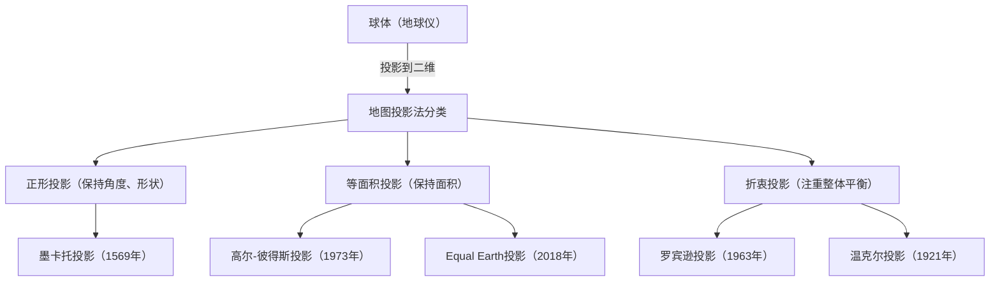

我们日常看到的“世界地图”。从智能手机屏幕上显示的数字地图，到教室墙上贴着的大海报，地图深深扎根于我们的生活中。然而，你是否曾深入思考过这样一个事实：画在平面上的世界地图，其实并不是“地球的准确样貌”。

地球的形状接近于三维的球体（严格来说是旋转椭球体），而我们使用的地图大多是二维平面。这种“将三维表面展开为二维”的行为，存在着不可避免的重大数学悖论。本文将从引领大航海时代的墨卡托投影，到引发政治波澜的彼得斯投影，再到现代的Equal Earth投影，为您梳理人类是如何理解地球这一巨大空间，并将其表现在平面上的，揭开其鲜为人知的历史与挣扎。

## 1. 将球体绘制在平面上的数学困境

在讲述地图投影法的历史时，首先必须理解由“[卡尔·弗里德里希·高斯](/zh-cn/p/gauss/)”所证明的数学大前提。19世纪伟大的数学家高斯推导出了被称为“绝妙定理（[Theorema Egregium](/zh-cn/p/theorema-egregium/)）”的微分几何学定理。根据这一定理，曲面的高斯曲率具有无论如何弯曲该曲面都不会改变的性质。

像地球这样的球面的高斯曲率是正数，而平面的高斯曲率是零。因此，将高斯曲率不同的曲面在没有拉伸、收缩或撕裂的情况下相互映射，在数学上是不可能的。这就像无法将剥下来的橘子皮毫无缝隙地展平成一个平整的长方形一样。

由于这种数学困境，任何世界地图都无法同时准确地保持以下四个要素。

1. **面积**（等面积性）：是否保持了实际陆地和海洋的面积比例
2. **角度・形状**（正形性）：是否保持了实际地形的轮廓以及相交线的角度
3. **距离**（等距离性）：是否保持了从特定点出发的距离比例
4. **方位**（正方位性）：是否正确保持了从特定点出发的方位

能够满足以上所有条件的只有“地球仪”。在制作平面地图时，地图制作者被迫做出“妥协”，为了某种目的而牺牲某些要素，优先考虑其他要素。这种选择本身就是地图投影法的历史。

## 2. 支撑大航海时代的革新：墨卡托投影

对于现代的我们来说，最熟悉的世界地图莫过于“墨卡托投影”了。1569年，佛兰德（现比利时）的地理学家杰拉杜斯·墨卡托发表了这幅地图，这是一项极大地改变了人类历史的突破性发明。

当时的欧洲正处于向未知大陆和海洋进发的“大航海时代”的鼎盛时期。然而，在广阔的海面上没有地标，水手们始终面临着遇险的风险。他们所需要的是“能确保抵达目的地的航海图”。

墨卡托投影最大的特征是“正形性”。经线和纬线始终垂直相交，连接任意两点的直线（等角航线）与实际指南针所指的方向一致。也就是说，水手只需在地图上用直线将出发地和目的地连接起来，测量该直线与经线之间的夹角（方位），然后保持指南针在该角度上航行，就能确保到达目的地。

这种功能强大的革命性地图，对航海家们来说简直是魔法工具。然而，在便利的背后却有着巨大的牺牲，那就是“面积的极度扭曲”。
在墨卡托投影中，纬度越高，东西和南北方向都会被放大，因此越靠近极地，被描绘出的面积就比实际面积大得多。

例如，在墨卡托投影上，格陵兰岛看起来与非洲大陆一样大，甚至更大。但比较实际面积，非洲大陆大约是格陵兰岛的14倍。同样，俄罗斯和加拿大等高纬度国家，也被强调为比实际面积大得多的广阔领土。

墨卡托本人最初是将此地图设计为仅供“航海使用”的。然而，由于其直线且整洁的美观外表，它开始被广泛应用于航海以外的通用地图和学校教育中，结果在几个世纪里扭曲了人们对“世界的空间认知”。

## 3. 政治与意识形态的投影：彼得斯投影的争论

进入20世纪后，对广泛继续使用墨卡托投影的批评开始增加。其背景不仅仅是追求纯粹的地理精确性，还深深交织着政治与社会的意识形态。

1973年，德国历史学家阿诺·彼得斯严厉批评道：“墨卡托投影不合理地将以欧洲为中心的的发达国家（位于北半球高纬度地区）画得很大，而将发展中国家众多的赤道附近地区（非洲、南美洲、东南亚等）画得很小。这是殖民主义白人至上主义的表现。”

随后，他作为“更平等、更正确的世界地图”而大张旗鼓发表的，便是“彼得斯投影（正式名称为高尔-彼得斯投影）”。这幅地图是一种“等面积投影”，即专门致力于准确反映全世界所有地区的实际面积比例。

看到彼得斯投影，我们会发现一个与我们习以为常的世界大相径庭的景象。欧洲被画得非常小，相反，非洲大陆和南美洲大陆显得纵向修长，其巨大的面积十分突出。对于第三世界国家来说，这成为了正当彰显本国存在感的强有力的视觉武器。联合国教科文组织（UNESCO）和许多国际非政府组织从公平性的角度出发，支持并采用了这幅地图。

然而，这引起了地图学专家的强烈反对。因为为了使面积准确，彼得斯投影中大陆的“形状（轮廓）”发生了极度的扭曲。赤道附近的国家看起来像是被纵向拉伸了，而高纬度地区则像是被横向压扁了。“形状不自然，没有实用价值”“彼得斯的观点不过是政治宣传”等激烈的争论随之爆发。

这场“彼得斯投影之争”是一起历史事件，它凸显了地图不仅是地理信息的表达，更是塑造观看者世界观、权力关系和政治意识形态的媒介。

## 4. 寻找美与实用性的妥协点：折衷投影

墨卡托投影的“面积谎言”与彼得斯投影的“形状扭曲”。由于两者都有着极端的因素，地图学家们开始寻找“面积和形状虽然都不完美，但在视觉上最自然、平衡最好的地图”。这就是“折衷投影”的诞生。

折衷投影的代表作是1963年美国地理学家亚瑟·H·罗宾逊发表的“罗宾逊投影”。罗宾逊并非从数学公式中推导出地图，而是以“在人类眼中看起来如何”这种视觉的、艺术的直觉作为出发点。他反复进行模拟，通过手工寻找出陆地形状不至于极度扭曲、且面积比例也不会偏离太多的妥协点，之后再将其转化为数学坐标。

罗宾逊投影整体呈现出圆润美丽的椭圆形，在我们的眼中显得非常自然。1988年，著名的国家地理学会将罗宾逊投影作为官方世界地图采用，使其成为了全球标准之一。

此后，国家地理学会又在1998年转向了“温克尔投影（温克尔-三重投影）”。由奥斯瓦尔德·温克尔发明的这一投影法，采取了将面积、角度、距离三种扭曲降至最低（三重在德语中意为“3”）的方法，被评价为比罗宾逊投影扭曲更小、更加平衡。在当前许多教科书和普通的世界地图中，这种类似于温克尔投影或罗宾逊投影的折衷投影已成为主流。

## 5. 现代的挑战与新的表达方式：AuthaGraph与Equal Earth投影

进入21世纪，地图投影法的演进仍未停止。在地球环境问题和全球化不断发展的今天，我们迫切需要以新的视角重新审视地球。

其中的一个尝试，是日本建筑师鸣川肇等人发明的“AuthaGraph（鸣川）世界地图”。这幅地图运用了独创的手法，将地球表面等分为96份并投影到正四面体上，然后将其展开成矩形平面图。其最大的优点是，在保持面积比例的同时，无论以哪个部分为中心，都可以无限拼接地图。它非常适合以无中心的全球视角来俯瞰海路和航线的网络、气候变化的影响等，并在2016年荣获了优良设计大奖（Good Design Award）。

近年来备受关注的新投影法，是2018年由博扬·沙夫里奇（Bojan Šavrič）、汤姆·帕特森（Tom Patterson）和伯恩哈德·珍妮（Bernhard Jenny）三位地图制作者联合发布的“Equal Earth投影”。

Equal Earth投影是为了克服彼得斯投影所存在的“形状极度不自然”的问题而开发的新型“等面积投影（面积准确的地图）”。他们的目标是，既要拥有像罗宾逊投影那样看起来柔和圆润的外观，又要确保各大陆和国家的面积比例完全准确。

开发的动机之一是强烈的危机感：在将气候变化和环境问题的数据可视化时，如果面积不准确就会引起误解。例如，在展示森林砍伐或海平面上升的影响时，墨卡托投影会过分夸大高纬度地区的影响。Equal Earth投影正是因为现代计算机技术的发展使得高度计算成为可能，才得以实现的兼具美感与科学准确性的创新设计。目前，它已被广泛应用于NASA（美国国家航空航天局）和GISS（戈达德太空飞行中心）的气候数据地图等领域。

## 结语：地图即世界观

回顾从墨卡托投影到Equal Earth投影的地图投影法历史，我们可以发现，其中反映的不仅是测绘技术和数学的发展，更是各个时代人们“希望如何看待地球，应该如何利用地球”的强烈意愿。

拯救航海家生命、使全球贸易成为可能的正形性。
引发对南北问题与不平等现象的关注、带来多元视角的等面积性。
以及追求整体和谐、有助于解决复杂现代社会问题的新表达方式。

我们所注视的世界地图，绝不是绝对的“真实面貌”。它是人类为了符合自身的目的和价值观，将广阔无垠的三维地球翻译成二维平面的众多“解释”之一。下次再欣赏世界地图时，不妨想象一下那张纸（或屏幕）上所承载的地图制作者们数百年来的试错与挣扎。我们如何看待世界，正是由我们选择了哪张地图所塑造的。
