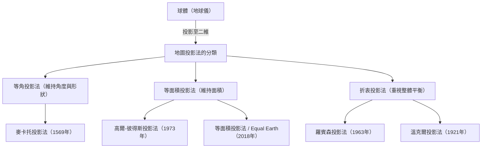

我們日常所見到的「世界地圖」。從智慧型手機螢幕上顯示的數位地圖，到教室牆上張貼的大海報，地圖深植於我們的生活中。然而，畫在平面上的世界地圖，其實並非「地球真實的樣貌」，您是否曾對這個事實進行過深入的思考呢？

地球的形狀接近三維球體（嚴格來說是旋轉橢球體），但我們使用的地圖大多是二維平面。這種「將三維表面展開為二維」的行為，存在著一個無可避免的重大數學悖論。本文將從引領大航海時代的麥卡托投影法，到引發政治波瀾的彼得斯投影法，再到現代的等面積投影法（Equal Earth），為您解開人類如何認知地球這個巨大的空間，以及如何將其表現在平面上的不為人知的歷史與糾葛。

## 1. 將球體繪製在平面上的數學困境

在講述地圖投影法歷史之前，首先必須理解由「卡爾·弗里德里希·高斯」所證明的數學大前提。19世紀偉大的數學家高斯，推導出了被稱為「絕妙定理（Theorema Egregium）」的微分幾何學定理。根據這個定理，曲面的高斯曲率具有即使將該曲面彎曲也不會改變的性質。

像地球這樣球面的高斯曲率為正，而平面的高斯曲率為零。因此，將高斯曲率不同的曲面，在不拉伸、縮小或撕裂的情況下相互映射，在數學上是不可能的。這與無法將橘子皮剝下，然後毫無縫隙地將其攤平成一張平坦的長方形是相同的原理。

由於這個數學困境，無論什麼樣的世界地圖，都無法同時準確地保持以下四個要素。

1. **面積**（等面積性）：是否保持了實際陸地或海洋的面積比例
2. **角度・形狀**（等角性）：是否保持了實際地形的輪廓，以及相交線條的角度
3. **距離**（等距性）：從特定點出發的距離比例是否得以保持
4. **方位**（等方位性）：從特定點出發的方位是否正確保持

能同時滿足這些條件的只有「地球儀」。在製作平面地圖時，地圖製作者被迫面臨為了目的而犧牲某些東西、優先考慮某些東西的「妥協」。這個選擇本身，可以說就是地圖投影法的歷史。

## 2. 支撐大航海時代的創新：麥卡托投影法

對現代的我們來說最熟悉的世界地圖，莫過於「麥卡托投影法」了。1569年，由法蘭德斯（今比利時）地理學家傑拉杜斯·麥卡托發表的這張地圖，是大幅改變人類歷史的劃時代發明。

當時的歐洲正處於向未知大陸與海洋進發的「大航海時代」鼎盛時期。然而，在廣闊的海面上沒有可以作為路標的東西，水手們總是面臨著遇難的風險。他們所尋求的，是「能確實抵達目的地的海圖」。

麥卡托投影法的最大特徵在於「等角性」。經線與緯線始終以直角相交，連接任意兩點的直線（等角航線），與實際指南針所指的方向一致。也就是說，水手只要在地圖上用直線連接出發地與目的地，測量該直線與經線所成的角度（方位），並保持指南針在該角度前進，就能確實抵達目的地。

這張具備功能性且劃時代的地圖，對航海士來說簡直是魔法工具。然而，這種便利性的背後卻有著巨大的犧牲。那就是「面積的極度扭曲」。
在麥卡托投影法中，緯度越高的地方，東西向與南北向都會被放大，因此越靠近極地，被描繪出的面積就比實際面積大得多。

例如，在麥卡托投影法上，格陵蘭島看起來與非洲大陸一樣大，甚至更大。但比較實際面積，非洲大陸大約是格陵蘭島的14倍大。同樣地，俄羅斯或加拿大等高緯度國家，也會被強調成比實際面積更廣闊的領域。

麥卡托本人原本就打算將這張地圖專門用於「航海」。然而，由於其直線且俐落的外觀美感，它開始被廣泛應用於航海以外的一般大眾地圖或學校教育中，結果導致幾世紀以來扭曲了人們對「世界的空間認知」。

## 3. 政治與意識形態的投影：彼得斯投影法的爭議

進入20世紀後，對於普遍繼續使用麥卡托投影法的批判開始高漲。其背景不僅是單純追求地理上的準確性，還深深交織著政治與社會的意識形態。

1973年，德國歷史學家阿諾·彼得斯提出了強烈的批判：「麥卡托投影法不公平地將以歐洲為中心的已開發國家（位於北半球高緯度）畫得很大，而將許多開發中國家所在的赤道附近（非洲、南美洲、東南亞等）縮小。這是殖民主義中白人至上主義的表現。」

然後，他作為「更平等、更正確的世界地圖」而大張旗鼓發表的，就是「彼得斯投影法（正式名稱為高爾-彼得斯投影法）」。這張地圖是「等面積投影法」，也就是專門為了準確反映世界所有地區的實際面積比例而製作。

看著彼得斯投影法，會浮現出與我們所熟悉的世界截然不同的樣貌。歐洲被畫得很小，相反地，非洲大陸與南美洲大陸則顯得細長，凸顯了它們的巨大。這對於第三世界國家來說，成為了正當宣傳本國存在感的強大視覺武器。聯合國教科文組織（UNESCO）與許多國際非政府組織基於公平性的觀點，支持並採用了這張地圖。

然而，地圖學的專家們卻提出了強烈的反對。因為為了使面積準確，彼得斯投影法極度扭曲了大陸的「形狀（輪廓）」。赤道附近的國家看起來像被垂直拉長，而高緯度地區則像被橫向壓扁。引發了「形狀不自然且不實用」、「彼得斯的觀點不過是政治宣傳」等激烈的爭論。

這場「彼得斯投影法爭議」，凸顯了地圖不僅僅是地理資訊的呈現，更是形塑觀看者世界觀、權力關係與政治意識形態的媒介，是一個歷史性的事件。

## 4. 尋找美感與實用性的妥協點：折衷投影法

麥卡托投影法的「面積謊言」，與彼得斯投影法的「形狀扭曲」。由於兩者都帶有極端的要素，地圖學者們開始摸索「雖然面積與形狀都不完美，但在視覺上最自然、平衡最好的地圖」。這就是「折衷投影法」的誕生。

折衷投影法的代表作，是1963年由美國地理學家亞瑟·H·羅賓森發表的「羅賓森投影法」。羅賓森並非從數學公式推導出地圖，而是以「在人類眼中看起來如何」的視覺與藝術直覺為出發點。他反覆進行了多次模擬，以手工尋找陸地形狀不會極度扭曲、且面積比例也不會偏差太大的妥協點，然後再將其轉換為數學座標。

羅賓森投影法整體呈現圓潤美麗的橢圓形，在我們眼中看起來非常自然。1988年，著名的國家地理學會將羅賓森投影法採用為官方世界地圖，使其成為全球標準之一。

其後，國家地理學會更於1998年過渡到「溫克爾投影法（溫克爾三矢投影法）」。由奧斯瓦爾德·溫克爾設計的這種投影法，採取了將面積、角度、距離這三種扭曲降至最低（Tripel在德語中意為「三」）的方法，被評價為比羅賓森投影法的扭曲更少且更為平衡。在現在許多教科書與一般世界地圖中，這類溫克爾投影法或羅賓森投影法等折衷投影法已成為主流。

## 5. 現代的挑戰與新表現：AuthaGraph 與 Equal Earth 投影法

進入21世紀，地圖投影法的演進仍未停止。在地球環境問題與全球化不斷推進的現代，我們被迫需要以全新的視角重新認識地球。

其中一個嘗試，是由日本建築師鳴川肇等人設計的「AuthaGraph世界地圖」。這張地圖運用了獨創的手法，將地球表面等分成96等份並投影在正四面體上，接著將其展開成平面的長方形。其最大的優點在於，在保持面積比例的同時，無論以哪個部分為中心，都可以無限地將地圖並排拼接。它非常適合以沒有中心的全球視角來俯瞰世界，例如海路與空路的網路、氣候變遷的影響等，並於2016年榮獲好設計大獎。

近年來最受矚目的新投影法，是2018年由博揚·薩夫里奇、湯姆·帕特森以及伯恩哈德·珍妮三位地圖製作者所發表的「等面積投影法（Equal Earth）」。

等面積投影法是為了克服彼得斯投影法所存在的「形狀極度不自然」問題而開發的全新「等面積投影法（面積正確的地圖）」。他們的目標是製作出一張地圖，既具有像羅賓森投影法那樣對視覺友善的圓潤外觀，同時又能讓各大陸與國家的面積比例完全正確。

開發的動機之一，是強烈的危機感，認為在將氣候變遷或環境問題的數據視覺化時，如果面積不準確將會產生誤導。例如，在展示森林砍伐或海平面上升的影響時，麥卡托投影法會高估高緯度地區的影響。等面積投影法，正是因為現代電腦技術的發展使得高度計算成為可能才得以實現，它是一種兼具美感與科學準確性的創新設計。目前，美國國家航空暨太空總署（NASA）及戈達德太空飛行中心（GISS）的氣候數據地圖等也正逐漸擴大採用此投影法。

## 結語：地圖就是世界觀本身

回顧從麥卡托投影到等面積投影的地圖投影法歷史，我們可以發現其中不僅反映了測量技術與數學的發展，更反映了各個時代人們「想如何看待地球、該如何利用地球」的強烈意志。

拯救了航海士的性命，使世界規模的貿易成為可能的等角性。
對南北問題與不平等現象投下震撼彈，帶來多元視角的等面積性。
還有追求整體和諧，為解決複雜現代社會課題做出貢獻的新表現。

我們所注視的世界地圖，絕對不是絕對的「真實樣貌」。那是人類將無限廣闊的三維地球，配合自己的目的與價值觀，翻譯成二維的一種「詮釋」。下次當您凝視世界地圖時，請務必將思緒馳騁於那張紙（或螢幕）中所蘊含的，數百年來地圖製作者們的試錯與糾葛的歷史。我們如何看待世界，正由我們選擇哪一張地圖所形塑。
