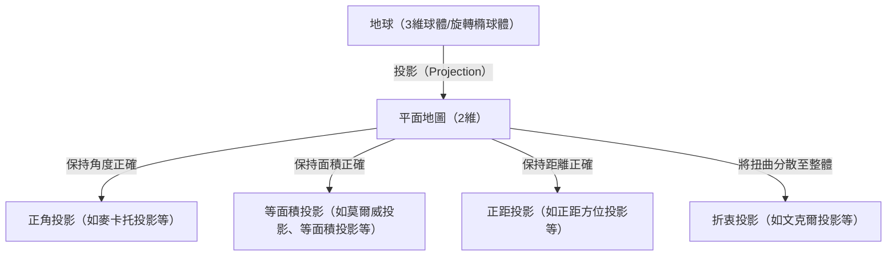
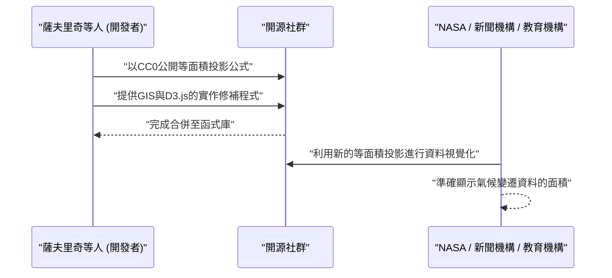

# 導論：將球體繪製於平面的終極矛盾

自古以來，人類為了理解和記錄自己居住的世界而繪製地圖。然而，這裡始終存在一個巨大的矛盾：「要在二維平面（地圖）上毫無扭曲地展開三維球體（地球），在數學上是不可能的。」這項數學真理正如卡爾·弗里德里希·高斯在《絕妙定理（Theorema Egregium）》中所證明的：曲率不同的曲面之間無法進行等距映射。

就像試圖將橘子皮攤平時必定會裂開或起皺一樣，將地球轉換為平面地圖時，也必然會產生某種「扭曲」。地圖投影法（Map Projection）的歷史，無非就是人類如何面對這種不可避免的「扭曲」，以及決定犧牲哪些要素（面積、角度、距離、方位）並保留哪些要素的妥協與選擇之歷史。

本文將探討從16世紀麥卡托投影法的誕生，到21世紀最新等面積投影（Equal Earth projection）為止的地圖投影演進，並結合數學、歷史及社會背景進行深入挖掘。



## 第1章：大航海時代與麥卡托投影法的誕生

### 1.1 航海者們的苦惱

在15世紀末到16世紀的大航海時代，歐洲的航海者們駛向了未知的海洋。隨著哥倫布抵達美洲、麥哲倫環繞地球等事件，世界急劇擴大，對準確海圖的需求呈現爆炸性增長。

當時的海圖，主要是依靠從中心呈放射狀繪製的方位線（羅盤線）來航行的波特蘭型海圖。然而，在長距離航行，特別是橫渡大洋的航行中，由於地球是球體而產生的誤差變得無法忽視。航海者們強烈需要一種「只要沿著指南針指示的固定方位（等角航線）直線前進，就能抵達目的地的地圖」。

### 1.2 傑拉杜斯·麥卡托的革新

1569年，法蘭德斯（今比利時）的地理學家傑拉杜斯·麥卡托（Gerardus Mercator）發表了一幅回應航海者迫切需求、具有劃時代意義的世界地圖。那就是「麥卡托投影法」。

麥卡托投影法的最大特徵在於：「連接任意兩點的直線，始終指示一定的羅盤方位（等角航線以直線表示）」。因此，航海者只需在地圖上用尺畫一條直線，就能得知通往目的地的羅盤方位。

### 1.3 麥卡托投影法的數學根據

麥卡托投影法可視為圓柱投影法的一種。想像將圓柱體纏繞在地球赤道上，從地球中心發出光源，將地圖投影到圓柱體內側。然而，麥卡托並非單純的投影，而是透過數學計算調整了緯線的間距。

設經度為 $\lambda$、緯度為 $\phi$，地圖上的座標為 $(x, y)$，則麥卡托投影法的投影公式如下（假設地球為正球體，半徑為 $R$）。

$$ x = R(\lambda - \lambda_0) $$
$$ y = R \ln \left( \tan\left(\frac{\pi}{4} + \frac{\phi}{2}\right) \right) $$

在此，$\lambda_0$ 為基準的中央經線。如公式所示，緯度越高，$y$ 的值就會急劇增大，在極點（$\phi = \pm \pi/2$）時則發散至無限大（$\infty$）。

以下是使用 Python 進行麥卡托投影法座標轉換的簡單程式碼片段。

```python
import math

def latlon_to_mercator(lat, lon, R=6378137.0):
    """
    從緯度經度轉換為麥卡托投影XY座標（公尺）的函式
    相當於 EPSG:3857 (Web Mercator) 的計算
    """
    # 將緯度經度轉換為弧度
    lat_rad = math.radians(lat)
    lon_rad = math.radians(lon)
    
    # 計算X座標
    x = R * lon_rad
    
    # 計算Y座標（古德曼函式的反函式）
    y = R * math.log(math.tan(math.pi / 4.0 + lat_rad / 2.0))
    
    return x, y

# 範例：東京（緯度35.6812, 經度139.7671）的計算
x, y = latlon_to_mercator(35.6812, 139.7671)
print(f"Tokyo (Mercator): X={x:.2f}, Y={y:.2f}")
```

### 1.4 麥卡托投影法的光與影

麥卡托投影法具有「正角性（保持角度正確）」，因此局部形狀與現實一致。但是，其代價是抱有「面積」極度扭曲的致命缺點。高緯度地區被過度放大，導致格陵蘭島被畫得與非洲大陸差不多大，但實際上非洲大陸的面積約為格陵蘭島的14倍。

這種面積的扭曲，後來引發了政治與社會問題。歐洲與北美等北半球高緯度地區被過度誇大，而赤道附近的開發中國家卻被畫得很小，因此受到了「灌輸以歐美為中心之世界觀」的批評。

## 第2章：追求面積的準確性：等面積投影的系譜

出於對麥卡托投影法面積扭曲的批評，許多保持面積比例正確的「等面積投影法」應運而生。

### 2.1 桑遜投影與莫爾威投影

在17世紀，由法國的尼古拉·桑遜等人使用的「桑遜投影法（Sanson-Flamsteed projection）」逐漸普及。這是一種緯線為等距平行線，經線以正弦曲線（Sine curve）繪製的等面積投影法。雖然中央經線附近的扭曲較小，但具有周邊部分（特別是高緯度地區）形狀扭曲嚴重的缺點。

改良此缺點的是1805年由德國數學家卡爾·莫爾威發表的「莫爾威投影法（Mollweide projection）」。莫爾威投影法將整個地球收納在一個橢圓形中，並比桑遜投影法減輕了高緯度地區的形狀扭曲。

### 2.2 古德的同形等面積投影（中斷投影法）

進入20世紀後，開始有在減少形狀扭曲的同時保持等面積性的嘗試。1923年，美國地理學家約翰·保羅·古德發表了「古德投影法（同形等面積投影法）」。

這採取了一種奇特的「中斷投影法」方式，將低緯度地區的桑遜投影法與高緯度地區的莫爾威投影法拼接在一起，並進一步將海洋部分（或大陸部分）撕裂來表現。透過這種方式，能夠將各大洲形狀的扭曲降至最低，同時以正確的面積比例俯瞰世界。然而，由於海洋被切開，難以直觀掌握連續的地球樣貌是其缺點。

## 第3章：冷戰與彼得斯投影法之爭

地圖投影法不僅僅停留在數學或地理學問題，甚至發展成捲入意識形態對立的大論戰，這就是1970年代圍繞「彼得斯投影法（Peters projection）」的風波。

### 3.1 蓋爾的等面積圓柱投影與阿諾·彼得斯的主張

1973年，德國歷史學家阿諾·彼得斯強烈批評「麥卡托投影法是傲慢的歐洲中心主義地圖，刻意縮小第三世界」，並發表了獨創的「彼得斯投影法」。他大力宣傳這是一幅「平等描繪所有人，真正公平且嶄新的世界地圖」。

彼得斯投影法屬於等面積投影法，高緯度地區不會像麥卡托投影法那樣被極度放大。因此，聯合國機構及許多NGO、宗教團體等支持這幅地圖，並廣泛採用為啟蒙海報。

### 3.2 來自地圖學界的強烈反彈

然而，對於彼得斯的發表，專業的地圖學家們卻強烈反彈。原因如下：

1. **抄襲疑雲**：在數學上，彼得斯投影法與1855年英國詹姆斯·蓋爾發表的「蓋爾等面積圓柱投影法」完全相同。這在地圖學界是已知的投影法，並非彼得斯原創。
2. **形狀嚴重扭曲**：為了保持等面積性而採用圓柱投影的結果，低緯度地區（非洲與南美）被極度縱向拉長，高緯度地區（歐洲與加拿大）則呈現被橫向壓扁的非常難看的形狀。
3. **作為政治宣傳工具**：地圖學家們譴責彼得斯無視地圖投影法的數學取捨（若保持面積則形狀會扭曲），不當地將麥卡托投影法視為反派，以此進行意識形態的宣傳。

這場論戰讓全世界重新認識到，地圖並非單純客觀現實的描摹，而是會對觀看者的世界觀與政治意識產生強烈影響的媒介。

## 第4章：妥協的藝術：折衷投影的興起

無論是面積還是形狀，如果想完美保留其中一方，另一方就必須極度犧牲。因此，捨棄嚴格的等面積性或正角性，追求「視覺自然感」與「整體扭曲較少」的「折衷投影（Compromise projection）」，成為了20世紀後半一般用途世界地圖的主流。

### 4.1 羅賓森投影法

1963年，由美國地圖學家亞瑟·H·羅賓森所設計的「羅賓森投影法（Robinson projection）」，並非從數學公式出發，而是採取了將「視覺美感」放在首位，憑經驗決定緯線長度與間距的獨特方式。

這項投影法在1988年被國家地理學會採納為官方世界地圖，因而廣受全世界認可。

### 4.2 文克爾第三投影法

隨後，國家地理學會在1998年以「文克爾第三投影法（Winkel Tripel projection）」取代了羅賓森投影法。這項由德國奧斯華·文克爾在1921年設計的投影法，是愛托夫投影法與正距圓柱投影法的算術平均。「Tripel」在德語中意味著「三個」，表示其試圖將面積、角度、距離這三個扭曲降至最低。至今，它仍被許多學習筆記本或地圖集作為標準的世界地圖使用。

## 第5章：數位時代的新挑戰：等面積投影（Equal Earth）的誕生

進入21世紀，我們與地圖的互動方式發生了劇烈變化。這歸因於 Google Maps 等網路地圖服務的普及。在這些網路地圖中，為了讓縮放操作更加流暢，諷刺的是再次採用了「麥卡托投影法（Web麥卡托）」。（近年來已有改善，當縮小時會切換為3D地球儀模型）。

然而，在討論氣候變遷或全球貧富差距等全球性議題的場合，以「正確的面積比例」將世界視覺化的重要性依然很高，因此需要新的等面積投影法。

### 5.1 博揚·薩夫里奇等人的挑戰

2018年，由博揚·薩夫里奇（Bojan Šavrič）、湯姆·帕特森（Tom Patterson）與伯恩哈德·珍妮（Bernhard Jenny）三位地圖學家，發表了全新的等面積投影法「等面積投影（Equal Earth projection）」。

他們的目標很明確：
「創造一幅不會像彼得斯投影法那樣形狀嚴重扭曲，且像羅賓森投影法般看起來自然優美，同時具備嚴格等面積性的世界地圖。」

### 5.2 等面積投影法的數學革新

等面積投影法（Equal Earth projection）的外形與羅賓森投影法極為相似，但使用了高級多項式來實現嚴格的等面積性。其投影公式如下：

設緯度為 $\phi$、經度為 $\lambda$（與中央經線的差），並令 $ \theta $ 為滿足 $ \sin \theta = \frac{\sqrt{3}}{2} \sin \phi $ 的角。

$$ x = \frac{2\sqrt{3} \lambda \cos \theta}{3 (9 A_4 \theta^8 + 7 A_3 \theta^6 + 3 A_2 \theta^2 + A_1)} $$
$$ y = A_4 \theta^9 + A_3 \theta^7 + A_2 \theta^3 + A_1 \theta $$

在此，係數如下：
$ A_1 = 1.340264 $
$ A_2 = -0.081106 $
$ A_3 = 0.000893 $
$ A_4 = 0.003796 $

透過這些複雜的數學公式，等面積投影法成功地在赤道附近不被拉長，高緯度不被極度壓扁的情況下，自然地保持大陸形狀並表現正確的面積比例。

### 5.3 作為開源的普及

等面積投影法的劃時代之處，不僅在於其設計，還在於其普及的推廣方式。開發者們將該投影法的數學公式以公有領域（CC0）形式公開，並積極推動其迅速實作到 QGIS 等開源 GIS 軟體，以及 D3.js 等資料視覺化函式庫中。

結果，它迅速被世界各地的科學家與媒體所接受，例如被美國太空總署（NASA）用於全球氣溫異常地圖等。



## 結論：地圖創造世界

從麥卡托投影法到等面積投影法的歷史，也是人類「如何認知並傳達自己居住的世界」這種思想變遷的歷史。

在大航海時代，「確實抵達目的地」被放在首位（正角性）；在殖民統治時代，偏好能誇耀本國遼闊疆域的地圖。在冷戰時期，呼籲糾正南北問題的地圖引發討論；而在現代，則需要能平實看待氣候變遷等全球性議題的地圖（等面積性＋自然形狀）。

**「地圖是反映世界的鏡子，同時也是創造世界的鏡頭」**。

當我們看地圖時，必須隨時意識到它是建立在何種數學妥協之上，並帶有何種意圖繪製而成。等面積投影法，可以說是展現現代人試圖如何重新審視世界，最新的一面「鏡頭」。
