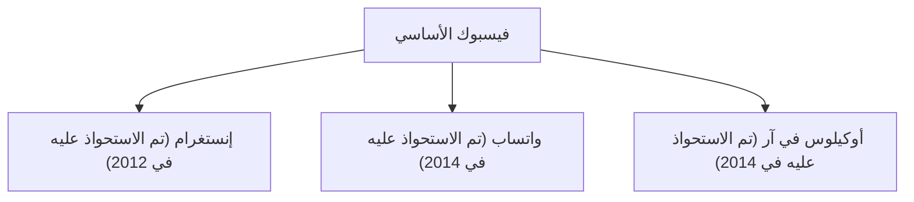

## 1. ولادة فيسبوك
في عام 2004، أطلق مارك زوكربيرغ فيسبوك من غرفته في سكن جامعة هارفارد.

## 2. تحدي الميتافيرس
في عام 2021، غيرت الشركة اسمها إلى "ميتا" (Meta)، وأعلنت عن استثمارات ضخمة في الواقع الافتراضي (الميتافيرس).
