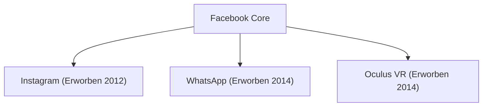

## 1. Die Entstehung von Facebook
Im Jahr 2004 gründete Mark Zuckerberg Facebook in einem Wohnheim der Harvard University.

## 2. Die Herausforderung des Metaversums
Im Jahr 2021 änderte das Unternehmen seinen Namen in „Meta“ und kündigte enorme Investitionen in die virtuelle Realität (Metaversum) an.
