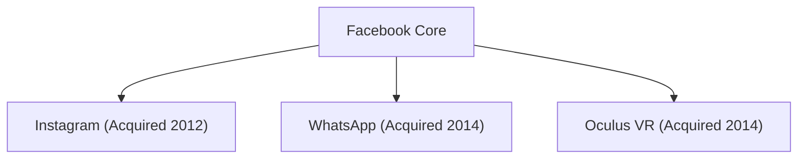

## 1. The Birth of Facebook
In 2004, Mark Zuckerberg launched Facebook in his Harvard University dorm room.

## 2. The Challenge of the Metaverse
In 2021, the company changed its name to "Meta" and announced a massive investment in virtual reality (the metaverse).
