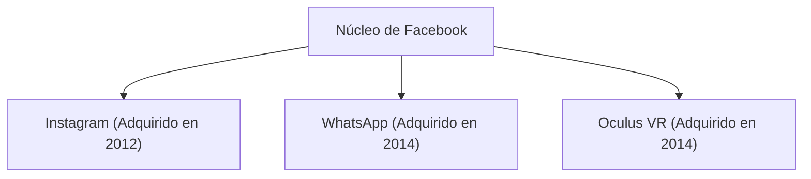

## 1. El nacimiento de Facebook
En 2004, Mark Zuckerberg fundó Facebook en su dormitorio de la Universidad de Harvard.

## 2. El desafío hacia el metaverso
En 2021, la empresa cambió su nombre a "Meta" y anunció una inversión masiva en realidad virtual (metaverso).
