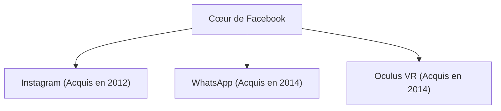

## 1. La naissance de Facebook
En 2004, Mark Zuckerberg a lancé Facebook depuis son dortoir à l'Université de Harvard.

## 2. Le défi du métavers
En 2021, l'entreprise a changé son nom en "Meta" et a déclaré un investissement massif dans la réalité virtuelle (métavers).
