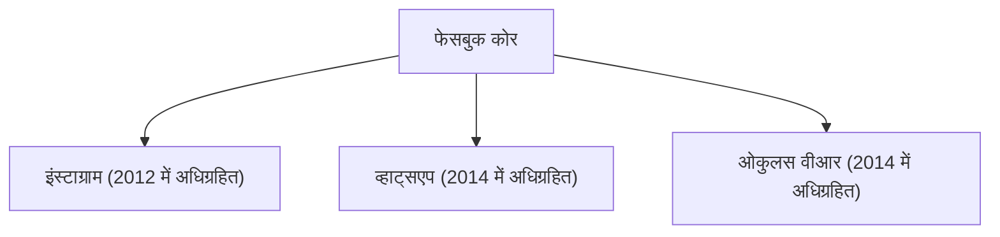

## 1. फेसबुक का जन्म
2004 में, मार्क जुकरबर्ग ने हार्वर्ड यूनिवर्सिटी के अपने डॉर्म रूम में फेसबुक की शुरुआत की।

## 2. मेटावर्स की चुनौती
2021 में, कंपनी ने अपना नाम बदलकर "मेटा" (Meta) कर लिया और वर्चुअल रियलिटी (मेटावर्स) में भारी निवेश की घोषणा की।
