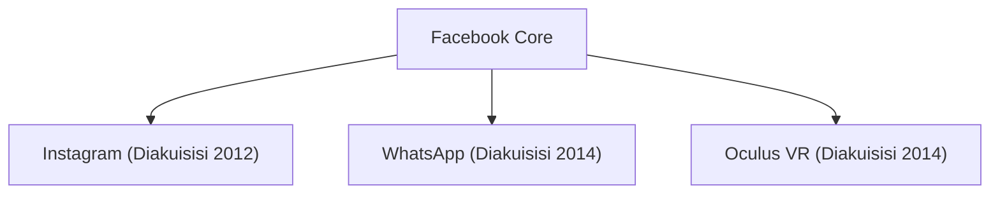

## 1. Lahirnya Facebook
Pada tahun 2004, Mark Zuckerberg mendirikan Facebook di asrama Universitas Harvard.

## 2. Tantangan menuju Metaverse
Pada tahun 2021, perusahaan mengubah namanya menjadi "Meta" dan mengumumkan investasi besar-besaran dalam realitas virtual (metaverse).
