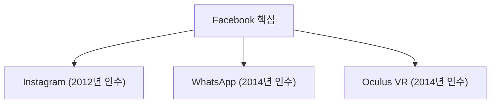

## 1. Facebook의 탄생
2004년, 마크 저커버그가 하버드 대학교 기숙사에서 Facebook을 설립했습니다.

```mermaid
graph TD
    FB["Facebook 핵심"] --> IG["Instagram (2012년 인수)"]
    FB --> WA["WhatsApp (2014년 인수)"]
    FB --> OR["Oculus VR (2014년 인수)"]
```

## 2. 메타버스로의 도전
2021년, 회사명을 'Meta'로 변경하고, 가상 현실(메타버스)에 대한 막대한 투자를 선언.
