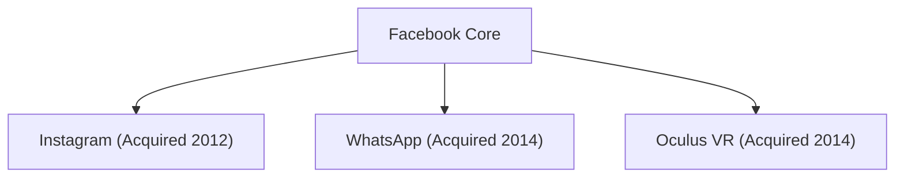

## 1. Facebookの誕生
2004年、マーク・ザッカーバーグがハーバード大学の寮でFacebookを立ち上げました。

## 2. メタバースへの挑戦
2021年、社名を「Meta」に変更し、仮想現実（メタバース）への莫大な投資を宣言。

## 追加技術検証パート 1

### 1. Facebookの誕生
2004年、マーク・ザッカーバーグがハーバード大学の寮でFacebookを立ち上げました。

### 2. メタバースへの挑戦
2021年、社名を「Meta」に変更し、仮想現実（メタバース）への莫大な投資を宣言。

## 追加技術検証パート 2

### 1. Facebookの誕生
2004年、マーク・ザッカーバーグがハーバード大学の寮でFacebookを立ち上げました。

### 2. メタバースへの挑戦
2021年、社名を「Meta」に変更し、仮想現実（メタバース）への莫大な投資を宣言。

## 追加技術検証パート 3

### 1. Facebookの誕生
2004年、マーク・ザッカーバーグがハーバード大学の寮でFacebookを立ち上げました。

### 2. メタバースへの挑戦
2021年、社名を「Meta」に変更し、仮想現実（メタバース）への莫大な投資を宣言。

## 追加技術検証パート 4

### 1. Facebookの誕生
2004年、マーク・ザッカーバーグがハーバード大学の寮でFacebookを立ち上げました。

### 2. メタバースへの挑戦
2021年、社名を「Meta」に変更し、仮想現実（メタバース）への莫大な投資を宣言。

## 追加技術検証パート 5

### 1. Facebookの誕生
2004年、マーク・ザッカーバーグがハーバード大学の寮でFacebookを立ち上げました。

### 2. メタバースへの挑戦
2021年、社名を「Meta」に変更し、仮想現実（メタバース）への莫大な投資を宣言。

## 追加技術検証パート 6

### 1. Facebookの誕生
2004年、マーク・ザッカーバーグがハーバード大学の寮でFacebookを立ち上げました。

### 2. メタバースへの挑戦
2021年、社名を「Meta」に変更し、仮想現実（メタバース）への莫大な投資を宣言。

## 追加技術検証パート 7

### 1. Facebookの誕生
2004年、マーク・ザッカーバーグがハーバード大学の寮でFacebookを立ち上げました。

### 2. メタバースへの挑戦
2021年、社名を「Meta」に変更し、仮想現実（メタバース）への莫大な投資を宣言。

## 追加技術検証パート 8

### 1. Facebookの誕生
2004年、マーク・ザッカーバーグがハーバード大学の寮でFacebookを立ち上げました。

### 2. メタバースへの挑戦
2021年、社名を「Meta」に変更し、仮想現実（メタバース）への莫大な投資を宣言。

## 追加技術検証パート 9

### 1. Facebookの誕生
2004年、マーク・ザッカーバーグがハーバード大学の寮でFacebookを立ち上げました。

### 2. メタバースへの挑戦
2021年、社名を「Meta」に変更し、仮想現実（メタバース）への莫大な投資を宣言。

## 追加技術検証パート 10

### 1. Facebookの誕生
2004年、マーク・ザッカーバーグがハーバード大学の寮でFacebookを立ち上げました。

### 2. メタバースへの挑戦
2021年、社名を「Meta」に変更し、仮想現実（メタバース）への莫大な投資を宣言。

## 追加技術検証パート 11

### 1. Facebookの誕生
2004年、マーク・ザッカーバーグがハーバード大学の寮でFacebookを立ち上げました。

### 2. メタバースへの挑戦
2021年、社名を「Meta」に変更し、仮想現実（メタバース）への莫大な投資を宣言。

## 追加技術検証パート 12

### 1. Facebookの誕生
2004年、マーク・ザッカーバーグがハーバード大学の寮でFacebookを立ち上げました。

### 2. メタバースへの挑戦
2021年、社名を「Meta」に変更し、仮想現実（メタバース）への莫大な投資を宣言。

## 追加技術検証パート 13

### 1. Facebookの誕生
2004年、マーク・ザッカーバーグがハーバード大学の寮でFacebookを立ち上げました。

### 2. メタバースへの挑戦
2021年、社名を「Meta」に変更し、仮想現実（メタバース）への莫大な投資を宣言。

## 追加技術検証パート 14

### 1. Facebookの誕生
2004年、マーク・ザッカーバーグがハーバード大学の寮でFacebookを立ち上げました。

### 2. メタバースへの挑戦
2021年、社名を「Meta」に変更し、仮想現実（メタバース）への莫大な投資を宣言。
