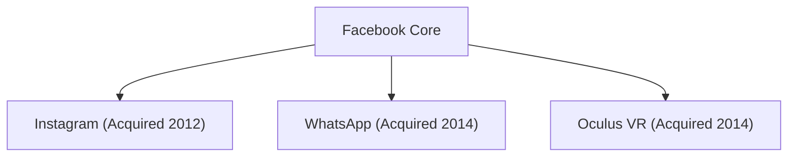

## 1. Facebookの誕生
2004年、マーク・ザッカーバーグがハーバード大学の寮でFacebookを立ち上げました。

```mermaid
graph TD
    FB["Facebook Core"] --> IG["Instagram (Acquired 2012)"]
    FB --> WA["WhatsApp (Acquired 2014)"]
    FB --> OR["Oculus VR (Acquired 2014)"]
```

## 2. メタバースへの挑戦
2021年、社名を「Meta」に変更し、仮想現実（メタバース）への莫大な投資を宣言。
