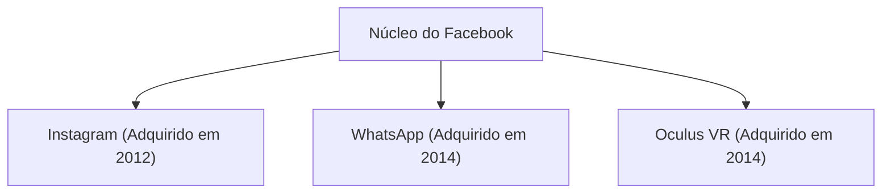

## 1. O Nascimento do Facebook
Em 2004, Mark Zuckerberg fundou o Facebook em seu dormitório na Universidade de Harvard.

## 2. O Desafio do Metaverso
Em 2021, a empresa mudou seu nome para "Meta" e anunciou investimentos maciços em realidade virtual (metaverso).
