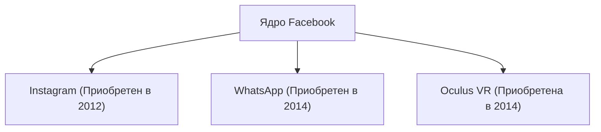

## 1. Рождение Facebook
В 2004 году Марк Цукерберг запустил Facebook в общежитии Гарвардского университета.

## 2. Вызов метавселенной
В 2021 году компания сменила название на «Meta» и объявила об огромных инвестициях в виртуальную реальность (метавселенную).
