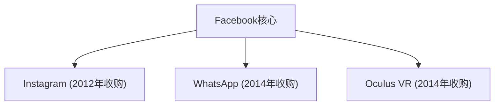

## 1. Facebook的诞生
2004年，马克·扎克伯格在哈佛大学的宿舍里创立了Facebook。

```mermaid
graph TD
    FB["Facebook核心"] --> IG["Instagram (2012年收购)"]
    FB --> WA["WhatsApp (2014年收购)"]
    FB --> OR["Oculus VR (2014年收购)"]
```

## 2. 对元宇宙的挑战
2021年，将公司名称更改为“Meta”，并宣布对虚拟现实（元宇宙）进行巨额投资。
