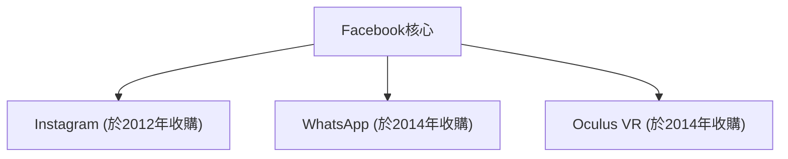

## 1. Facebook的誕生
2004年，馬克·祖克柏在哈佛大學的宿舍裡創立了Facebook。

```mermaid
graph TD
    FB["Facebook核心"] --> IG["Instagram (於2012年收購)"]
    FB --> WA["WhatsApp (於2014年收購)"]
    FB --> OR["Oculus VR (於2014年收購)"]
```

## 2. 挑戰元宇宙
2021年，將公司名稱變更為「Meta」，並宣佈對虛擬實境（元宇宙）進行巨額投資。
