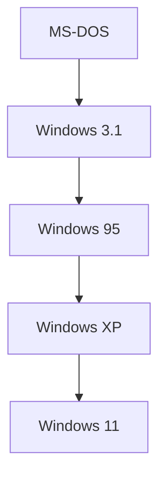

## 1. فجر الكمبيوتر الشخصي و MS-DOS
تأسست في عام 1975 على يد بيل غيتس وبول ألين.

## 2. "السحابة أولاً" بقيادة ساتيا ناديلا
بعد عصر بالمر، أصبح ساتيا ناديلا الرئيس التنفيذي. لقد ابتعدت الشركة عن "الاعتماد على Windows" وتحولت نحو التركيز على Azure.
