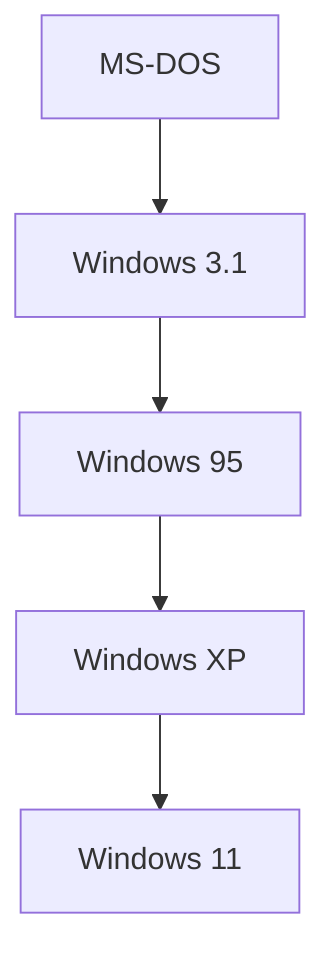

## 1. Die Morgendämmerung des PC und MS-DOS
1975 von Bill Gates und Paul Allen gegründet.

## 2. „Cloud-First“ durch Satya Nadella
Nach der Ballmer-Ära wurde Satya Nadella CEO. Das Unternehmen löste sich von der „Windows-Abhängigkeit“ und vollzog einen Pivot hin zu Azure als Mittelpunkt.
