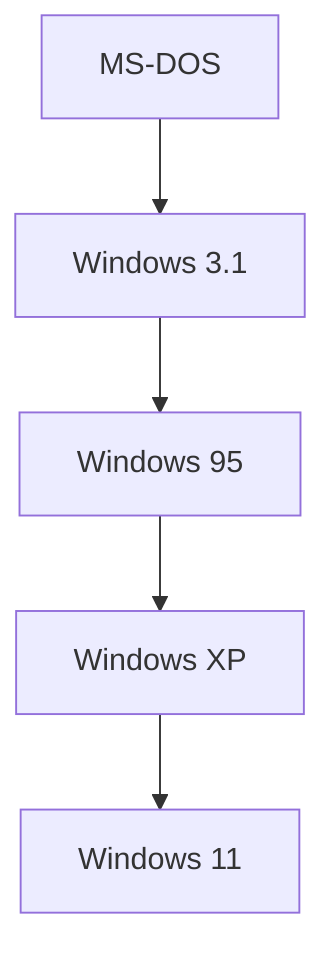

## 1. Dawn of the PC and MS-DOS
Founded in 1975 by Bill Gates and Paul Allen.

## 2. "Cloud First" by Satya Nadella
After the Ballmer era, Satya Nadella became CEO. The company pivoted from "Windows dependency" to an Azure-centric approach.
