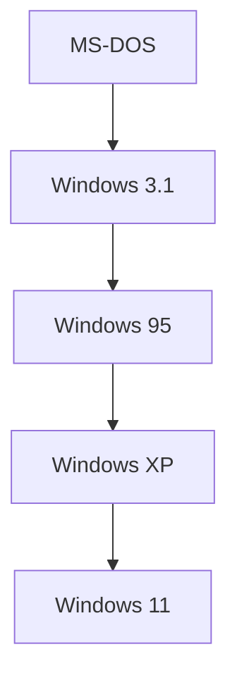

## 1. El amanecer del PC y MS-DOS
Fundada en 1975 por Bill Gates y Paul Allen.

## 2. "Primero la nube" por Satya Nadella
Tras la era de Ballmer, Satya Nadella asumió el cargo de CEO. Pivotó dejando atrás la "dependencia de Windows" para centrarse en Azure.
