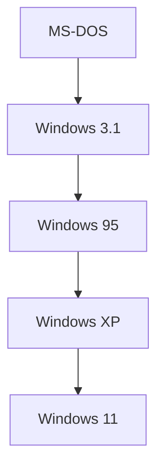

## 1. L'aube des PC et MS-DOS
Fondée en 1975 par Bill Gates et Paul Allen.

## 2. Le « cloud first » par Satya Nadella
Après l'ère Ballmer, Satya Nadella est devenu PDG. L'entreprise s'est affranchie de sa « dépendance à Windows » pour pivoter vers un modèle centré sur Azure.
