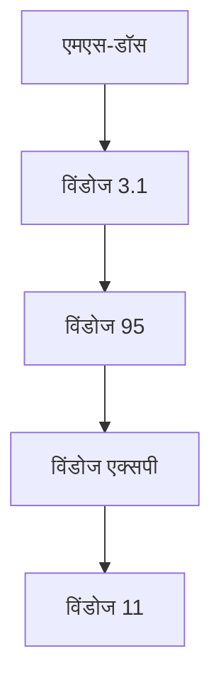

## 1. पीसी की शुरुआत और एमएस-डॉस
बिल गेट्स और पॉल एलन द्वारा 1975 में स्थापित।

## 2. सत्या नडेला द्वारा "क्लाउड-फर्स्ट"
बाल्मर युग के बाद, सत्या नडेला सीईओ बने। उन्होंने "विंडोज निर्भरता" से हटकर एज़्योर पर ध्यान केंद्रित किया।
