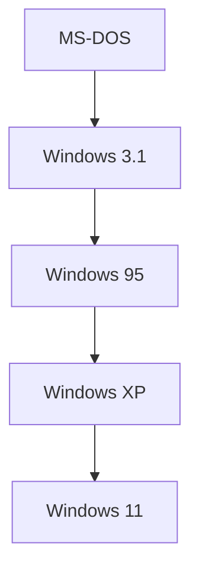

## 1. Fajar PC dan MS-DOS
Didirikan pada tahun 1975 oleh Bill Gates dan Paul Allen.

## 2. "Cloud First" oleh Satya Nadella
Setelah era Ballmer, Satya Nadella menjabat sebagai CEO. Melakukan pivot dari "Ketergantungan pada Windows" menjadi berpusat pada Azure.
