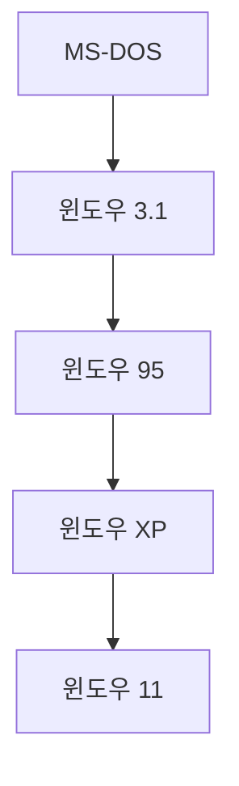

## 1. PC의 여명과 MS-DOS
빌 게이츠와 폴 앨런에 의해 1975년에 설립.

```mermaid
graph TD
    DOS["MS-DOS"] --> W31["윈도우 3.1"]
    W31 --> W95["윈도우 95"]
    W95 --> XP["윈도우 XP"]
    XP --> W11["윈도우 11"]
```

## 2. 사티아 나델라에 의한 '클라우드 퍼스트'
발머 시대를 거쳐, 사티아 나델라가 CEO에 취임. 'Windows 의존'에서 벗어나 Azure 중심으로 피벗했습니다.
