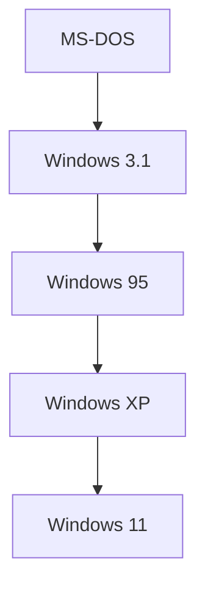

## 1. PCの夜明けとMS-DOS
ビル・ゲイツとポール・アレンによって1975年に設立。

```mermaid
graph TD
    DOS["MS-DOS"] --> W31["Windows 3.1"]
    W31 --> W95["Windows 95"]
    W95 --> XP["Windows XP"]
    XP --> W11["Windows 11"]
```

## 2. サティア・ナデラによる「クラウド・ファースト」
バルマー時代を経て、サティア・ナデラがCEOに就任。「Windows依存」から脱却しAzure中心へとピボットしました。
