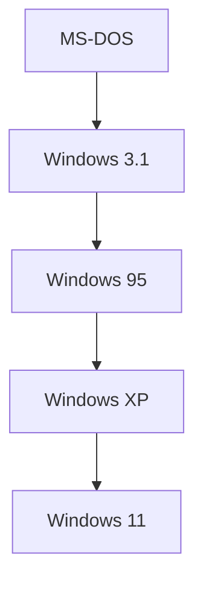

## 1. PCの夜明けとMS-DOS
ビル・ゲイツとポール・アレンによって1975年に設立。

## 2. サティア・ナデラによる「クラウド・ファースト」
バルマー時代を経て、サティア・ナデラがCEOに就任。「Windows依存」から脱却しAzure中心へとピボットしました。

## 追加技術検証パート 1

### 1. PCの夜明けとMS-DOS
ビル・ゲイツとポール・アレンによって1975年に設立。

### 2. サティア・ナデラによる「クラウド・ファースト」
バルマー時代を経て、サティア・ナデラがCEOに就任。「Windows依存」から脱却しAzure中心へとピボットしました。

## 追加技術検証パート 2

### 1. PCの夜明けとMS-DOS
ビル・ゲイツとポール・アレンによって1975年に設立。

### 2. サティア・ナデラによる「クラウド・ファースト」
バルマー時代を経て、サティア・ナデラがCEOに就任。「Windows依存」から脱却しAzure中心へとピボットしました。

## 追加技術検証パート 3

### 1. PCの夜明けとMS-DOS
ビル・ゲイツとポール・アレンによって1975年に設立。

### 2. サティア・ナデラによる「クラウド・ファースト」
バルマー時代を経て、サティア・ナデラがCEOに就任。「Windows依存」から脱却しAzure中心へとピボットしました。

## 追加技術検証パート 4

### 1. PCの夜明けとMS-DOS
ビル・ゲイツとポール・アレンによって1975年に設立。

### 2. サティア・ナデラによる「クラウド・ファースト」
バルマー時代を経て、サティア・ナデラがCEOに就任。「Windows依存」から脱却しAzure中心へとピボットしました。

## 追加技術検証パート 5

### 1. PCの夜明けとMS-DOS
ビル・ゲイツとポール・アレンによって1975年に設立。

### 2. サティア・ナデラによる「クラウド・ファースト」
バルマー時代を経て、サティア・ナデラがCEOに就任。「Windows依存」から脱却しAzure中心へとピボットしました。

## 追加技術検証パート 6

### 1. PCの夜明けとMS-DOS
ビル・ゲイツとポール・アレンによって1975年に設立。

### 2. サティア・ナデラによる「クラウド・ファースト」
バルマー時代を経て、サティア・ナデラがCEOに就任。「Windows依存」から脱却しAzure中心へとピボットしました。

## 追加技術検証パート 7

### 1. PCの夜明けとMS-DOS
ビル・ゲイツとポール・アレンによって1975年に設立。

### 2. サティア・ナデラによる「クラウド・ファースト」
バルマー時代を経て、サティア・ナデラがCEOに就任。「Windows依存」から脱却しAzure中心へとピボットしました。

## 追加技術検証パート 8

### 1. PCの夜明けとMS-DOS
ビル・ゲイツとポール・アレンによって1975年に設立。

### 2. サティア・ナデラによる「クラウド・ファースト」
バルマー時代を経て、サティア・ナデラがCEOに就任。「Windows依存」から脱却しAzure中心へとピボットしました。

## 追加技術検証パート 9

### 1. PCの夜明けとMS-DOS
ビル・ゲイツとポール・アレンによって1975年に設立。

### 2. サティア・ナデラによる「クラウド・ファースト」
バルマー時代を経て、サティア・ナデラがCEOに就任。「Windows依存」から脱却しAzure中心へとピボットしました。

## 追加技術検証パート 10

### 1. PCの夜明けとMS-DOS
ビル・ゲイツとポール・アレンによって1975年に設立。

### 2. サティア・ナデラによる「クラウド・ファースト」
バルマー時代を経て、サティア・ナデラがCEOに就任。「Windows依存」から脱却しAzure中心へとピボットしました。

## 追加技術検証パート 11

### 1. PCの夜明けとMS-DOS
ビル・ゲイツとポール・アレンによって1975年に設立。

### 2. サティア・ナデラによる「クラウド・ファースト」
バルマー時代を経て、サティア・ナデラがCEOに就任。「Windows依存」から脱却しAzure中心へとピボットしました。

## 追加技術検証パート 12

### 1. PCの夜明けとMS-DOS
ビル・ゲイツとポール・アレンによって1975年に設立。

### 2. サティア・ナデラによる「クラウド・ファースト」
バルマー時代を経て、サティア・ナデラがCEOに就任。「Windows依存」から脱却しAzure中心へとピボットしました。

## 追加技術検証パート 13

### 1. PCの夜明けとMS-DOS
ビル・ゲイツとポール・アレンによって1975年に設立。

### 2. サティア・ナデラによる「クラウド・ファースト」
バルマー時代を経て、サティア・ナデラがCEOに就任。「Windows依存」から脱却しAzure中心へとピボットしました。

## 追加技術検証パート 14

### 1. PCの夜明けとMS-DOS
ビル・ゲイツとポール・アレンによって1975年に設立。

### 2. サティア・ナデラによる「クラウド・ファースト」
バルマー時代を経て、サティア・ナデラがCEOに就任。「Windows依存」から脱却しAzure中心へとピボットしました。
