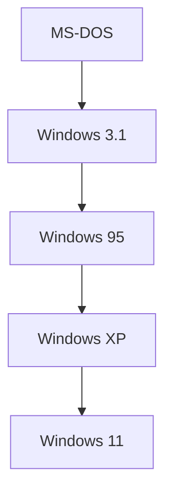

## 1. O Alvorecer dos PCs e o MS-DOS
Fundada em 1975 por Bill Gates e Paul Allen.

## 2. "Cloud First" por Satya Nadella
Após a era Ballmer, Satya Nadella tornou-se CEO. Ele realizou um pivô, afastando-se da "dependência do Windows" para um foco central no Azure.
