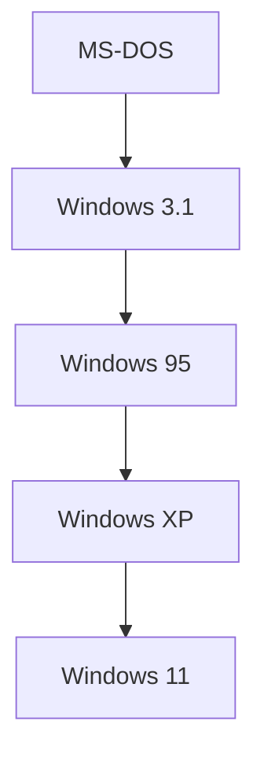

## 1. Заря ПК и MS-DOS
Основана Биллом Гейтсом и Полом Алленом в 1975 году.

## 2. Стратегия «Cloud First» Сатьи Наделлы
После эпохи Балмера Сатья Наделла стал генеральным директором. Компания отошла от «зависимости от Windows» и переключилась на развитие облачной платформы Azure.
