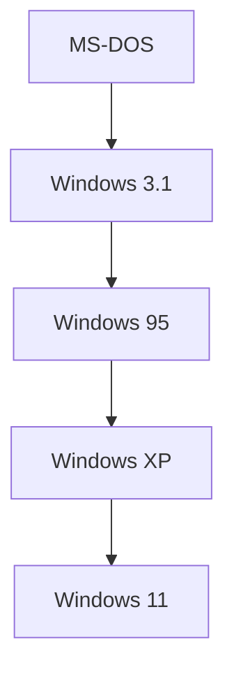

## 1. PC的黎明与MS-DOS
由比尔·盖茨和保罗·艾伦于1975年创立。

```mermaid
graph TD
    DOS["MS-DOS"] --> W31["Windows 3.1"]
    W31 --> W95["Windows 95"]
    W95 --> XP["Windows XP"]
    XP --> W11["Windows 11"]
```

## 2. 萨提亚·纳德拉的“云优先”
经历了鲍尔默时代后，萨提亚·纳德拉出任CEO。公司摆脱了“Windows依赖”，转向以Azure为中心。
