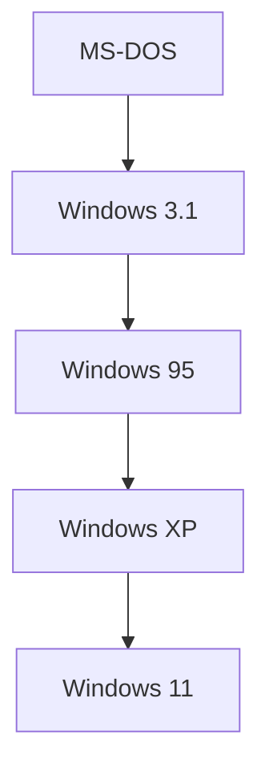

## 1. PC 的黎明與 MS-DOS
由比爾·蓋茲與保羅·艾倫於 1975 年創立。

```mermaid
graph TD
    DOS["MS-DOS"] --> W31["Windows 3.1"]
    W31 --> W95["Windows 95"]
    W95 --> XP["Windows XP"]
    XP --> W11["Windows 11"]
```

## 2. 薩蒂亞·納德拉的「雲端優先」
歷經鮑爾默時代，薩蒂亞·納德拉就任 CEO。擺脫「對 Windows 的依賴」，轉型為以 Azure 為中心。
