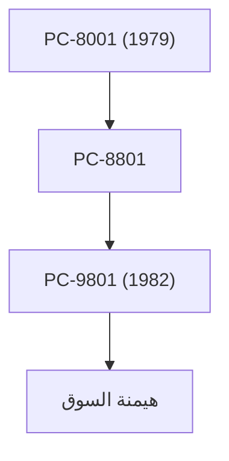

## 1. تأسيس شركة نيبون دينكي (NEC)
في عام 1899، تأسست كأول شركة يابانية بمشروع مشترك مع رأس مال أجنبي من خلال الشراكة مع ويسترن إلكتريك. بدأت بتصنيع الهواتف ومعدات الاتصالات.

## 2. العصر الذهبي لسلسلة PC-9800
من الثمانينيات إلى التسعينيات، اجتاحت سلسلة "PC-98" سوق أجهزة الكمبيوتر الشخصية في اليابان بالكامل. كانت قوة السلسلة تكمن في بنية الأجهزة المتخصصة في معالجة اللغة اليابانية.

## 3. C&C (اندماج الكمبيوتر والاتصالات)
إن رؤية "C&C (الكمبيوتر والاتصالات)" التي اقترحها الرئيس كوجي كوباياشي في عام 1977 توقعت بالكامل مجتمع الإنترنت اللاحق.

## 4. المصادقة البيومترية الحالية وأعمال الفضاء
حاليًا، تم فصل أعمال الكمبيوتر الشخصي، وتركز الشركة على أعمال البنية التحتية الاجتماعية مثل تقنية التعرف على الوجوه ذات المستوى العالمي، الكابلات البحرية، والأقمار الصناعية (مثل مشروع هايابوسا).

## جزء التحقق التقني الإضافي 1

### 1. تأسيس شركة نيبون دينكي (NEC)
في عام 1899، تأسست كأول شركة يابانية بمشروع مشترك مع رأس مال أجنبي من خلال الشراكة مع ويسترن إلكتريك. بدأت بتصنيع الهواتف ومعدات الاتصالات.

### 2. العصر الذهبي لسلسلة PC-9800
من الثمانينيات إلى التسعينيات، اجتاحت سلسلة "PC-98" سوق أجهزة الكمبيوتر الشخصية في اليابان بالكامل. كانت قوة السلسلة تكمن في بنية الأجهزة المتخصصة في معالجة اللغة اليابانية.

### 3. C&C (اندماج الكمبيوتر والاتصالات)
إن رؤية "C&C (الكمبيوتر والاتصالات)" التي اقترحها الرئيس كوجي كوباياشي في عام 1977 توقعت بالكامل مجتمع الإنترنت اللاحق.

### 4. المصادقة البيومترية الحالية وأعمال الفضاء
حاليًا، تم فصل أعمال الكمبيوتر الشخصي، وتركز الشركة على أعمال البنية التحتية الاجتماعية مثل تقنية التعرف على الوجوه ذات المستوى العالمي، الكابلات البحرية، والأقمار الصناعية (مثل مشروع هايابوسا).

## جزء التحقق التقني الإضافي 2

### 1. تأسيس شركة نيبون دينكي (NEC)
في عام 1899، تأسست كأول شركة يابانية بمشروع مشترك مع رأس مال أجنبي من خلال الشراكة مع ويسترن إلكتريك. بدأت بتصنيع الهواتف ومعدات الاتصالات.

### 2. العصر الذهبي لسلسلة PC-9800
من الثمانينيات إلى التسعينيات، اجتاحت سلسلة "PC-98" سوق أجهزة الكمبيوتر الشخصية في اليابان بالكامل. كانت قوة السلسلة تكمن في بنية الأجهزة المتخصصة في معالجة اللغة اليابانية.

### 3. C&C (اندماج الكمبيوتر والاتصالات)
إن رؤية "C&C (الكمبيوتر والاتصالات)" التي اقترحها الرئيس كوجي كوباياشي في عام 1977 توقعت بالكامل مجتمع الإنترنت اللاحق.

### 4. المصادقة البيومترية الحالية وأعمال الفضاء
حاليًا، تم فصل أعمال الكمبيوتر الشخصي، وتركز الشركة على أعمال البنية التحتية الاجتماعية مثل تقنية التعرف على الوجوه ذات المستوى العالمي، الكابلات البحرية، والأقمار الصناعية (مثل مشروع هايابوسا).

## جزء التحقق التقني الإضافي 3

### 1. تأسيس شركة نيبون دينكي (NEC)
في عام 1899، تأسست كأول شركة يابانية بمشروع مشترك مع رأس مال أجنبي من خلال الشراكة مع ويسترن إلكتريك. بدأت بتصنيع الهواتف ومعدات الاتصالات.

### 2. العصر الذهبي لسلسلة PC-9800
من الثمانينيات إلى التسعينيات، اجتاحت سلسلة "PC-98" سوق أجهزة الكمبيوتر الشخصية في اليابان بالكامل. كانت قوة السلسلة تكمن في بنية الأجهزة المتخصصة في معالجة اللغة اليابانية.

### 3. C&C (اندماج الكمبيوتر والاتصالات)
إن رؤية "C&C (الكمبيوتر والاتصالات)" التي اقترحها الرئيس كوجي كوباياشي في عام 1977 توقعت بالكامل مجتمع الإنترنت اللاحق.

### 4. المصادقة البيومترية الحالية وأعمال الفضاء
حاليًا، تم فصل أعمال الكمبيوتر الشخصي، وتركز الشركة على أعمال البنية التحتية الاجتماعية مثل تقنية التعرف على الوجوه ذات المستوى العالمي، الكابلات البحرية، والأقمار الصناعية (مثل مشروع هايابوسا).

## جزء التحقق التقني الإضافي 4

### 1. تأسيس شركة نيبون دينكي (NEC)
في عام 1899، تأسست كأول شركة يابانية بمشروع مشترك مع رأس مال أجنبي من خلال الشراكة مع ويسترن إلكتريك. بدأت بتصنيع الهواتف ومعدات الاتصالات.

### 2. العصر الذهبي لسلسلة PC-9800
من الثمانينيات إلى التسعينيات، اجتاحت سلسلة "PC-98" سوق أجهزة الكمبيوتر الشخصية في اليابان بالكامل. كانت قوة السلسلة تكمن في بنية الأجهزة المتخصصة في معالجة اللغة اليابانية.

### 3. C&C (اندماج الكمبيوتر والاتصالات)
إن رؤية "C&C (الكمبيوتر والاتصالات)" التي اقترحها الرئيس كوجي كوباياشي في عام 1977 توقعت بالكامل مجتمع الإنترنت اللاحق.

### 4. المصادقة البيومترية الحالية وأعمال الفضاء
حاليًا، تم فصل أعمال الكمبيوتر الشخصي، وتركز الشركة على أعمال البنية التحتية الاجتماعية مثل تقنية التعرف على الوجوه ذات المستوى العالمي، الكابلات البحرية، والأقمار الصناعية (مثل مشروع هايابوسا).

## جزء التحقق التقني الإضافي 5

### 1. تأسيس شركة نيبون دينكي (NEC)
في عام 1899، تأسست كأول شركة يابانية بمشروع مشترك مع رأس مال أجنبي من خلال الشراكة مع ويسترن إلكتريك. بدأت بتصنيع الهواتف ومعدات الاتصالات.

### 2. العصر الذهبي لسلسلة PC-9800
من الثمانينيات إلى التسعينيات، اجتاحت سلسلة "PC-98" سوق أجهزة الكمبيوتر الشخصية في اليابان بالكامل. كانت قوة السلسلة تكمن في بنية الأجهزة المتخصصة في معالجة اللغة اليابانية.

### 3. C&C (اندماج الكمبيوتر والاتصالات)
إن رؤية "C&C (الكمبيوتر والاتصالات)" التي اقترحها الرئيس كوجي كوباياشي في عام 1977 توقعت بالكامل مجتمع الإنترنت اللاحق.

### 4. المصادقة البيومترية الحالية وأعمال الفضاء
حاليًا، تم فصل أعمال الكمبيوتر الشخصي، وتركز الشركة على أعمال البنية التحتية الاجتماعية مثل تقنية التعرف على الوجوه ذات المستوى العالمي، الكابلات البحرية، والأقمار الصناعية (مثل مشروع هايابوسا).

## جزء التحقق التقني الإضافي 6

### 1. تأسيس شركة نيبون دينكي (NEC)
في عام 1899، تأسست كأول شركة يابانية بمشروع مشترك مع رأس مال أجنبي من خلال الشراكة مع ويسترن إلكتريك. بدأت بتصنيع الهواتف ومعدات الاتصالات.

### 2. العصر الذهبي لسلسلة PC-9800
من الثمانينيات إلى التسعينيات، اجتاحت سلسلة "PC-98" سوق أجهزة الكمبيوتر الشخصية في اليابان بالكامل. كانت قوة السلسلة تكمن في بنية الأجهزة المتخصصة في معالجة اللغة اليابانية.

### 3. C&C (اندماج الكمبيوتر والاتصالات)
إن رؤية "C&C (الكمبيوتر والاتصالات)" التي اقترحها الرئيس كوجي كوباياشي في عام 1977 توقعت بالكامل مجتمع الإنترنت اللاحق.

### 4. المصادقة البيومترية الحالية وأعمال الفضاء
حاليًا، تم فصل أعمال الكمبيوتر الشخصي، وتركز الشركة على أعمال البنية التحتية الاجتماعية مثل تقنية التعرف على الوجوه ذات المستوى العالمي، الكابلات البحرية، والأقمار الصناعية (مثل مشروع هايابوسا).

## جزء التحقق التقني الإضافي 7

### 1. تأسيس شركة نيبون دينكي (NEC)
في عام 1899، تأسست كأول شركة يابانية بمشروع مشترك مع رأس مال أجنبي من خلال الشراكة مع ويسترن إلكتريك. بدأت بتصنيع الهواتف ومعدات الاتصالات.

### 2. العصر الذهبي لسلسلة PC-9800
من الثمانينيات إلى التسعينيات، اجتاحت سلسلة "PC-98" سوق أجهزة الكمبيوتر الشخصية في اليابان بالكامل. كانت قوة السلسلة تكمن في بنية الأجهزة المتخصصة في معالجة اللغة اليابانية.

### 3. C&C (اندماج الكمبيوتر والاتصالات)
إن رؤية "C&C (الكمبيوتر والاتصالات)" التي اقترحها الرئيس كوجي كوباياشي في عام 1977 توقعت بالكامل مجتمع الإنترنت اللاحق.

### 4. المصادقة البيومترية الحالية وأعمال الفضاء
حاليًا، تم فصل أعمال الكمبيوتر الشخصي، وتركز الشركة على أعمال البنية التحتية الاجتماعية مثل تقنية التعرف على الوجوه ذات المستوى العالمي، الكابلات البحرية، والأقمار الصناعية (مثل مشروع هايابوسا).

## جزء التحقق التقني الإضافي 8

### 1. تأسيس شركة نيبون دينكي (NEC)
في عام 1899، تأسست كأول شركة يابانية بمشروع مشترك مع رأس مال أجنبي من خلال الشراكة مع ويسترن إلكتريك. بدأت بتصنيع الهواتف ومعدات الاتصالات.

### 2. العصر الذهبي لسلسلة PC-9800
من الثمانينيات إلى التسعينيات، اجتاحت سلسلة "PC-98" سوق أجهزة الكمبيوتر الشخصية في اليابان بالكامل. كانت قوة السلسلة تكمن في بنية الأجهزة المتخصصة في معالجة اللغة اليابانية.

### 3. C&C (اندماج الكمبيوتر والاتصالات)
إن رؤية "C&C (الكمبيوتر والاتصالات)" التي اقترحها الرئيس كوجي كوباياشي في عام 1977 توقعت بالكامل مجتمع الإنترنت اللاحق.

### 4. المصادقة البيومترية الحالية وأعمال الفضاء
حاليًا، تم فصل أعمال الكمبيوتر الشخصي، وتركز الشركة على أعمال البنية التحتية الاجتماعية مثل تقنية التعرف على الوجوه ذات المستوى العالمي، الكابلات البحرية، والأقمار الصناعية (مثل مشروع هايابوسا).

## جزء التحقق التقني الإضافي 9

### 1. تأسيس شركة نيبون دينكي (NEC)
في عام 1899، تأسست كأول شركة يابانية بمشروع مشترك مع رأس مال أجنبي من خلال الشراكة مع ويسترن إلكتريك. بدأت بتصنيع الهواتف ومعدات الاتصالات.

### 2. العصر الذهبي لسلسلة PC-9800
من الثمانينيات إلى التسعينيات، اجتاحت سلسلة "PC-98" سوق أجهزة الكمبيوتر الشخصية في اليابان بالكامل. كانت قوة السلسلة تكمن في بنية الأجهزة المتخصصة في معالجة اللغة اليابانية.

### 3. C&C (اندماج الكمبيوتر والاتصالات)
إن رؤية "C&C (الكمبيوتر والاتصالات)" التي اقترحها الرئيس كوجي كوباياشي في عام 1977 توقعت بالكامل مجتمع الإنترنت اللاحق.

### 4. المصادقة البيومترية الحالية وأعمال الفضاء
حاليًا، تم فصل أعمال الكمبيوتر الشخصي، وتركز الشركة على أعمال البنية التحتية الاجتماعية مثل تقنية التعرف على الوجوه ذات المستوى العالمي، الكابلات البحرية، والأقمار الصناعية (مثل مشروع هايابوسا).

## جزء التحقق التقني الإضافي 10

### 1. تأسيس شركة نيبون دينكي (NEC)
في عام 1899، تأسست كأول شركة يابانية بمشروع مشترك مع رأس مال أجنبي من خلال الشراكة مع ويسترن إلكتريك. بدأت بتصنيع الهواتف ومعدات الاتصالات.

### 2. العصر الذهبي لسلسلة PC-9800
من الثمانينيات إلى التسعينيات، اجتاحت سلسلة "PC-98" سوق أجهزة الكمبيوتر الشخصية في اليابان بالكامل. كانت قوة السلسلة تكمن في بنية الأجهزة المتخصصة في معالجة اللغة اليابانية.

### 3. C&C (اندماج الكمبيوتر والاتصالات)
إن رؤية "C&C (الكمبيوتر والاتصالات)" التي اقترحها الرئيس كوجي كوباياشي في عام 1977 توقعت بالكامل مجتمع الإنترنت اللاحق.

### 4. المصادقة البيومترية الحالية وأعمال الفضاء
حاليًا، تم فصل أعمال الكمبيوتر الشخصي، وتركز الشركة على أعمال البنية التحتية الاجتماعية مثل تقنية التعرف على الوجوه ذات المستوى العالمي، الكابلات البحرية، والأقمار الصناعية (مثل مشروع هايابوسا).

## جزء التحقق التقني الإضافي 11

### 1. تأسيس شركة نيبون دينكي (NEC)
في عام 1899، تأسست كأول شركة يابانية بمشروع مشترك مع رأس مال أجنبي من خلال الشراكة مع ويسترن إلكتريك. بدأت بتصنيع الهواتف ومعدات الاتصالات.

### 2. العصر الذهبي لسلسلة PC-9800
من الثمانينيات إلى التسعينيات، اجتاحت سلسلة "PC-98" سوق أجهزة الكمبيوتر الشخصية في اليابان بالكامل. كانت قوة السلسلة تكمن في بنية الأجهزة المتخصصة في معالجة اللغة اليابانية.

### 3. C&C (اندماج الكمبيوتر والاتصالات)
إن رؤية "C&C (الكمبيوتر والاتصالات)" التي اقترحها الرئيس كوجي كوباياشي في عام 1977 توقعت بالكامل مجتمع الإنترنت اللاحق.

### 4. المصادقة البيومترية الحالية وأعمال الفضاء
حاليًا، تم فصل أعمال الكمبيوتر الشخصي، وتركز الشركة على أعمال البنية التحتية الاجتماعية مثل تقنية التعرف على الوجوه ذات المستوى العالمي، الكابلات البحرية، والأقمار الصناعية (مثل مشروع هايابوسا).

## جزء التحقق التقني الإضافي 12

### 1. تأسيس شركة نيبون دينكي (NEC)
في عام 1899، تأسست كأول شركة يابانية بمشروع مشترك مع رأس مال أجنبي من خلال الشراكة مع ويسترن إلكتريك. بدأت بتصنيع الهواتف ومعدات الاتصالات.

### 2. العصر الذهبي لسلسلة PC-9800
من الثمانينيات إلى التسعينيات، اجتاحت سلسلة "PC-98" سوق أجهزة الكمبيوتر الشخصية في اليابان بالكامل. كانت قوة السلسلة تكمن في بنية الأجهزة المتخصصة في معالجة اللغة اليابانية.

### 3. C&C (اندماج الكمبيوتر والاتصالات)
إن رؤية "C&C (الكمبيوتر والاتصالات)" التي اقترحها الرئيس كوجي كوباياشي في عام 1977 توقعت بالكامل مجتمع الإنترنت اللاحق.

### 4. المصادقة البيومترية الحالية وأعمال الفضاء
حاليًا، تم فصل أعمال الكمبيوتر الشخصي، وتركز الشركة على أعمال البنية التحتية الاجتماعية مثل تقنية التعرف على الوجوه ذات المستوى العالمي، الكابلات البحرية، والأقمار الصناعية (مثل مشروع هايابوسا).

## جزء التحقق التقني الإضافي 13

### 1. تأسيس شركة نيبون دينكي (NEC)
في عام 1899، تأسست كأول شركة يابانية بمشروع مشترك مع رأس مال أجنبي من خلال الشراكة مع ويسترن إلكتريك. بدأت بتصنيع الهواتف ومعدات الاتصالات.

### 2. العصر الذهبي لسلسلة PC-9800
من الثمانينيات إلى التسعينيات، اجتاحت سلسلة "PC-98" سوق أجهزة الكمبيوتر الشخصية في اليابان بالكامل. كانت قوة السلسلة تكمن في بنية الأجهزة المتخصصة في معالجة اللغة اليابانية.

### 3. C&C (اندماج الكمبيوتر والاتصالات)
إن رؤية "C&C (الكمبيوتر والاتصالات)" التي اقترحها الرئيس كوجي كوباياشي في عام 1977 توقعت بالكامل مجتمع الإنترنت اللاحق.

### 4. المصادقة البيومترية الحالية وأعمال الفضاء
حاليًا، تم فصل أعمال الكمبيوتر الشخصي، وتركز الشركة على أعمال البنية التحتية الاجتماعية مثل تقنية التعرف على الوجوه ذات المستوى العالمي، الكابلات البحرية، والأقمار الصناعية (مثل مشروع هايابوسا).

## جزء التحقق التقني الإضافي 14

### 1. تأسيس شركة نيبون دينكي (NEC)
في عام 1899، تأسست كأول شركة يابانية بمشروع مشترك مع رأس مال أجنبي من خلال الشراكة مع ويسترن إلكتريك. بدأت بتصنيع الهواتف ومعدات الاتصالات.

### 2. العصر الذهبي لسلسلة PC-9800
من الثمانينيات إلى التسعينيات، اجتاحت سلسلة "PC-98" سوق أجهزة الكمبيوتر الشخصية في اليابان بالكامل. كانت قوة السلسلة تكمن في بنية الأجهزة المتخصصة في معالجة اللغة اليابانية.

### 3. C&C (اندماج الكمبيوتر والاتصالات)
إن رؤية "C&C (الكمبيوتر والاتصالات)" التي اقترحها الرئيس كوجي كوباياشي في عام 1977 توقعت بالكامل مجتمع الإنترنت اللاحق.

### 4. المصادقة البيومترية الحالية وأعمال الفضاء
حاليًا، تم فصل أعمال الكمبيوتر الشخصي، وتركز الشركة على أعمال البنية التحتية الاجتماعية مثل تقنية التعرف على الوجوه ذات المستوى العالمي، الكابلات البحرية، والأقمار الصناعية (مثل مشروع هايابوسا).
