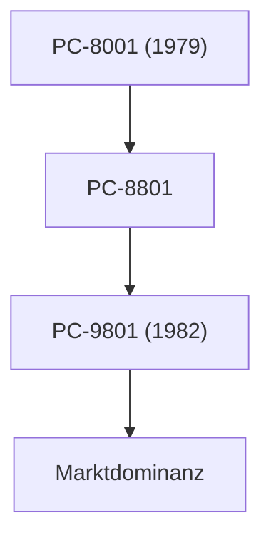

## 1. Die Geburt von NEC
1899 durch ein Joint Venture mit Western Electric als erstes ausländisches Joint-Venture-Unternehmen in Japan gegründet. Es begann mit der Herstellung von Telefonen und Kommunikationsgeräten.

## 2. Das Goldene Zeitalter der PC-9800-Serie
Von den 1980er bis zu den 1990er Jahren dominierte die „PC-98“-Serie den japanischen PC-Markt vollständig. Die Stärke lag in der auf japanische Sprachverarbeitung spezialisierten Hardware-Architektur.

## 3. C&C (Integration von Computer und Kommunikation)
Die 1977 von Präsident Koji Kobayashi vorgeschlagene Vision „C&C (Computer and Communication)“ nahm die spätere Internetgesellschaft vollständig vorweg.

## 4. Aktuelle Biometrie und Raumfahrtgeschäft
Heute hat sich das Unternehmen von seinem PC-Geschäft getrennt und konzentriert sich auf soziale Infrastrukturprojekte, wie erstklassige Gesichtserkennungstechnologie, Unterseekabel und künstliche Satelliten (wie das Hayabusa-Projekt).

## Zusätzlicher technischer Verifizierungsteil 1

## Zusätzlicher technischer Verifizierungsteil 2

## Zusätzlicher technischer Verifizierungsteil 3

## Zusätzlicher technischer Verifizierungsteil 4

## Zusätzlicher technischer Verifizierungsteil 5

## Zusätzlicher technischer Verifizierungsteil 6

## Zusätzlicher technischer Verifizierungsteil 7

## Zusätzlicher technischer Verifizierungsteil 8

## Zusätzlicher technischer Verifizierungsteil 9

## Zusätzlicher technischer Verifizierungsteil 10

## Zusätzlicher technischer Verifizierungsteil 11

## Zusätzlicher technischer Verifizierungsteil 12

## Zusätzlicher technischer Verifizierungsteil 13

## Zusätzlicher technischer Verifizierungsteil 14

