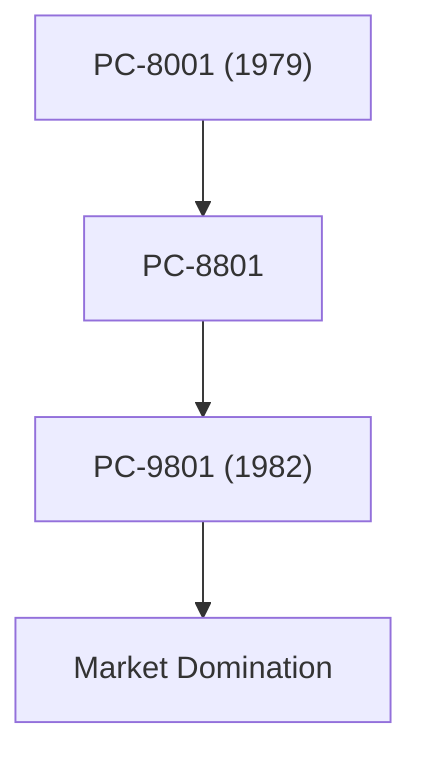

## 1. Birth of NEC
Born in 1899 as Japan's first foreign-affiliated joint venture in partnership with Western Electric. It began with the manufacturing of telephones and communication equipment.

## 2. Golden Age of the PC-9800 Series
From the 1980s through the 90s, the "PC-98" series completely dominated the Japanese personal computer market. Its hardware architecture specialized in Japanese language processing was its strength.

## 3. C&C (Integration of Computers and Communications)
The "C&C (Computer and Communication)" vision advocated by President Koji Kobayashi in 1977 perfectly foresaw the later internet society.

## 4. Current Biometrics and Space Business
Currently, it has spun off its PC business and is focusing on social infrastructure businesses such as world-class facial recognition technology, submarine cables, and artificial satellites (like the Hayabusa project).

## Additional Technical Verification Part 1

### 1. Birth of NEC
Born in 1899 as Japan's first foreign-affiliated joint venture in partnership with Western Electric. It began with the manufacturing of telephones and communication equipment.

### 2. Golden Age of the PC-9800 Series
From the 1980s through the 90s, the "PC-98" series completely dominated the Japanese personal computer market. Its hardware architecture specialized in Japanese language processing was its strength.

### 3. C&C (Integration of Computers and Communications)
The "C&C (Computer and Communication)" vision advocated by President Koji Kobayashi in 1977 perfectly foresaw the later internet society.

### 4. Current Biometrics and Space Business
Currently, it has spun off its PC business and is focusing on social infrastructure businesses such as world-class facial recognition technology, submarine cables, and artificial satellites (like the Hayabusa project).

## Additional Technical Verification Part 2

### 1. Birth of NEC
Born in 1899 as Japan's first foreign-affiliated joint venture in partnership with Western Electric. It began with the manufacturing of telephones and communication equipment.

### 2. Golden Age of the PC-9800 Series
From the 1980s through the 90s, the "PC-98" series completely dominated the Japanese personal computer market. Its hardware architecture specialized in Japanese language processing was its strength.

### 3. C&C (Integration of Computers and Communications)
The "C&C (Computer and Communication)" vision advocated by President Koji Kobayashi in 1977 perfectly foresaw the later internet society.

### 4. Current Biometrics and Space Business
Currently, it has spun off its PC business and is focusing on social infrastructure businesses such as world-class facial recognition technology, submarine cables, and artificial satellites (like the Hayabusa project).

## Additional Technical Verification Part 3

### 1. Birth of NEC
Born in 1899 as Japan's first foreign-affiliated joint venture in partnership with Western Electric. It began with the manufacturing of telephones and communication equipment.

### 2. Golden Age of the PC-9800 Series
From the 1980s through the 90s, the "PC-98" series completely dominated the Japanese personal computer market. Its hardware architecture specialized in Japanese language processing was its strength.

### 3. C&C (Integration of Computers and Communications)
The "C&C (Computer and Communication)" vision advocated by President Koji Kobayashi in 1977 perfectly foresaw the later internet society.

### 4. Current Biometrics and Space Business
Currently, it has spun off its PC business and is focusing on social infrastructure businesses such as world-class facial recognition technology, submarine cables, and artificial satellites (like the Hayabusa project).

## Additional Technical Verification Part 4

### 1. Birth of NEC
Born in 1899 as Japan's first foreign-affiliated joint venture in partnership with Western Electric. It began with the manufacturing of telephones and communication equipment.

### 2. Golden Age of the PC-9800 Series
From the 1980s through the 90s, the "PC-98" series completely dominated the Japanese personal computer market. Its hardware architecture specialized in Japanese language processing was its strength.

### 3. C&C (Integration of Computers and Communications)
The "C&C (Computer and Communication)" vision advocated by President Koji Kobayashi in 1977 perfectly foresaw the later internet society.

### 4. Current Biometrics and Space Business
Currently, it has spun off its PC business and is focusing on social infrastructure businesses such as world-class facial recognition technology, submarine cables, and artificial satellites (like the Hayabusa project).

## Additional Technical Verification Part 5

### 1. Birth of NEC
Born in 1899 as Japan's first foreign-affiliated joint venture in partnership with Western Electric. It began with the manufacturing of telephones and communication equipment.

### 2. Golden Age of the PC-9800 Series
From the 1980s through the 90s, the "PC-98" series completely dominated the Japanese personal computer market. Its hardware architecture specialized in Japanese language processing was its strength.

### 3. C&C (Integration of Computers and Communications)
The "C&C (Computer and Communication)" vision advocated by President Koji Kobayashi in 1977 perfectly foresaw the later internet society.

### 4. Current Biometrics and Space Business
Currently, it has spun off its PC business and is focusing on social infrastructure businesses such as world-class facial recognition technology, submarine cables, and artificial satellites (like the Hayabusa project).

## Additional Technical Verification Part 6

### 1. Birth of NEC
Born in 1899 as Japan's first foreign-affiliated joint venture in partnership with Western Electric. It began with the manufacturing of telephones and communication equipment.

### 2. Golden Age of the PC-9800 Series
From the 1980s through the 90s, the "PC-98" series completely dominated the Japanese personal computer market. Its hardware architecture specialized in Japanese language processing was its strength.

### 3. C&C (Integration of Computers and Communications)
The "C&C (Computer and Communication)" vision advocated by President Koji Kobayashi in 1977 perfectly foresaw the later internet society.

### 4. Current Biometrics and Space Business
Currently, it has spun off its PC business and is focusing on social infrastructure businesses such as world-class facial recognition technology, submarine cables, and artificial satellites (like the Hayabusa project).

## Additional Technical Verification Part 7

### 1. Birth of NEC
Born in 1899 as Japan's first foreign-affiliated joint venture in partnership with Western Electric. It began with the manufacturing of telephones and communication equipment.

### 2. Golden Age of the PC-9800 Series
From the 1980s through the 90s, the "PC-98" series completely dominated the Japanese personal computer market. Its hardware architecture specialized in Japanese language processing was its strength.

### 3. C&C (Integration of Computers and Communications)
The "C&C (Computer and Communication)" vision advocated by President Koji Kobayashi in 1977 perfectly foresaw the later internet society.

### 4. Current Biometrics and Space Business
Currently, it has spun off its PC business and is focusing on social infrastructure businesses such as world-class facial recognition technology, submarine cables, and artificial satellites (like the Hayabusa project).

## Additional Technical Verification Part 8

### 1. Birth of NEC
Born in 1899 as Japan's first foreign-affiliated joint venture in partnership with Western Electric. It began with the manufacturing of telephones and communication equipment.

### 2. Golden Age of the PC-9800 Series
From the 1980s through the 90s, the "PC-98" series completely dominated the Japanese personal computer market. Its hardware architecture specialized in Japanese language processing was its strength.

### 3. C&C (Integration of Computers and Communications)
The "C&C (Computer and Communication)" vision advocated by President Koji Kobayashi in 1977 perfectly foresaw the later internet society.

### 4. Current Biometrics and Space Business
Currently, it has spun off its PC business and is focusing on social infrastructure businesses such as world-class facial recognition technology, submarine cables, and artificial satellites (like the Hayabusa project).

## Additional Technical Verification Part 9

### 1. Birth of NEC
Born in 1899 as Japan's first foreign-affiliated joint venture in partnership with Western Electric. It began with the manufacturing of telephones and communication equipment.

### 2. Golden Age of the PC-9800 Series
From the 1980s through the 90s, the "PC-98" series completely dominated the Japanese personal computer market. Its hardware architecture specialized in Japanese language processing was its strength.

### 3. C&C (Integration of Computers and Communications)
The "C&C (Computer and Communication)" vision advocated by President Koji Kobayashi in 1977 perfectly foresaw the later internet society.

### 4. Current Biometrics and Space Business
Currently, it has spun off its PC business and is focusing on social infrastructure businesses such as world-class facial recognition technology, submarine cables, and artificial satellites (like the Hayabusa project).

## Additional Technical Verification Part 10

### 1. Birth of NEC
Born in 1899 as Japan's first foreign-affiliated joint venture in partnership with Western Electric. It began with the manufacturing of telephones and communication equipment.

### 2. Golden Age of the PC-9800 Series
From the 1980s through the 90s, the "PC-98" series completely dominated the Japanese personal computer market. Its hardware architecture specialized in Japanese language processing was its strength.

### 3. C&C (Integration of Computers and Communications)
The "C&C (Computer and Communication)" vision advocated by President Koji Kobayashi in 1977 perfectly foresaw the later internet society.

### 4. Current Biometrics and Space Business
Currently, it has spun off its PC business and is focusing on social infrastructure businesses such as world-class facial recognition technology, submarine cables, and artificial satellites (like the Hayabusa project).

## Additional Technical Verification Part 11

### 1. Birth of NEC
Born in 1899 as Japan's first foreign-affiliated joint venture in partnership with Western Electric. It began with the manufacturing of telephones and communication equipment.

### 2. Golden Age of the PC-9800 Series
From the 1980s through the 90s, the "PC-98" series completely dominated the Japanese personal computer market. Its hardware architecture specialized in Japanese language processing was its strength.

### 3. C&C (Integration of Computers and Communications)
The "C&C (Computer and Communication)" vision advocated by President Koji Kobayashi in 1977 perfectly foresaw the later internet society.

### 4. Current Biometrics and Space Business
Currently, it has spun off its PC business and is focusing on social infrastructure businesses such as world-class facial recognition technology, submarine cables, and artificial satellites (like the Hayabusa project).

## Additional Technical Verification Part 12

### 1. Birth of NEC
Born in 1899 as Japan's first foreign-affiliated joint venture in partnership with Western Electric. It began with the manufacturing of telephones and communication equipment.

### 2. Golden Age of the PC-9800 Series
From the 1980s through the 90s, the "PC-98" series completely dominated the Japanese personal computer market. Its hardware architecture specialized in Japanese language processing was its strength.

### 3. C&C (Integration of Computers and Communications)
The "C&C (Computer and Communication)" vision advocated by President Koji Kobayashi in 1977 perfectly foresaw the later internet society.

### 4. Current Biometrics and Space Business
Currently, it has spun off its PC business and is focusing on social infrastructure businesses such as world-class facial recognition technology, submarine cables, and artificial satellites (like the Hayabusa project).

## Additional Technical Verification Part 13

### 1. Birth of NEC
Born in 1899 as Japan's first foreign-affiliated joint venture in partnership with Western Electric. It began with the manufacturing of telephones and communication equipment.

### 2. Golden Age of the PC-9800 Series
From the 1980s through the 90s, the "PC-98" series completely dominated the Japanese personal computer market. Its hardware architecture specialized in Japanese language processing was its strength.

### 3. C&C (Integration of Computers and Communications)
The "C&C (Computer and Communication)" vision advocated by President Koji Kobayashi in 1977 perfectly foresaw the later internet society.

### 4. Current Biometrics and Space Business
Currently, it has spun off its PC business and is focusing on social infrastructure businesses such as world-class facial recognition technology, submarine cables, and artificial satellites (like the Hayabusa project).

## Additional Technical Verification Part 14

### 1. Birth of NEC
Born in 1899 as Japan's first foreign-affiliated joint venture in partnership with Western Electric. It began with the manufacturing of telephones and communication equipment.

### 2. Golden Age of the PC-9800 Series
From the 1980s through the 90s, the "PC-98" series completely dominated the Japanese personal computer market. Its hardware architecture specialized in Japanese language processing was its strength.

### 3. C&C (Integration of Computers and Communications)
The "C&C (Computer and Communication)" vision advocated by President Koji Kobayashi in 1977 perfectly foresaw the later internet society.

### 4. Current Biometrics and Space Business
Currently, it has spun off its PC business and is focusing on social infrastructure businesses such as world-class facial recognition technology, submarine cables, and artificial satellites (like the Hayabusa project).
