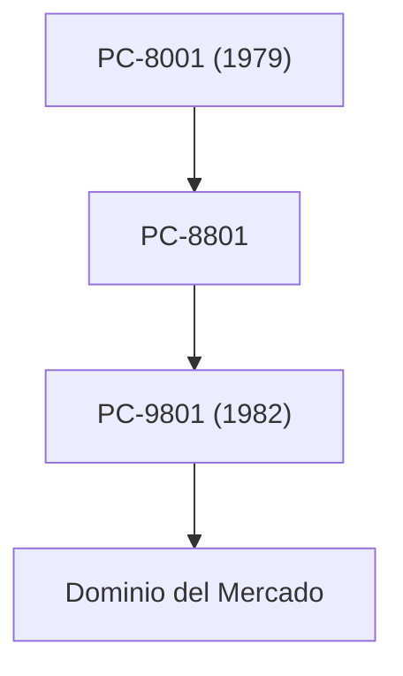

## 1. El nacimiento de Nippon Electric Company
En 1899, nació como la primera empresa conjunta con capital extranjero en Japón mediante una empresa conjunta con Western Electric. Comenzó con la fabricación de teléfonos y equipos de comunicación.

## 2. La era dorada de la serie PC-9800
Durante las décadas de 1980 y 1990, la serie "PC-98" dominó por completo el mercado de computadoras personales en Japón. Su punto fuerte fue una arquitectura de hardware especializada en el procesamiento del idioma japonés.

## 3. C&C (Fusión de Computadoras y Comunicaciones)
La visión "C&C (Computer and Communication)" propuesta por el presidente Koji Kobayashi en 1977 anticipó por completo la futura sociedad de Internet.

## 4. Negocio actual de biometría y tecnología espacial
En la actualidad, ha separado su negocio de PC y se enfoca en negocios de infraestructura social, como la tecnología de reconocimiento facial de clase mundial, cables submarinos y satélites artificiales (como el proyecto Hayabusa).

## Parte de verificación técnica adicional 1

## Parte de verificación técnica adicional 2

## Parte de verificación técnica adicional 3

## Parte de verificación técnica adicional 4

## Parte de verificación técnica adicional 5

## Parte de verificación técnica adicional 6

## Parte de verificación técnica adicional 7

## Parte de verificación técnica adicional 8

## Parte de verificación técnica adicional 9

## Parte de verificación técnica adicional 10

## Parte de verificación técnica adicional 11

## Parte de verificación técnica adicional 12

## Parte de verificación técnica adicional 13

## Parte de verificación técnica adicional 14

