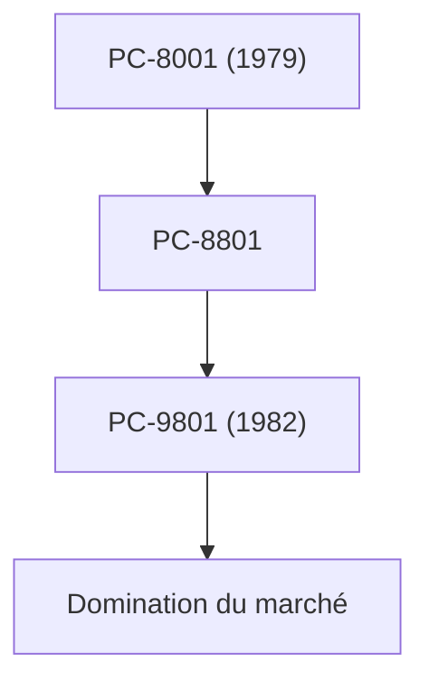

## 1. La naissance de Nippon Electric Company
En 1899, elle voit le jour en tant que première coentreprise à capitaux étrangers du Japon, en partenariat avec Western Electric. Elle a débuté par la fabrication de téléphones et d'équipements de communication.

## 2. L'âge d'or de la série PC-9800
Des années 1980 aux années 1990, la série « PC-98 » a complètement dominé le marché japonais des ordinateurs personnels. Sa force résidait dans son architecture matérielle spécialisée dans le traitement de la langue japonaise.

## 3. C&C (Fusion de l'informatique et des communications)
La vision « C&C (Computer and Communication) » proposée en 1977 par le président Koji Kobayashi avait parfaitement anticipé la future société d'Internet.

## 4. La biométrie actuelle et les activités spatiales
Aujourd'hui, l'entreprise s'est séparée de son activité PC et se concentre sur les infrastructures sociales, telles que sa technologie de reconnaissance faciale de classe mondiale, les câbles sous-marins et les satellites artificiels (comme le projet Hayabusa).

## Partie de vérification technique supplémentaire 1

### 1. La naissance de Nippon Electric Company
En 1899, elle voit le jour en tant que première coentreprise à capitaux étrangers du Japon, en partenariat avec Western Electric. Elle a débuté par la fabrication de téléphones et d'équipements de communication.

### 2. L'âge d'or de la série PC-9800
Des années 1980 aux années 1990, la série « PC-98 » a complètement dominé le marché japonais des ordinateurs personnels. Sa force résidait dans son architecture matérielle spécialisée dans le traitement de la langue japonaise.

### 3. C&C (Fusion de l'informatique et des communications)
La vision « C&C (Computer and Communication) » proposée en 1977 par le président Koji Kobayashi avait parfaitement anticipé la future société d'Internet.

### 4. La biométrie actuelle et les activités spatiales
Aujourd'hui, l'entreprise s'est séparée de son activité PC et se concentre sur les infrastructures sociales, telles que sa technologie de reconnaissance faciale de classe mondiale, les câbles sous-marins et les satellites artificiels (comme le projet Hayabusa).

## Partie de vérification technique supplémentaire 2

### 1. La naissance de Nippon Electric Company
En 1899, elle voit le jour en tant que première coentreprise à capitaux étrangers du Japon, en partenariat avec Western Electric. Elle a débuté par la fabrication de téléphones et d'équipements de communication.

### 2. L'âge d'or de la série PC-9800
Des années 1980 aux années 1990, la série « PC-98 » a complètement dominé le marché japonais des ordinateurs personnels. Sa force résidait dans son architecture matérielle spécialisée dans le traitement de la langue japonaise.

### 3. C&C (Fusion de l'informatique et des communications)
La vision « C&C (Computer and Communication) » proposée en 1977 par le président Koji Kobayashi avait parfaitement anticipé la future société d'Internet.

### 4. La biométrie actuelle et les activités spatiales
Aujourd'hui, l'entreprise s'est séparée de son activité PC et se concentre sur les infrastructures sociales, telles que sa technologie de reconnaissance faciale de classe mondiale, les câbles sous-marins et les satellites artificiels (comme le projet Hayabusa).

## Partie de vérification technique supplémentaire 3

### 1. La naissance de Nippon Electric Company
En 1899, elle voit le jour en tant que première coentreprise à capitaux étrangers du Japon, en partenariat avec Western Electric. Elle a débuté par la fabrication de téléphones et d'équipements de communication.

### 2. L'âge d'or de la série PC-9800
Des années 1980 aux années 1990, la série « PC-98 » a complètement dominé le marché japonais des ordinateurs personnels. Sa force résidait dans son architecture matérielle spécialisée dans le traitement de la langue japonaise.

### 3. C&C (Fusion de l'informatique et des communications)
La vision « C&C (Computer and Communication) » proposée en 1977 par le président Koji Kobayashi avait parfaitement anticipé la future société d'Internet.

### 4. La biométrie actuelle et les activités spatiales
Aujourd'hui, l'entreprise s'est séparée de son activité PC et se concentre sur les infrastructures sociales, telles que sa technologie de reconnaissance faciale de classe mondiale, les câbles sous-marins et les satellites artificiels (comme le projet Hayabusa).

## Partie de vérification technique supplémentaire 4

### 1. La naissance de Nippon Electric Company
En 1899, elle voit le jour en tant que première coentreprise à capitaux étrangers du Japon, en partenariat avec Western Electric. Elle a débuté par la fabrication de téléphones et d'équipements de communication.

### 2. L'âge d'or de la série PC-9800
Des années 1980 aux années 1990, la série « PC-98 » a complètement dominé le marché japonais des ordinateurs personnels. Sa force résidait dans son architecture matérielle spécialisée dans le traitement de la langue japonaise.

### 3. C&C (Fusion de l'informatique et des communications)
La vision « C&C (Computer and Communication) » proposée en 1977 par le président Koji Kobayashi avait parfaitement anticipé la future société d'Internet.

### 4. La biométrie actuelle et les activités spatiales
Aujourd'hui, l'entreprise s'est séparée de son activité PC et se concentre sur les infrastructures sociales, telles que sa technologie de reconnaissance faciale de classe mondiale, les câbles sous-marins et les satellites artificiels (comme le projet Hayabusa).

## Partie de vérification technique supplémentaire 5

### 1. La naissance de Nippon Electric Company
En 1899, elle voit le jour en tant que première coentreprise à capitaux étrangers du Japon, en partenariat avec Western Electric. Elle a débuté par la fabrication de téléphones et d'équipements de communication.

### 2. L'âge d'or de la série PC-9800
Des années 1980 aux années 1990, la série « PC-98 » a complètement dominé le marché japonais des ordinateurs personnels. Sa force résidait dans son architecture matérielle spécialisée dans le traitement de la langue japonaise.

### 3. C&C (Fusion de l'informatique et des communications)
La vision « C&C (Computer and Communication) » proposée en 1977 par le président Koji Kobayashi avait parfaitement anticipé la future société d'Internet.

### 4. La biométrie actuelle et les activités spatiales
Aujourd'hui, l'entreprise s'est séparée de son activité PC et se concentre sur les infrastructures sociales, telles que sa technologie de reconnaissance faciale de classe mondiale, les câbles sous-marins et les satellites artificiels (comme le projet Hayabusa).

## Partie de vérification technique supplémentaire 6

### 1. La naissance de Nippon Electric Company
En 1899, elle voit le jour en tant que première coentreprise à capitaux étrangers du Japon, en partenariat avec Western Electric. Elle a débuté par la fabrication de téléphones et d'équipements de communication.

### 2. L'âge d'or de la série PC-9800
Des années 1980 aux années 1990, la série « PC-98 » a complètement dominé le marché japonais des ordinateurs personnels. Sa force résidait dans son architecture matérielle spécialisée dans le traitement de la langue japonaise.

### 3. C&C (Fusion de l'informatique et des communications)
La vision « C&C (Computer and Communication) » proposée en 1977 par le président Koji Kobayashi avait parfaitement anticipé la future société d'Internet.

### 4. La biométrie actuelle et les activités spatiales
Aujourd'hui, l'entreprise s'est séparée de son activité PC et se concentre sur les infrastructures sociales, telles que sa technologie de reconnaissance faciale de classe mondiale, les câbles sous-marins et les satellites artificiels (comme le projet Hayabusa).

## Partie de vérification technique supplémentaire 7

### 1. La naissance de Nippon Electric Company
En 1899, elle voit le jour en tant que première coentreprise à capitaux étrangers du Japon, en partenariat avec Western Electric. Elle a débuté par la fabrication de téléphones et d'équipements de communication.

### 2. L'âge d'or de la série PC-9800
Des années 1980 aux années 1990, la série « PC-98 » a complètement dominé le marché japonais des ordinateurs personnels. Sa force résidait dans son architecture matérielle spécialisée dans le traitement de la langue japonaise.

### 3. C&C (Fusion de l'informatique et des communications)
La vision « C&C (Computer and Communication) » proposée en 1977 par le président Koji Kobayashi avait parfaitement anticipé la future société d'Internet.

### 4. La biométrie actuelle et les activités spatiales
Aujourd'hui, l'entreprise s'est séparée de son activité PC et se concentre sur les infrastructures sociales, telles que sa technologie de reconnaissance faciale de classe mondiale, les câbles sous-marins et les satellites artificiels (comme le projet Hayabusa).

## Partie de vérification technique supplémentaire 8

### 1. La naissance de Nippon Electric Company
En 1899, elle voit le jour en tant que première coentreprise à capitaux étrangers du Japon, en partenariat avec Western Electric. Elle a débuté par la fabrication de téléphones et d'équipements de communication.

### 2. L'âge d'or de la série PC-9800
Des années 1980 aux années 1990, la série « PC-98 » a complètement dominé le marché japonais des ordinateurs personnels. Sa force résidait dans son architecture matérielle spécialisée dans le traitement de la langue japonaise.

### 3. C&C (Fusion de l'informatique et des communications)
La vision « C&C (Computer and Communication) » proposée en 1977 par le président Koji Kobayashi avait parfaitement anticipé la future société d'Internet.

### 4. La biométrie actuelle et les activités spatiales
Aujourd'hui, l'entreprise s'est séparée de son activité PC et se concentre sur les infrastructures sociales, telles que sa technologie de reconnaissance faciale de classe mondiale, les câbles sous-marins et les satellites artificiels (comme le projet Hayabusa).

## Partie de vérification technique supplémentaire 9

### 1. La naissance de Nippon Electric Company
En 1899, elle voit le jour en tant que première coentreprise à capitaux étrangers du Japon, en partenariat avec Western Electric. Elle a débuté par la fabrication de téléphones et d'équipements de communication.

### 2. L'âge d'or de la série PC-9800
Des années 1980 aux années 1990, la série « PC-98 » a complètement dominé le marché japonais des ordinateurs personnels. Sa force résidait dans son architecture matérielle spécialisée dans le traitement de la langue japonaise.

### 3. C&C (Fusion de l'informatique et des communications)
La vision « C&C (Computer and Communication) » proposée en 1977 par le président Koji Kobayashi avait parfaitement anticipé la future société d'Internet.

### 4. La biométrie actuelle et les activités spatiales
Aujourd'hui, l'entreprise s'est séparée de son activité PC et se concentre sur les infrastructures sociales, telles que sa technologie de reconnaissance faciale de classe mondiale, les câbles sous-marins et les satellites artificiels (comme le projet Hayabusa).

## Partie de vérification technique supplémentaire 10

### 1. La naissance de Nippon Electric Company
En 1899, elle voit le jour en tant que première coentreprise à capitaux étrangers du Japon, en partenariat avec Western Electric. Elle a débuté par la fabrication de téléphones et d'équipements de communication.

### 2. L'âge d'or de la série PC-9800
Des années 1980 aux années 1990, la série « PC-98 » a complètement dominé le marché japonais des ordinateurs personnels. Sa force résidait dans son architecture matérielle spécialisée dans le traitement de la langue japonaise.

### 3. C&C (Fusion de l'informatique et des communications)
La vision « C&C (Computer and Communication) » proposée en 1977 par le président Koji Kobayashi avait parfaitement anticipé la future société d'Internet.

### 4. La biométrie actuelle et les activités spatiales
Aujourd'hui, l'entreprise s'est séparée de son activité PC et se concentre sur les infrastructures sociales, telles que sa technologie de reconnaissance faciale de classe mondiale, les câbles sous-marins et les satellites artificiels (comme le projet Hayabusa).

## Partie de vérification technique supplémentaire 11

### 1. La naissance de Nippon Electric Company
En 1899, elle voit le jour en tant que première coentreprise à capitaux étrangers du Japon, en partenariat avec Western Electric. Elle a débuté par la fabrication de téléphones et d'équipements de communication.

### 2. L'âge d'or de la série PC-9800
Des années 1980 aux années 1990, la série « PC-98 » a complètement dominé le marché japonais des ordinateurs personnels. Sa force résidait dans son architecture matérielle spécialisée dans le traitement de la langue japonaise.

### 3. C&C (Fusion de l'informatique et des communications)
La vision « C&C (Computer and Communication) » proposée en 1977 par le président Koji Kobayashi avait parfaitement anticipé la future société d'Internet.

### 4. La biométrie actuelle et les activités spatiales
Aujourd'hui, l'entreprise s'est séparée de son activité PC et se concentre sur les infrastructures sociales, telles que sa technologie de reconnaissance faciale de classe mondiale, les câbles sous-marins et les satellites artificiels (comme le projet Hayabusa).

## Partie de vérification technique supplémentaire 12

### 1. La naissance de Nippon Electric Company
En 1899, elle voit le jour en tant que première coentreprise à capitaux étrangers du Japon, en partenariat avec Western Electric. Elle a débuté par la fabrication de téléphones et d'équipements de communication.

### 2. L'âge d'or de la série PC-9800
Des années 1980 aux années 1990, la série « PC-98 » a complètement dominé le marché japonais des ordinateurs personnels. Sa force résidait dans son architecture matérielle spécialisée dans le traitement de la langue japonaise.

### 3. C&C (Fusion de l'informatique et des communications)
La vision « C&C (Computer and Communication) » proposée en 1977 par le président Koji Kobayashi avait parfaitement anticipé la future société d'Internet.

### 4. La biométrie actuelle et les activités spatiales
Aujourd'hui, l'entreprise s'est séparée de son activité PC et se concentre sur les infrastructures sociales, telles que sa technologie de reconnaissance faciale de classe mondiale, les câbles sous-marins et les satellites artificiels (comme le projet Hayabusa).

## Partie de vérification technique supplémentaire 13

### 1. La naissance de Nippon Electric Company
En 1899, elle voit le jour en tant que première coentreprise à capitaux étrangers du Japon, en partenariat avec Western Electric. Elle a débuté par la fabrication de téléphones et d'équipements de communication.

### 2. L'âge d'or de la série PC-9800
Des années 1980 aux années 1990, la série « PC-98 » a complètement dominé le marché japonais des ordinateurs personnels. Sa force résidait dans son architecture matérielle spécialisée dans le traitement de la langue japonaise.

### 3. C&C (Fusion de l'informatique et des communications)
La vision « C&C (Computer and Communication) » proposée en 1977 par le président Koji Kobayashi avait parfaitement anticipé la future société d'Internet.

### 4. La biométrie actuelle et les activités spatiales
Aujourd'hui, l'entreprise s'est séparée de son activité PC et se concentre sur les infrastructures sociales, telles que sa technologie de reconnaissance faciale de classe mondiale, les câbles sous-marins et les satellites artificiels (comme le projet Hayabusa).

## Partie de vérification technique supplémentaire 14

### 1. La naissance de Nippon Electric Company
En 1899, elle voit le jour en tant que première coentreprise à capitaux étrangers du Japon, en partenariat avec Western Electric. Elle a débuté par la fabrication de téléphones et d'équipements de communication.

### 2. L'âge d'or de la série PC-9800
Des années 1980 aux années 1990, la série « PC-98 » a complètement dominé le marché japonais des ordinateurs personnels. Sa force résidait dans son architecture matérielle spécialisée dans le traitement de la langue japonaise.

### 3. C&C (Fusion de l'informatique et des communications)
La vision « C&C (Computer and Communication) » proposée en 1977 par le président Koji Kobayashi avait parfaitement anticipé la future société d'Internet.

### 4. La biométrie actuelle et les activités spatiales
Aujourd'hui, l'entreprise s'est séparée de son activité PC et se concentre sur les infrastructures sociales, telles que sa technologie de reconnaissance faciale de classe mondiale, les câbles sous-marins et les satellites artificiels (comme le projet Hayabusa).
