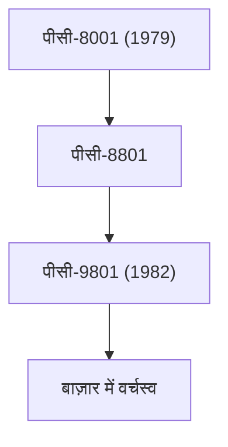

## 1. एनईसी का जन्म
1899 में, वेस्टर्न इलेक्ट्रिक के साथ एक संयुक्त उद्यम के माध्यम से, यह जापान की पहली विदेशी-संबद्ध संयुक्त उद्यम कंपनी के रूप में पैदा हुई थी। इसकी शुरुआत टेलीफोन और संचार उपकरणों के निर्माण से हुई थी।

## 2. पीसी-9800 सीरीज़ का स्वर्णिम युग
1980 और 90 के दशक में, "पीसी-98" सीरीज़ ने जापानी पर्सनल कंप्यूटर बाज़ार पर पूरी तरह से कब्ज़ा कर लिया था। जापानी भाषा प्रसंस्करण में विशेषज्ञता वाला इसका हार्डवेयर आर्किटेक्चर इसकी सबसे बड़ी ताकत थी।

## 3. सी एंड सी (कंप्यूटर और संचार का एकीकरण)
1977 में अध्यक्ष कोजी कोबायाशी द्वारा प्रस्तावित "सी एंड सी (कंप्यूटर और संचार)" का दृष्टिकोण, भविष्य के इंटरनेट समाज की पूरी तरह से भविष्यवाणी करता था।

## 4. वर्तमान बायोमेट्रिक्स और अंतरिक्ष व्यवसाय
वर्तमान में, इसने अपने पीसी व्यवसाय को अलग कर दिया है और विश्व स्तरीय चेहरे की पहचान तकनीक, पनडुब्बी केबल और कृत्रिम उपग्रह (हयाबुसा परियोजना आदि) जैसे सामाजिक बुनियादी ढांचा व्यवसायों पर ध्यान केंद्रित कर रहा है।

## अतिरिक्त तकनीकी सत्यापन भाग 1

### 1. एनईसी का जन्म
1899 में, वेस्टर्न इलेक्ट्रिक के साथ एक संयुक्त उद्यम के माध्यम से, यह जापान की पहली विदेशी-संबद्ध संयुक्त उद्यम कंपनी के रूप में पैदा हुई थी। इसकी शुरुआत टेलीफोन और संचार उपकरणों के निर्माण से हुई थी।

### 2. पीसी-9800 सीरीज़ का स्वर्णिम युग
1980 और 90 के दशक में, "पीसी-98" सीरीज़ ने जापानी पर्सनल कंप्यूटर बाज़ार पर पूरी तरह से कब्ज़ा कर लिया था। जापानी भाषा प्रसंस्करण में विशेषज्ञता वाला इसका हार्डवेयर आर्किटेक्चर इसकी सबसे बड़ी ताकत थी।

### 3. सी एंड सी (कंप्यूटर और संचार का एकीकरण)
1977 में अध्यक्ष कोजी कोबायाशी द्वारा प्रस्तावित "सी एंड सी (कंप्यूटर और संचार)" का दृष्टिकोण, भविष्य के इंटरनेट समाज की पूरी तरह से भविष्यवाणी करता था।

### 4. वर्तमान बायोमेट्रिक्स और अंतरिक्ष व्यवसाय
वर्तमान में, इसने अपने पीसी व्यवसाय को अलग कर दिया है और विश्व स्तरीय चेहरे की पहचान तकनीक, पनडुब्बी केबल और कृत्रिम उपग्रह (हयाबुसा परियोजना आदि) जैसे सामाजिक बुनियादी ढांचा व्यवसायों पर ध्यान केंद्रित कर रहा है।

## अतिरिक्त तकनीकी सत्यापन भाग 2

### 1. एनईसी का जन्म
1899 में, वेस्टर्न इलेक्ट्रिक के साथ एक संयुक्त उद्यम के माध्यम से, यह जापान की पहली विदेशी-संबद्ध संयुक्त उद्यम कंपनी के रूप में पैदा हुई थी। इसकी शुरुआत टेलीफोन और संचार उपकरणों के निर्माण से हुई थी।

### 2. पीसी-9800 सीरीज़ का स्वर्णिम युग
1980 और 90 के दशक में, "पीसी-98" सीरीज़ ने जापानी पर्सनल कंप्यूटर बाज़ार पर पूरी तरह से कब्ज़ा कर लिया था। जापानी भाषा प्रसंस्करण में विशेषज्ञता वाला इसका हार्डवेयर आर्किटेक्चर इसकी सबसे बड़ी ताकत थी।

### 3. सी एंड सी (कंप्यूटर और संचार का एकीकरण)
1977 में अध्यक्ष कोजी कोबायाशी द्वारा प्रस्तावित "सी एंड सी (कंप्यूटर और संचार)" का दृष्टिकोण, भविष्य के इंटरनेट समाज की पूरी तरह से भविष्यवाणी करता था।

### 4. वर्तमान बायोमेट्रिक्स और अंतरिक्ष व्यवसाय
वर्तमान में, इसने अपने पीसी व्यवसाय को अलग कर दिया है और विश्व स्तरीय चेहरे की पहचान तकनीक, पनडुब्बी केबल और कृत्रिम उपग्रह (हयाबुसा परियोजना आदि) जैसे सामाजिक बुनियादी ढांचा व्यवसायों पर ध्यान केंद्रित कर रहा है।

## अतिरिक्त तकनीकी सत्यापन भाग 3

### 1. एनईसी का जन्म
1899 में, वेस्टर्न इलेक्ट्रिक के साथ एक संयुक्त उद्यम के माध्यम से, यह जापान की पहली विदेशी-संबद्ध संयुक्त उद्यम कंपनी के रूप में पैदा हुई थी। इसकी शुरुआत टेलीफोन और संचार उपकरणों के निर्माण से हुई थी।

### 2. पीसी-9800 सीरीज़ का स्वर्णिम युग
1980 और 90 के दशक में, "पीसी-98" सीरीज़ ने जापानी पर्सनल कंप्यूटर बाज़ार पर पूरी तरह से कब्ज़ा कर लिया था। जापानी भाषा प्रसंस्करण में विशेषज्ञता वाला इसका हार्डवेयर आर्किटेक्चर इसकी सबसे बड़ी ताकत थी।

### 3. सी एंड सी (कंप्यूटर और संचार का एकीकरण)
1977 में अध्यक्ष कोजी कोबायाशी द्वारा प्रस्तावित "सी एंड सी (कंप्यूटर और संचार)" का दृष्टिकोण, भविष्य के इंटरनेट समाज की पूरी तरह से भविष्यवाणी करता था।

### 4. वर्तमान बायोमेट्रिक्स और अंतरिक्ष व्यवसाय
वर्तमान में, इसने अपने पीसी व्यवसाय को अलग कर दिया है और विश्व स्तरीय चेहरे की पहचान तकनीक, पनडुब्बी केबल और कृत्रिम उपग्रह (हयाबुसा परियोजना आदि) जैसे सामाजिक बुनियादी ढांचा व्यवसायों पर ध्यान केंद्रित कर रहा है।

## अतिरिक्त तकनीकी सत्यापन भाग 4

### 1. एनईसी का जन्म
1899 में, वेस्टर्न इलेक्ट्रिक के साथ एक संयुक्त उद्यम के माध्यम से, यह जापान की पहली विदेशी-संबद्ध संयुक्त उद्यम कंपनी के रूप में पैदा हुई थी। इसकी शुरुआत टेलीफोन और संचार उपकरणों के निर्माण से हुई थी।

### 2. पीसी-9800 सीरीज़ का स्वर्णिम युग
1980 और 90 के दशक में, "पीसी-98" सीरीज़ ने जापानी पर्सनल कंप्यूटर बाज़ार पर पूरी तरह से कब्ज़ा कर लिया था। जापानी भाषा प्रसंस्करण में विशेषज्ञता वाला इसका हार्डवेयर आर्किटेक्चर इसकी सबसे बड़ी ताकत थी।

### 3. सी एंड सी (कंप्यूटर और संचार का एकीकरण)
1977 में अध्यक्ष कोजी कोबायाशी द्वारा प्रस्तावित "सी एंड सी (कंप्यूटर और संचार)" का दृष्टिकोण, भविष्य के इंटरनेट समाज की पूरी तरह से भविष्यवाणी करता था।

### 4. वर्तमान बायोमेट्रिक्स और अंतरिक्ष व्यवसाय
वर्तमान में, इसने अपने पीसी व्यवसाय को अलग कर दिया है और विश्व स्तरीय चेहरे की पहचान तकनीक, पनडुब्बी केबल और कृत्रिम उपग्रह (हयाबुसा परियोजना आदि) जैसे सामाजिक बुनियादी ढांचा व्यवसायों पर ध्यान केंद्रित कर रहा है।

## अतिरिक्त तकनीकी सत्यापन भाग 5

### 1. एनईसी का जन्म
1899 में, वेस्टर्न इलेक्ट्रिक के साथ एक संयुक्त उद्यम के माध्यम से, यह जापान की पहली विदेशी-संबद्ध संयुक्त उद्यम कंपनी के रूप में पैदा हुई थी। इसकी शुरुआत टेलीफोन और संचार उपकरणों के निर्माण से हुई थी।

### 2. पीसी-9800 सीरीज़ का स्वर्णिम युग
1980 और 90 के दशक में, "पीसी-98" सीरीज़ ने जापानी पर्सनल कंप्यूटर बाज़ार पर पूरी तरह से कब्ज़ा कर लिया था। जापानी भाषा प्रसंस्करण में विशेषज्ञता वाला इसका हार्डवेयर आर्किटेक्चर इसकी सबसे बड़ी ताकत थी।

### 3. सी एंड सी (कंप्यूटर और संचार का एकीकरण)
1977 में अध्यक्ष कोजी कोबायाशी द्वारा प्रस्तावित "सी एंड सी (कंप्यूटर और संचार)" का दृष्टिकोण, भविष्य के इंटरनेट समाज की पूरी तरह से भविष्यवाणी करता था।

### 4. वर्तमान बायोमेट्रिक्स और अंतरिक्ष व्यवसाय
वर्तमान में, इसने अपने पीसी व्यवसाय को अलग कर दिया है और विश्व स्तरीय चेहरे की पहचान तकनीक, पनडुब्बी केबल और कृत्रिम उपग्रह (हयाबुसा परियोजना आदि) जैसे सामाजिक बुनियादी ढांचा व्यवसायों पर ध्यान केंद्रित कर रहा है।

## अतिरिक्त तकनीकी सत्यापन भाग 6

### 1. एनईसी का जन्म
1899 में, वेस्टर्न इलेक्ट्रिक के साथ एक संयुक्त उद्यम के माध्यम से, यह जापान की पहली विदेशी-संबद्ध संयुक्त उद्यम कंपनी के रूप में पैदा हुई थी। इसकी शुरुआत टेलीफोन और संचार उपकरणों के निर्माण से हुई थी।

### 2. पीसी-9800 सीरीज़ का स्वर्णिम युग
1980 और 90 के दशक में, "पीसी-98" सीरीज़ ने जापानी पर्सनल कंप्यूटर बाज़ार पर पूरी तरह से कब्ज़ा कर लिया था। जापानी भाषा प्रसंस्करण में विशेषज्ञता वाला इसका हार्डवेयर आर्किटेक्चर इसकी सबसे बड़ी ताकत थी।

### 3. सी एंड सी (कंप्यूटर और संचार का एकीकरण)
1977 में अध्यक्ष कोजी कोबायाशी द्वारा प्रस्तावित "सी एंड सी (कंप्यूटर और संचार)" का दृष्टिकोण, भविष्य के इंटरनेट समाज की पूरी तरह से भविष्यवाणी करता था।

### 4. वर्तमान बायोमेट्रिक्स और अंतरिक्ष व्यवसाय
वर्तमान में, इसने अपने पीसी व्यवसाय को अलग कर दिया है और विश्व स्तरीय चेहरे की पहचान तकनीक, पनडुब्बी केबल और कृत्रिम उपग्रह (हयाबुसा परियोजना आदि) जैसे सामाजिक बुनियादी ढांचा व्यवसायों पर ध्यान केंद्रित कर रहा है।

## अतिरिक्त तकनीकी सत्यापन भाग 7

### 1. एनईसी का जन्म
1899 में, वेस्टर्न इलेक्ट्रिक के साथ एक संयुक्त उद्यम के माध्यम से, यह जापान की पहली विदेशी-संबद्ध संयुक्त उद्यम कंपनी के रूप में पैदा हुई थी। इसकी शुरुआत टेलीफोन और संचार उपकरणों के निर्माण से हुई थी।

### 2. पीसी-9800 सीरीज़ का स्वर्णिम युग
1980 और 90 के दशक में, "पीसी-98" सीरीज़ ने जापानी पर्सनल कंप्यूटर बाज़ार पर पूरी तरह से कब्ज़ा कर लिया था। जापानी भाषा प्रसंस्करण में विशेषज्ञता वाला इसका हार्डवेयर आर्किटेक्चर इसकी सबसे बड़ी ताकत थी।

### 3. सी एंड सी (कंप्यूटर और संचार का एकीकरण)
1977 में अध्यक्ष कोजी कोबायाशी द्वारा प्रस्तावित "सी एंड सी (कंप्यूटर और संचार)" का दृष्टिकोण, भविष्य के इंटरनेट समाज की पूरी तरह से भविष्यवाणी करता था।

### 4. वर्तमान बायोमेट्रिक्स और अंतरिक्ष व्यवसाय
वर्तमान में, इसने अपने पीसी व्यवसाय को अलग कर दिया है और विश्व स्तरीय चेहरे की पहचान तकनीक, पनडुब्बी केबल और कृत्रिम उपग्रह (हयाबुसा परियोजना आदि) जैसे सामाजिक बुनियादी ढांचा व्यवसायों पर ध्यान केंद्रित कर रहा है।

## अतिरिक्त तकनीकी सत्यापन भाग 8

### 1. एनईसी का जन्म
1899 में, वेस्टर्न इलेक्ट्रिक के साथ एक संयुक्त उद्यम के माध्यम से, यह जापान की पहली विदेशी-संबद्ध संयुक्त उद्यम कंपनी के रूप में पैदा हुई थी। इसकी शुरुआत टेलीफोन और संचार उपकरणों के निर्माण से हुई थी।

### 2. पीसी-9800 सीरीज़ का स्वर्णिम युग
1980 और 90 के दशक में, "पीसी-98" सीरीज़ ने जापानी पर्सनल कंप्यूटर बाज़ार पर पूरी तरह से कब्ज़ा कर लिया था। जापानी भाषा प्रसंस्करण में विशेषज्ञता वाला इसका हार्डवेयर आर्किटेक्चर इसकी सबसे बड़ी ताकत थी।

### 3. सी एंड सी (कंप्यूटर और संचार का एकीकरण)
1977 में अध्यक्ष कोजी कोबायाशी द्वारा प्रस्तावित "सी एंड सी (कंप्यूटर और संचार)" का दृष्टिकोण, भविष्य के इंटरनेट समाज की पूरी तरह से भविष्यवाणी करता था।

### 4. वर्तमान बायोमेट्रिक्स और अंतरिक्ष व्यवसाय
वर्तमान में, इसने अपने पीसी व्यवसाय को अलग कर दिया है और विश्व स्तरीय चेहरे की पहचान तकनीक, पनडुब्बी केबल और कृत्रिम उपग्रह (हयाबुसा परियोजना आदि) जैसे सामाजिक बुनियादी ढांचा व्यवसायों पर ध्यान केंद्रित कर रहा है।

## अतिरिक्त तकनीकी सत्यापन भाग 9

### 1. एनईसी का जन्म
1899 में, वेस्टर्न इलेक्ट्रिक के साथ एक संयुक्त उद्यम के माध्यम से, यह जापान की पहली विदेशी-संबद्ध संयुक्त उद्यम कंपनी के रूप में पैदा हुई थी। इसकी शुरुआत टेलीफोन और संचार उपकरणों के निर्माण से हुई थी।

### 2. पीसी-9800 सीरीज़ का स्वर्णिम युग
1980 और 90 के दशक में, "पीसी-98" सीरीज़ ने जापानी पर्सनल कंप्यूटर बाज़ार पर पूरी तरह से कब्ज़ा कर लिया था। जापानी भाषा प्रसंस्करण में विशेषज्ञता वाला इसका हार्डवेयर आर्किटेक्चर इसकी सबसे बड़ी ताकत थी।

### 3. सी एंड सी (कंप्यूटर और संचार का एकीकरण)
1977 में अध्यक्ष कोजी कोबायाशी द्वारा प्रस्तावित "सी एंड सी (कंप्यूटर और संचार)" का दृष्टिकोण, भविष्य के इंटरनेट समाज की पूरी तरह से भविष्यवाणी करता था।

### 4. वर्तमान बायोमेट्रिक्स और अंतरिक्ष व्यवसाय
वर्तमान में, इसने अपने पीसी व्यवसाय को अलग कर दिया है और विश्व स्तरीय चेहरे की पहचान तकनीक, पनडुब्बी केबल और कृत्रिम उपग्रह (हयाबुसा परियोजना आदि) जैसे सामाजिक बुनियादी ढांचा व्यवसायों पर ध्यान केंद्रित कर रहा है।

## अतिरिक्त तकनीकी सत्यापन भाग 10

### 1. एनईसी का जन्म
1899 में, वेस्टर्न इलेक्ट्रिक के साथ एक संयुक्त उद्यम के माध्यम से, यह जापान की पहली विदेशी-संबद्ध संयुक्त उद्यम कंपनी के रूप में पैदा हुई थी। इसकी शुरुआत टेलीफोन और संचार उपकरणों के निर्माण से हुई थी।

### 2. पीसी-9800 सीरीज़ का स्वर्णिम युग
1980 और 90 के दशक में, "पीसी-98" सीरीज़ ने जापानी पर्सनल कंप्यूटर बाज़ार पर पूरी तरह से कब्ज़ा कर लिया था। जापानी भाषा प्रसंस्करण में विशेषज्ञता वाला इसका हार्डवेयर आर्किटेक्चर इसकी सबसे बड़ी ताकत थी।

### 3. सी एंड सी (कंप्यूटर और संचार का एकीकरण)
1977 में अध्यक्ष कोजी कोबायाशी द्वारा प्रस्तावित "सी एंड सी (कंप्यूटर और संचार)" का दृष्टिकोण, भविष्य के इंटरनेट समाज की पूरी तरह से भविष्यवाणी करता था।

### 4. वर्तमान बायोमेट्रिक्स और अंतरिक्ष व्यवसाय
वर्तमान में, इसने अपने पीसी व्यवसाय को अलग कर दिया है और विश्व स्तरीय चेहरे की पहचान तकनीक, पनडुब्बी केबल और कृत्रिम उपग्रह (हयाबुसा परियोजना आदि) जैसे सामाजिक बुनियादी ढांचा व्यवसायों पर ध्यान केंद्रित कर रहा है।

## अतिरिक्त तकनीकी सत्यापन भाग 11

### 1. एनईसी का जन्म
1899 में, वेस्टर्न इलेक्ट्रिक के साथ एक संयुक्त उद्यम के माध्यम से, यह जापान की पहली विदेशी-संबद्ध संयुक्त उद्यम कंपनी के रूप में पैदा हुई थी। इसकी शुरुआत टेलीफोन और संचार उपकरणों के निर्माण से हुई थी।

### 2. पीसी-9800 सीरीज़ का स्वर्णिम युग
1980 और 90 के दशक में, "पीसी-98" सीरीज़ ने जापानी पर्सनल कंप्यूटर बाज़ार पर पूरी तरह से कब्ज़ा कर लिया था। जापानी भाषा प्रसंस्करण में विशेषज्ञता वाला इसका हार्डवेयर आर्किटेक्चर इसकी सबसे बड़ी ताकत थी।

### 3. सी एंड सी (कंप्यूटर और संचार का एकीकरण)
1977 में अध्यक्ष कोजी कोबायाशी द्वारा प्रस्तावित "सी एंड सी (कंप्यूटर और संचार)" का दृष्टिकोण, भविष्य के इंटरनेट समाज की पूरी तरह से भविष्यवाणी करता था।

### 4. वर्तमान बायोमेट्रिक्स और अंतरिक्ष व्यवसाय
वर्तमान में, इसने अपने पीसी व्यवसाय को अलग कर दिया है और विश्व स्तरीय चेहरे की पहचान तकनीक, पनडुब्बी केबल और कृत्रिम उपग्रह (हयाबुसा परियोजना आदि) जैसे सामाजिक बुनियादी ढांचा व्यवसायों पर ध्यान केंद्रित कर रहा है।

## अतिरिक्त तकनीकी सत्यापन भाग 12

### 1. एनईसी का जन्म
1899 में, वेस्टर्न इलेक्ट्रिक के साथ एक संयुक्त उद्यम के माध्यम से, यह जापान की पहली विदेशी-संबद्ध संयुक्त उद्यम कंपनी के रूप में पैदा हुई थी। इसकी शुरुआत टेलीफोन और संचार उपकरणों के निर्माण से हुई थी।

### 2. पीसी-9800 सीरीज़ का स्वर्णिम युग
1980 और 90 के दशक में, "पीसी-98" सीरीज़ ने जापानी पर्सनल कंप्यूटर बाज़ार पर पूरी तरह से कब्ज़ा कर लिया था। जापानी भाषा प्रसंस्करण में विशेषज्ञता वाला इसका हार्डवेयर आर्किटेक्चर इसकी सबसे बड़ी ताकत थी।

### 3. सी एंड सी (कंप्यूटर और संचार का एकीकरण)
1977 में अध्यक्ष कोजी कोबायाशी द्वारा प्रस्तावित "सी एंड सी (कंप्यूटर और संचार)" का दृष्टिकोण, भविष्य के इंटरनेट समाज की पूरी तरह से भविष्यवाणी करता था।

### 4. वर्तमान बायोमेट्रिक्स और अंतरिक्ष व्यवसाय
वर्तमान में, इसने अपने पीसी व्यवसाय को अलग कर दिया है और विश्व स्तरीय चेहरे की पहचान तकनीक, पनडुब्बी केबल और कृत्रिम उपग्रह (हयाबुसा परियोजना आदि) जैसे सामाजिक बुनियादी ढांचा व्यवसायों पर ध्यान केंद्रित कर रहा है।

## अतिरिक्त तकनीकी सत्यापन भाग 13

### 1. एनईसी का जन्म
1899 में, वेस्टर्न इलेक्ट्रिक के साथ एक संयुक्त उद्यम के माध्यम से, यह जापान की पहली विदेशी-संबद्ध संयुक्त उद्यम कंपनी के रूप में पैदा हुई थी। इसकी शुरुआत टेलीफोन और संचार उपकरणों के निर्माण से हुई थी।

### 2. पीसी-9800 सीरीज़ का स्वर्णिम युग
1980 और 90 के दशक में, "पीसी-98" सीरीज़ ने जापानी पर्सनल कंप्यूटर बाज़ार पर पूरी तरह से कब्ज़ा कर लिया था। जापानी भाषा प्रसंस्करण में विशेषज्ञता वाला इसका हार्डवेयर आर्किटेक्चर इसकी सबसे बड़ी ताकत थी।

### 3. सी एंड सी (कंप्यूटर और संचार का एकीकरण)
1977 में अध्यक्ष कोजी कोबायाशी द्वारा प्रस्तावित "सी एंड सी (कंप्यूटर और संचार)" का दृष्टिकोण, भविष्य के इंटरनेट समाज की पूरी तरह से भविष्यवाणी करता था।

### 4. वर्तमान बायोमेट्रिक्स और अंतरिक्ष व्यवसाय
वर्तमान में, इसने अपने पीसी व्यवसाय को अलग कर दिया है और विश्व स्तरीय चेहरे की पहचान तकनीक, पनडुब्बी केबल और कृत्रिम उपग्रह (हयाबुसा परियोजना आदि) जैसे सामाजिक बुनियादी ढांचा व्यवसायों पर ध्यान केंद्रित कर रहा है।

## अतिरिक्त तकनीकी सत्यापन भाग 14

### 1. एनईसी का जन्म
1899 में, वेस्टर्न इलेक्ट्रिक के साथ एक संयुक्त उद्यम के माध्यम से, यह जापान की पहली विदेशी-संबद्ध संयुक्त उद्यम कंपनी के रूप में पैदा हुई थी। इसकी शुरुआत टेलीफोन और संचार उपकरणों के निर्माण से हुई थी।

### 2. पीसी-9800 सीरीज़ का स्वर्णिम युग
1980 और 90 के दशक में, "पीसी-98" सीरीज़ ने जापानी पर्सनल कंप्यूटर बाज़ार पर पूरी तरह से कब्ज़ा कर लिया था। जापानी भाषा प्रसंस्करण में विशेषज्ञता वाला इसका हार्डवेयर आर्किटेक्चर इसकी सबसे बड़ी ताकत थी।

### 3. सी एंड सी (कंप्यूटर और संचार का एकीकरण)
1977 में अध्यक्ष कोजी कोबायाशी द्वारा प्रस्तावित "सी एंड सी (कंप्यूटर और संचार)" का दृष्टिकोण, भविष्य के इंटरनेट समाज की पूरी तरह से भविष्यवाणी करता था।

### 4. वर्तमान बायोमेट्रिक्स और अंतरिक्ष व्यवसाय
वर्तमान में, इसने अपने पीसी व्यवसाय को अलग कर दिया है और विश्व स्तरीय चेहरे की पहचान तकनीक, पनडुब्बी केबल और कृत्रिम उपग्रह (हयाबुसा परियोजना आदि) जैसे सामाजिक बुनियादी ढांचा व्यवसायों पर ध्यान केंद्रित कर रहा है।
