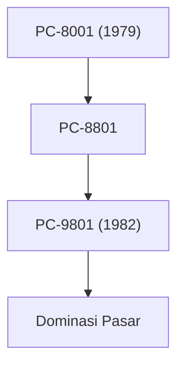

## 1. Lahirnya Nippon Electric Company (NEC)
Pada tahun 1899, NEC didirikan sebagai perusahaan patungan asing pertama di Jepang melalui kerja sama dengan Western Electric. Perusahaan ini berawal dari pembuatan telepon dan peralatan komunikasi.

## 2. Era Keemasan Seri PC-9800
Dari tahun 1980-an hingga 90-an, seri "PC-98" sepenuhnya mendominasi pasar komputer pribadi di Jepang. Kekuatan utamanya terletak pada arsitektur perangkat keras yang dikhususkan untuk pemrosesan bahasa Jepang.

## 3. C&C (Konvergensi Komputer dan Komunikasi)
Visi "C&C (Computer and Communication)" yang diusulkan oleh Presiden Koji Kobayashi pada tahun 1977 sepenuhnya memprediksi masyarakat internet di masa mendatang.

## 4. Autentikasi Biometrik dan Bisnis Luar Angkasa Saat Ini
Saat ini, NEC telah melepaskan bisnis PC-nya dan berfokus pada bisnis infrastruktur sosial seperti teknologi pengenalan wajah kelas dunia, kabel bawah laut, dan satelit buatan (seperti proyek Hayabusa).

## Bagian Verifikasi Teknologi Tambahan 1

## Bagian Verifikasi Teknologi Tambahan 2

## Bagian Verifikasi Teknologi Tambahan 3

## Bagian Verifikasi Teknologi Tambahan 4

## Bagian Verifikasi Teknologi Tambahan 5

## Bagian Verifikasi Teknologi Tambahan 6

## Bagian Verifikasi Teknologi Tambahan 7

## Bagian Verifikasi Teknologi Tambahan 8

## Bagian Verifikasi Teknologi Tambahan 9

## Bagian Verifikasi Teknologi Tambahan 10

## Bagian Verifikasi Teknologi Tambahan 11

## Bagian Verifikasi Teknologi Tambahan 12

## Bagian Verifikasi Teknologi Tambahan 13

## Bagian Verifikasi Teknologi Tambahan 14

