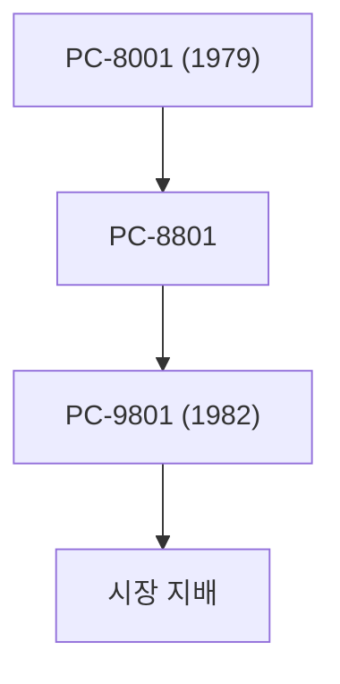

## 1. 일본전기의 탄생
1899년, 웨스턴 일렉트릭과의 합작을 통해 일본 최초의 외국계 합작 기업으로 탄생. 전화기와 통신 기기 제조부터 시작되었습니다.

## 2. PC-9800 시리즈의 황금시대
1980년대부터 90년대에 걸쳐 'PC-98' 시리즈는 일본의 PC 시장을 완전히 석권했습니다. 일본어 처리에 특화된 하드웨어 아키텍처가 강점이었습니다.

## 3. C&C(컴퓨터와 통신의 융합)
1977년에 고바야시 고지 사장이 제창한 'C&C(Computer and Communication)' 비전은 이후의 인터넷 사회를 완전히 예견하고 있었습니다.

## 4. 현재의 생체 인증과 우주 사업
현재는 PC 사업을 분리하고, 세계 최고 수준의 얼굴 인식 기술이나 해저 케이블, 인공위성(하야부사 프로젝트 등)과 같은 사회 인프라 사업에 주력하고 있습니다.

## 추가 기술 검증 파트 1

## 추가 기술 검증 파트 2

## 추가 기술 검증 파트 3

## 추가 기술 검증 파트 4

## 추가 기술 검증 파트 5

## 추가 기술 검증 파트 6

## 추가 기술 검증 파트 7

## 추가 기술 검증 파트 8

## 추가 기술 검증 파트 9

## 추가 기술 검증 파트 10

## 추가 기술 검증 파트 11

## 추가 기술 검증 파트 12

## 추가 기술 검증 파트 13

## 추가 기술 검증 파트 14

