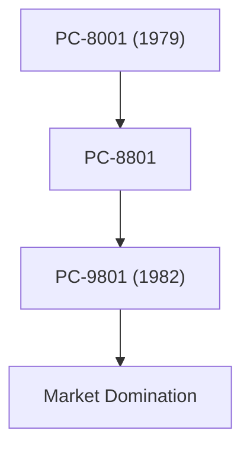

## 1. 日本電気の誕生
1899年、ウェスタン・エレクトリックとの合弁により、日本初の外資系合弁企業として誕生。電話機や通信機器の製造から始まりました。

## 2. PC-9800シリーズの黄金時代
1980年代から90年代にかけて、「PC-98」シリーズは日本のパソコン市場を完全に席巻しました。日本語処理に特化したハードウェアアーキテクチャが強みでした。

## 3. C&C（コンピュータと通信の融合）
1977年に小林宏治社長が提唱した「C&C（Computer and Communication）」のビジョンは、後のインターネット社会を完全に予見していました。

## 4. 現在の生体認証と宇宙事業
現在ではPC事業を切り離し、世界トップクラスの顔認証技術や、海底ケーブル、人工衛星（はやぶさプロジェクト等）などの社会インフラ事業に注力しています。

## 追加技術検証パート 1

### 1. 日本電気の誕生
1899年、ウェスタン・エレクトリックとの合弁により、日本初の外資系合弁企業として誕生。電話機や通信機器の製造から始まりました。

### 2. PC-9800シリーズの黄金時代
1980年代から90年代にかけて、「PC-98」シリーズは日本のパソコン市場を完全に席巻しました。日本語処理に特化したハードウェアアーキテクチャが強みでした。

### 3. C&C（コンピュータと通信の融合）
1977年に小林宏治社長が提唱した「C&C（Computer and Communication）」のビジョンは、後のインターネット社会を完全に予見していました。

### 4. 現在の生体認証と宇宙事業
現在ではPC事業を切り離し、世界トップクラスの顔認証技術や、海底ケーブル、人工衛星（はやぶさプロジェクト等）などの社会インフラ事業に注力しています。

## 追加技術検証パート 2

### 1. 日本電気の誕生
1899年、ウェスタン・エレクトリックとの合弁により、日本初の外資系合弁企業として誕生。電話機や通信機器の製造から始まりました。

### 2. PC-9800シリーズの黄金時代
1980年代から90年代にかけて、「PC-98」シリーズは日本のパソコン市場を完全に席巻しました。日本語処理に特化したハードウェアアーキテクチャが強みでした。

### 3. C&C（コンピュータと通信の融合）
1977年に小林宏治社長が提唱した「C&C（Computer and Communication）」のビジョンは、後のインターネット社会を完全に予見していました。

### 4. 現在の生体認証と宇宙事業
現在ではPC事業を切り離し、世界トップクラスの顔認証技術や、海底ケーブル、人工衛星（はやぶさプロジェクト等）などの社会インフラ事業に注力しています。

## 追加技術検証パート 3

### 1. 日本電気の誕生
1899年、ウェスタン・エレクトリックとの合弁により、日本初の外資系合弁企業として誕生。電話機や通信機器の製造から始まりました。

### 2. PC-9800シリーズの黄金時代
1980年代から90年代にかけて、「PC-98」シリーズは日本のパソコン市場を完全に席巻しました。日本語処理に特化したハードウェアアーキテクチャが強みでした。

### 3. C&C（コンピュータと通信の融合）
1977年に小林宏治社長が提唱した「C&C（Computer and Communication）」のビジョンは、後のインターネット社会を完全に予見していました。

### 4. 現在の生体認証と宇宙事業
現在ではPC事業を切り離し、世界トップクラスの顔認証技術や、海底ケーブル、人工衛星（はやぶさプロジェクト等）などの社会インフラ事業に注力しています。

## 追加技術検証パート 4

### 1. 日本電気の誕生
1899年、ウェスタン・エレクトリックとの合弁により、日本初の外資系合弁企業として誕生。電話機や通信機器の製造から始まりました。

### 2. PC-9800シリーズの黄金時代
1980年代から90年代にかけて、「PC-98」シリーズは日本のパソコン市場を完全に席巻しました。日本語処理に特化したハードウェアアーキテクチャが強みでした。

### 3. C&C（コンピュータと通信の融合）
1977年に小林宏治社長が提唱した「C&C（Computer and Communication）」のビジョンは、後のインターネット社会を完全に予見していました。

### 4. 現在の生体認証と宇宙事業
現在ではPC事業を切り離し、世界トップクラスの顔認証技術や、海底ケーブル、人工衛星（はやぶさプロジェクト等）などの社会インフラ事業に注力しています。

## 追加技術検証パート 5

### 1. 日本電気の誕生
1899年、ウェスタン・エレクトリックとの合弁により、日本初の外資系合弁企業として誕生。電話機や通信機器の製造から始まりました。

### 2. PC-9800シリーズの黄金時代
1980年代から90年代にかけて、「PC-98」シリーズは日本のパソコン市場を完全に席巻しました。日本語処理に特化したハードウェアアーキテクチャが強みでした。

### 3. C&C（コンピュータと通信の融合）
1977年に小林宏治社長が提唱した「C&C（Computer and Communication）」のビジョンは、後のインターネット社会を完全に予見していました。

### 4. 現在の生体認証と宇宙事業
現在ではPC事業を切り離し、世界トップクラスの顔認証技術や、海底ケーブル、人工衛星（はやぶさプロジェクト等）などの社会インフラ事業に注力しています。

## 追加技術検証パート 6

### 1. 日本電気の誕生
1899年、ウェスタン・エレクトリックとの合弁により、日本初の外資系合弁企業として誕生。電話機や通信機器の製造から始まりました。

### 2. PC-9800シリーズの黄金時代
1980年代から90年代にかけて、「PC-98」シリーズは日本のパソコン市場を完全に席巻しました。日本語処理に特化したハードウェアアーキテクチャが強みでした。

### 3. C&C（コンピュータと通信の融合）
1977年に小林宏治社長が提唱した「C&C（Computer and Communication）」のビジョンは、後のインターネット社会を完全に予見していました。

### 4. 現在の生体認証と宇宙事業
現在ではPC事業を切り離し、世界トップクラスの顔認証技術や、海底ケーブル、人工衛星（はやぶさプロジェクト等）などの社会インフラ事業に注力しています。

## 追加技術検証パート 7

### 1. 日本電気の誕生
1899年、ウェスタン・エレクトリックとの合弁により、日本初の外資系合弁企業として誕生。電話機や通信機器の製造から始まりました。

### 2. PC-9800シリーズの黄金時代
1980年代から90年代にかけて、「PC-98」シリーズは日本のパソコン市場を完全に席巻しました。日本語処理に特化したハードウェアアーキテクチャが強みでした。

### 3. C&C（コンピュータと通信の融合）
1977年に小林宏治社長が提唱した「C&C（Computer and Communication）」のビジョンは、後のインターネット社会を完全に予見していました。

### 4. 現在の生体認証と宇宙事業
現在ではPC事業を切り離し、世界トップクラスの顔認証技術や、海底ケーブル、人工衛星（はやぶさプロジェクト等）などの社会インフラ事業に注力しています。

## 追加技術検証パート 8

### 1. 日本電気の誕生
1899年、ウェスタン・エレクトリックとの合弁により、日本初の外資系合弁企業として誕生。電話機や通信機器の製造から始まりました。

### 2. PC-9800シリーズの黄金時代
1980年代から90年代にかけて、「PC-98」シリーズは日本のパソコン市場を完全に席巻しました。日本語処理に特化したハードウェアアーキテクチャが強みでした。

### 3. C&C（コンピュータと通信の融合）
1977年に小林宏治社長が提唱した「C&C（Computer and Communication）」のビジョンは、後のインターネット社会を完全に予見していました。

### 4. 現在の生体認証と宇宙事業
現在ではPC事業を切り離し、世界トップクラスの顔認証技術や、海底ケーブル、人工衛星（はやぶさプロジェクト等）などの社会インフラ事業に注力しています。

## 追加技術検証パート 9

### 1. 日本電気の誕生
1899年、ウェスタン・エレクトリックとの合弁により、日本初の外資系合弁企業として誕生。電話機や通信機器の製造から始まりました。

### 2. PC-9800シリーズの黄金時代
1980年代から90年代にかけて、「PC-98」シリーズは日本のパソコン市場を完全に席巻しました。日本語処理に特化したハードウェアアーキテクチャが強みでした。

### 3. C&C（コンピュータと通信の融合）
1977年に小林宏治社長が提唱した「C&C（Computer and Communication）」のビジョンは、後のインターネット社会を完全に予見していました。

### 4. 現在の生体認証と宇宙事業
現在ではPC事業を切り離し、世界トップクラスの顔認証技術や、海底ケーブル、人工衛星（はやぶさプロジェクト等）などの社会インフラ事業に注力しています。

## 追加技術検証パート 10

### 1. 日本電気の誕生
1899年、ウェスタン・エレクトリックとの合弁により、日本初の外資系合弁企業として誕生。電話機や通信機器の製造から始まりました。

### 2. PC-9800シリーズの黄金時代
1980年代から90年代にかけて、「PC-98」シリーズは日本のパソコン市場を完全に席巻しました。日本語処理に特化したハードウェアアーキテクチャが強みでした。

### 3. C&C（コンピュータと通信の融合）
1977年に小林宏治社長が提唱した「C&C（Computer and Communication）」のビジョンは、後のインターネット社会を完全に予見していました。

### 4. 現在の生体認証と宇宙事業
現在ではPC事業を切り離し、世界トップクラスの顔認証技術や、海底ケーブル、人工衛星（はやぶさプロジェクト等）などの社会インフラ事業に注力しています。

## 追加技術検証パート 11

### 1. 日本電気の誕生
1899年、ウェスタン・エレクトリックとの合弁により、日本初の外資系合弁企業として誕生。電話機や通信機器の製造から始まりました。

### 2. PC-9800シリーズの黄金時代
1980年代から90年代にかけて、「PC-98」シリーズは日本のパソコン市場を完全に席巻しました。日本語処理に特化したハードウェアアーキテクチャが強みでした。

### 3. C&C（コンピュータと通信の融合）
1977年に小林宏治社長が提唱した「C&C（Computer and Communication）」のビジョンは、後のインターネット社会を完全に予見していました。

### 4. 現在の生体認証と宇宙事業
現在ではPC事業を切り離し、世界トップクラスの顔認証技術や、海底ケーブル、人工衛星（はやぶさプロジェクト等）などの社会インフラ事業に注力しています。

## 追加技術検証パート 12

### 1. 日本電気の誕生
1899年、ウェスタン・エレクトリックとの合弁により、日本初の外資系合弁企業として誕生。電話機や通信機器の製造から始まりました。

### 2. PC-9800シリーズの黄金時代
1980年代から90年代にかけて、「PC-98」シリーズは日本のパソコン市場を完全に席巻しました。日本語処理に特化したハードウェアアーキテクチャが強みでした。

### 3. C&C（コンピュータと通信の融合）
1977年に小林宏治社長が提唱した「C&C（Computer and Communication）」のビジョンは、後のインターネット社会を完全に予見していました。

### 4. 現在の生体認証と宇宙事業
現在ではPC事業を切り離し、世界トップクラスの顔認証技術や、海底ケーブル、人工衛星（はやぶさプロジェクト等）などの社会インフラ事業に注力しています。

## 追加技術検証パート 13

### 1. 日本電気の誕生
1899年、ウェスタン・エレクトリックとの合弁により、日本初の外資系合弁企業として誕生。電話機や通信機器の製造から始まりました。

### 2. PC-9800シリーズの黄金時代
1980年代から90年代にかけて、「PC-98」シリーズは日本のパソコン市場を完全に席巻しました。日本語処理に特化したハードウェアアーキテクチャが強みでした。

### 3. C&C（コンピュータと通信の融合）
1977年に小林宏治社長が提唱した「C&C（Computer and Communication）」のビジョンは、後のインターネット社会を完全に予見していました。

### 4. 現在の生体認証と宇宙事業
現在ではPC事業を切り離し、世界トップクラスの顔認証技術や、海底ケーブル、人工衛星（はやぶさプロジェクト等）などの社会インフラ事業に注力しています。

## 追加技術検証パート 14

### 1. 日本電気の誕生
1899年、ウェスタン・エレクトリックとの合弁により、日本初の外資系合弁企業として誕生。電話機や通信機器の製造から始まりました。

### 2. PC-9800シリーズの黄金時代
1980年代から90年代にかけて、「PC-98」シリーズは日本のパソコン市場を完全に席巻しました。日本語処理に特化したハードウェアアーキテクチャが強みでした。

### 3. C&C（コンピュータと通信の融合）
1977年に小林宏治社長が提唱した「C&C（Computer and Communication）」のビジョンは、後のインターネット社会を完全に予見していました。

### 4. 現在の生体認証と宇宙事業
現在ではPC事業を切り離し、世界トップクラスの顔認証技術や、海底ケーブル、人工衛星（はやぶさプロジェクト等）などの社会インフラ事業に注力しています。
