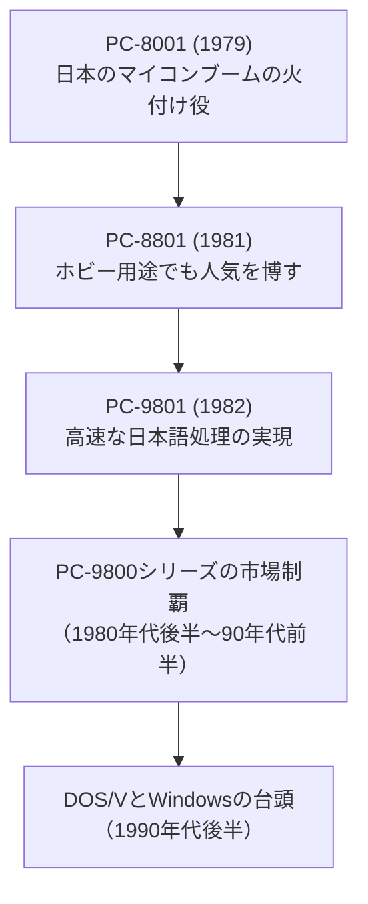

日本のテクノロジー史を語る上で、NEC（日本電気株式会社）の存在を抜きにすることはできません。現在でこそ、顔認証技術をはじめとする生体認証や、海底ケーブル、宇宙開発、AIといった社会インフラを中心とするBtoB（企業向け）ビジネスに特化していますが、かつては日本のパソコン市場をほぼ独占し、「国民機」と呼ばれたPC-9800シリーズで一世を風靡した時代がありました。

本記事では、1899年の創業から現在に至るまで、NECが日本の通信インフラとコンピュータ産業の発展にどのような役割を果たし、時代の激しい変化の中でいかにして事業構造を転換させてきたのか、その波乱万丈かつ革新的な歴史を紐解いていきます。

## 1. 創業と通信インフラの構築（1899年〜戦前）

### 日本初の外資系合弁企業としての誕生
NECの歴史は、明治時代末期の1899年（明治32年）に遡ります。創業者である岩垂邦彦（いわだれ くにひこ）は、エジソンのもとで働いた経験を持つ先見の明を持った技術者でした。彼はアメリカの通信機器メーカーであるウェスタン・エレクトリック（WE社、後のルーセント・テクノロジーズ）との合弁事業として「日本電気株式会社」を設立しました。これが、日本における最初の外資系合弁企業とされています。

創業当初のNECの主な事業は、電話機や電話交換機など通信機器の輸入と販売、そして国産化でした。当時の日本は近代国家としてのインフラ整備を急ピッチで進めており、電話網の拡充は国策として極めて重要な課題でした。NECは逓信省（現在の総務省・日本郵政グループなどの前身）と強いパイプを築き、通信技術の国産化を通じて日本の通信インフラの礎を築いていきました。

## 2. 通信の高度化と宇宙開発への進出（戦後〜1970年代）

### 電電公社との連携とマイクロ波通信網
第二次世界大戦で甚大な被害を受けた日本ですが、戦後の復興期において、通信インフラの再建は急務でした。1952年に日本電信電話公社（電電公社、現在のNTT）が設立されると、NECはいわゆる「電電ファミリー」の中核企業として、電話網の全国展開を強力にサポートしました。

特に画期的だったのがマイクロ波通信技術の発展です。テレビ放送の開始や長距離電話の需要増大に伴い、大容量の情報を高速に伝送する技術が求められていました。NECはマイクロ波通信システムで高い技術力を発揮し、国内のみならず海外へも通信インフラを輸出するグローバルな通信機器メーカーへと成長を遂げました。

### 日本の宇宙開発を支える技術力
1970年、日本初の人工衛星「おおすみ」が打ち上げられました。この歴史的快挙を技術面で裏から支えていたのがNECです。電波や通信の技術を応用し、人工衛星の開発や地上局のシステム構築において中心的な役割を担いました。この宇宙開発への取り組みは、現在に至るまでNECの重要なコア事業の一つとして脈々と受け継がれており、小惑星探査機「はやぶさ」「はやぶさ2」のシステム開発にも結実しています。

## 3. 「C&C」ビジョンとマイコン時代への幕開け（1970年代後半〜）

### コンピュータと通信の融合「C&C」の提唱
1977年、当時のNEC社長であった小林宏治氏は、アメリカのアトランタで開催された国際会議において「C&C（Computer and Communication）」という革新的なビジョンを提唱しました。

これは、「コンピュータ技術（情報処理）」と「コミュニケーション技術（通信）」が、やがてLSI（大規模集積回路）などの半導体技術の進化によって融合し、一つの巨大な情報社会のネットワークを形成するというコンセプトです。インターネットが普及するはるか前の1970年代に、現在のクラウドコンピューティングやIoT、スマートフォンの世界を予見していたこのビジョンは、その後のNECの経営方針の絶対的な羅針盤となりました。

### マイコンキット「TK-80」からパソコン市場へ
コンピュータ事業においても、NECは独自の道を切り開きました。メインフレーム（大型汎用機）市場では富士通や日立製作所と激しい開発競争を繰り広げていましたが、それと同時に「個人が使えるコンピュータ」の可能性にもいち早く着目しました。

1976年に発売されたワンボードマイコンキット「TK-80」は、本来は半導体デバイスの販売促進のための評価キットでしたが、技術者やアマチュアの間で爆発的なブームを巻き起こしました。この熱狂を目の当たりにしたNECは、本格的なパーソナルコンピュータ市場への参入を決断します。1979年に発売された「PC-8001」は、キーボードと本体が一体化し、BASIC言語を搭載したことで、日本のマイコンブームを牽引する大ヒット製品となりました。

## 4. 「PC-9800シリーズ」の黄金時代と覇権（1980年代〜1990年代）

### 圧倒的なシェアを誇った「国民機」PC-9801
1982年、日本のパソコンの歴史を決定づける歴史的名機「PC-9801」が誕生します。当時のパソコンは、漢字やひらがなといった複雑な日本語を高速に画面に表示することがハードウェアの性能的に非常に困難でした。NECは、メインCPUとは別にグラフィック（文字表示）専用のコントローラを搭載する独自のアーキテクチャを採用し、実用的な速度での日本語処理を実現しました。

このPC-9801の登場により、日本国内のビジネスシーンにおけるOA化（オフィスオートメーション）が一気に進みました。表計算ソフト、ワープロソフト、さらにはゲームに至るまで、ソフトウェア開発企業（サードパーティ）はこぞってPC-9801向けにソフトを開発しました。

「ソフトウェアが豊富だからPC-98を買う」「PC-98が売れるからソフトメーカーもPC-98向けに開発する」という強力なエコシステム（好循環）が形成され、1980年代後半から90年代前半にかけて、NECは国内パソコン市場で50%を超える圧倒的なシェアを獲得。「98（キューハチ）帝国」とも呼ばれる絶対的な覇権を確立しました。

### 黒船「DOS/V」とWindowsの波による時代の転換
しかし、栄華は永遠には続きませんでした。1990年に日本IBMが発表した「DOS/V」は、特殊なハードウェアを用いずとも、ソフトウェアだけで日本語を表示できる画期的な仕組みでした。これにより、世界中で安価に生産されているIBM PC/AT互換機（いわゆる世界標準のパソコン）に日本語表示能力を持たせることが可能になったのです。

さらに、1995年の「Windows 95」の空前の大ヒットが決定打となりました。WindowsというOS自体が日本語表示をサポートしたことで、PC-9800シリーズ独自のハードウェアによる日本語表示のアドバンテージは完全に消滅しました。コンパックなどの海外メーカーが安価なパソコンを引っさげて日本市場に本格参入し、NECも1997年の「PC98-NXシリーズ」の投入をもって、ついに独自アーキテクチャの道を諦め、世界標準であるPC/AT互換機路線へと転換することになります。

## 5. 事業の選択と集中、そして社会価値創造企業へ（2000年代〜現在）

### ITバブル崩壊と「選択と集中」
2000年代以降、日本の電機メーカーはグローバル化の荒波と価格競争の中で大きな試練を迎えます。NECも例外ではなく、かつて世界トップシェアを争った半導体事業を切り離し（後のエルピーダメモリやルネサスエレクトロニクス）、スマートフォン市場からの撤退を余儀なくされるなど、厳しい事業の統廃合やリストラ（選択と集中）を断行しました。

2011年には、かつて一時代を築いたパソコン事業部門を中国のレノボ（Lenovo）との合弁会社（NECレノボ・ジャパングループ）へと移行させました。かつての「パソコンのNEC」「半導体のNEC」という看板を降ろすという、非常に苦渋の決断でした。

### 社会インフラ事業での躍進
現在のNECは、消費者向けのハードウェア製品から、国家や企業向けの「社会ソリューション事業」へと完全に舵を切っています。特に以下の分野において、世界トップクラスの技術と競争力を持っています。

*   **生体認証技術・AI**
    米国国立標準技術研究所（NIST）のコンテストで幾度も世界第1位の評価を獲得している「顔認証技術」や「虹彩認証技術」は、世界の空港の出入国管理システムや、企業のセキュリティシステムとして広く導入されています。独自のAI技術「NEC the WISE」の展開も進んでいます。
*   **海底ケーブルネットワーク**
    世界のインターネット通信の99%を担うと言われる光海底ケーブル。NECはアメリカのサブコム（SubCom）、フランスのアルカテル・サブマリン・ネットワークス（ASN）と並び、世界3大サプライヤーの一角を占め、世界の通信インフラを海底から支え続けています。
*   **宇宙・防衛・航空事業**
    前述の「はやぶさ2」だけでなく、気象衛星や地球観測衛星の開発、さらには防衛省向けのレーダーや通信システムなど、国の安全保障や科学技術の発展に直結するミッションクリティカルな事業を牽引しています。

## おわりに

NECの120年以上にわたる歴史は、まさに通信機器の国産化から始まり、コンピュータと通信を融合させる「C&C」の思想を経て、現在のAIや生体認証を駆使した社会インフラの構築へとつながる、一本のブレない太い軸を持っています。

PC-9800シリーズという「日本独自の生態系」を築き上げた誇りと、そこから世界標準へと転換せざるを得なかった挫折。そして、激動の時代を乗り越えて「社会価値創造企業」として再生を果たしたその歩みは、日本のテクノロジー産業が歩んできた歴史そのものと言えるでしょう。これからもNECは、目に見えないところで私たちの生活基盤を支え、未来のインフラを創造し続けていくはずです。
