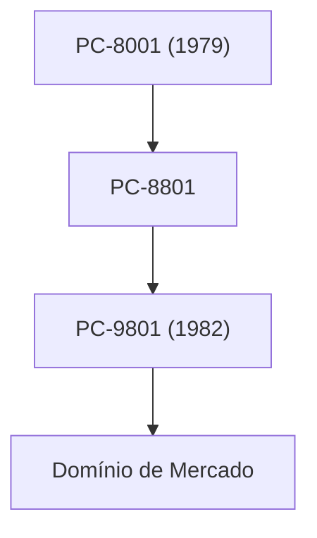

## 1. O Nascimento da Nippon Electric
Em 1899, nasceu como a primeira joint venture de capital estrangeiro no Japão, por meio de uma parceria com a Western Electric. Começou com a fabricação de telefones e equipamentos de comunicação.

## 2. A Era de Ouro da Série PC-9800
Entre as décadas de 1980 e 1990, a série "PC-98" dominou completamente o mercado de computadores no Japão. Seu ponto forte era a arquitetura de hardware especializada em processamento da língua japonesa.

## 3. C&C (Integração de Computadores e Comunicações)
A visão de "C&C (Computer and Communication)", proposta pelo presidente Koji Kobayashi em 1977, previu perfeitamente a futura sociedade da internet.

## 4. Biometria Atual e Negócios Espaciais
Atualmente, após desmembrar seu negócio de PCs, a empresa concentra-se em negócios de infraestrutura social, como tecnologia de reconhecimento facial de classe mundial, cabos submarinos e satélites artificiais (como o projeto Hayabusa, entre outros).

## Parte de Verificação Técnica Adicional 1

### 1. O Nascimento da Nippon Electric
Em 1899, nasceu como a primeira joint venture de capital estrangeiro no Japão, por meio de uma parceria com a Western Electric. Começou com a fabricação de telefones e equipamentos de comunicação.

### 2. A Era de Ouro da Série PC-9800
Entre as décadas de 1980 e 1990, a série "PC-98" dominou completamente o mercado de computadores no Japão. Seu ponto forte era a arquitetura de hardware especializada em processamento da língua japonesa.

### 3. C&C (Integração de Computadores e Comunicações)
A visão de "C&C (Computer and Communication)", proposta pelo presidente Koji Kobayashi em 1977, previu perfeitamente a futura sociedade da internet.

### 4. Biometria Atual e Negócios Espaciais
Atualmente, após desmembrar seu negócio de PCs, a empresa concentra-se em negócios de infraestrutura social, como tecnologia de reconhecimento facial de classe mundial, cabos submarinos e satélites artificiais (como o projeto Hayabusa, entre outros).

## Parte de Verificação Técnica Adicional 2

### 1. O Nascimento da Nippon Electric
Em 1899, nasceu como a primeira joint venture de capital estrangeiro no Japão, por meio de uma parceria com a Western Electric. Começou com a fabricação de telefones e equipamentos de comunicação.

### 2. A Era de Ouro da Série PC-9800
Entre as décadas de 1980 e 1990, a série "PC-98" dominou completamente o mercado de computadores no Japão. Seu ponto forte era a arquitetura de hardware especializada em processamento da língua japonesa.

### 3. C&C (Integração de Computadores e Comunicações)
A visão de "C&C (Computer and Communication)", proposta pelo presidente Koji Kobayashi em 1977, previu perfeitamente a futura sociedade da internet.

### 4. Biometria Atual e Negócios Espaciais
Atualmente, após desmembrar seu negócio de PCs, a empresa concentra-se em negócios de infraestrutura social, como tecnologia de reconhecimento facial de classe mundial, cabos submarinos e satélites artificiais (como o projeto Hayabusa, entre outros).

## Parte de Verificação Técnica Adicional 3

### 1. O Nascimento da Nippon Electric
Em 1899, nasceu como a primeira joint venture de capital estrangeiro no Japão, por meio de uma parceria com a Western Electric. Começou com a fabricação de telefones e equipamentos de comunicação.

### 2. A Era de Ouro da Série PC-9800
Entre as décadas de 1980 e 1990, a série "PC-98" dominou completamente o mercado de computadores no Japão. Seu ponto forte era a arquitetura de hardware especializada em processamento da língua japonesa.

### 3. C&C (Integração de Computadores e Comunicações)
A visão de "C&C (Computer and Communication)", proposta pelo presidente Koji Kobayashi em 1977, previu perfeitamente a futura sociedade da internet.

### 4. Biometria Atual e Negócios Espaciais
Atualmente, após desmembrar seu negócio de PCs, a empresa concentra-se em negócios de infraestrutura social, como tecnologia de reconhecimento facial de classe mundial, cabos submarinos e satélites artificiais (como o projeto Hayabusa, entre outros).

## Parte de Verificação Técnica Adicional 4

### 1. O Nascimento da Nippon Electric
Em 1899, nasceu como a primeira joint venture de capital estrangeiro no Japão, por meio de uma parceria com a Western Electric. Começou com a fabricação de telefones e equipamentos de comunicação.

### 2. A Era de Ouro da Série PC-9800
Entre as décadas de 1980 e 1990, a série "PC-98" dominou completamente o mercado de computadores no Japão. Seu ponto forte era a arquitetura de hardware especializada em processamento da língua japonesa.

### 3. C&C (Integração de Computadores e Comunicações)
A visão de "C&C (Computer and Communication)", proposta pelo presidente Koji Kobayashi em 1977, previu perfeitamente a futura sociedade da internet.

### 4. Biometria Atual e Negócios Espaciais
Atualmente, após desmembrar seu negócio de PCs, a empresa concentra-se em negócios de infraestrutura social, como tecnologia de reconhecimento facial de classe mundial, cabos submarinos e satélites artificiais (como o projeto Hayabusa, entre outros).

## Parte de Verificação Técnica Adicional 5

### 1. O Nascimento da Nippon Electric
Em 1899, nasceu como a primeira joint venture de capital estrangeiro no Japão, por meio de uma parceria com a Western Electric. Começou com a fabricação de telefones e equipamentos de comunicação.

### 2. A Era de Ouro da Série PC-9800
Entre as décadas de 1980 e 1990, a série "PC-98" dominou completamente o mercado de computadores no Japão. Seu ponto forte era a arquitetura de hardware especializada em processamento da língua japonesa.

### 3. C&C (Integração de Computadores e Comunicações)
A visão de "C&C (Computer and Communication)", proposta pelo presidente Koji Kobayashi em 1977, previu perfeitamente a futura sociedade da internet.

### 4. Biometria Atual e Negócios Espaciais
Atualmente, após desmembrar seu negócio de PCs, a empresa concentra-se em negócios de infraestrutura social, como tecnologia de reconhecimento facial de classe mundial, cabos submarinos e satélites artificiais (como o projeto Hayabusa, entre outros).

## Parte de Verificação Técnica Adicional 6

### 1. O Nascimento da Nippon Electric
Em 1899, nasceu como a primeira joint venture de capital estrangeiro no Japão, por meio de uma parceria com a Western Electric. Começou com a fabricação de telefones e equipamentos de comunicação.

### 2. A Era de Ouro da Série PC-9800
Entre as décadas de 1980 e 1990, a série "PC-98" dominou completamente o mercado de computadores no Japão. Seu ponto forte era a arquitetura de hardware especializada em processamento da língua japonesa.

### 3. C&C (Integração de Computadores e Comunicações)
A visão de "C&C (Computer and Communication)", proposta pelo presidente Koji Kobayashi em 1977, previu perfeitamente a futura sociedade da internet.

### 4. Biometria Atual e Negócios Espaciais
Atualmente, após desmembrar seu negócio de PCs, a empresa concentra-se em negócios de infraestrutura social, como tecnologia de reconhecimento facial de classe mundial, cabos submarinos e satélites artificiais (como o projeto Hayabusa, entre outros).

## Parte de Verificação Técnica Adicional 7

### 1. O Nascimento da Nippon Electric
Em 1899, nasceu como a primeira joint venture de capital estrangeiro no Japão, por meio de uma parceria com a Western Electric. Começou com a fabricação de telefones e equipamentos de comunicação.

### 2. A Era de Ouro da Série PC-9800
Entre as décadas de 1980 e 1990, a série "PC-98" dominou completamente o mercado de computadores no Japão. Seu ponto forte era a arquitetura de hardware especializada em processamento da língua japonesa.

### 3. C&C (Integração de Computadores e Comunicações)
A visão de "C&C (Computer and Communication)", proposta pelo presidente Koji Kobayashi em 1977, previu perfeitamente a futura sociedade da internet.

### 4. Biometria Atual e Negócios Espaciais
Atualmente, após desmembrar seu negócio de PCs, a empresa concentra-se em negócios de infraestrutura social, como tecnologia de reconhecimento facial de classe mundial, cabos submarinos e satélites artificiais (como o projeto Hayabusa, entre outros).

## Parte de Verificação Técnica Adicional 8

### 1. O Nascimento da Nippon Electric
Em 1899, nasceu como a primeira joint venture de capital estrangeiro no Japão, por meio de uma parceria com a Western Electric. Começou com a fabricação de telefones e equipamentos de comunicação.

### 2. A Era de Ouro da Série PC-9800
Entre as décadas de 1980 e 1990, a série "PC-98" dominou completamente o mercado de computadores no Japão. Seu ponto forte era a arquitetura de hardware especializada em processamento da língua japonesa.

### 3. C&C (Integração de Computadores e Comunicações)
A visão de "C&C (Computer and Communication)", proposta pelo presidente Koji Kobayashi em 1977, previu perfeitamente a futura sociedade da internet.

### 4. Biometria Atual e Negócios Espaciais
Atualmente, após desmembrar seu negócio de PCs, a empresa concentra-se em negócios de infraestrutura social, como tecnologia de reconhecimento facial de classe mundial, cabos submarinos e satélites artificiais (como o projeto Hayabusa, entre outros).

## Parte de Verificação Técnica Adicional 9

### 1. O Nascimento da Nippon Electric
Em 1899, nasceu como a primeira joint venture de capital estrangeiro no Japão, por meio de uma parceria com a Western Electric. Começou com a fabricação de telefones e equipamentos de comunicação.

### 2. A Era de Ouro da Série PC-9800
Entre as décadas de 1980 e 1990, a série "PC-98" dominou completamente o mercado de computadores no Japão. Seu ponto forte era a arquitetura de hardware especializada em processamento da língua japonesa.

### 3. C&C (Integração de Computadores e Comunicações)
A visão de "C&C (Computer and Communication)", proposta pelo presidente Koji Kobayashi em 1977, previu perfeitamente a futura sociedade da internet.

### 4. Biometria Atual e Negócios Espaciais
Atualmente, após desmembrar seu negócio de PCs, a empresa concentra-se em negócios de infraestrutura social, como tecnologia de reconhecimento facial de classe mundial, cabos submarinos e satélites artificiais (como o projeto Hayabusa, entre outros).

## Parte de Verificação Técnica Adicional 10

### 1. O Nascimento da Nippon Electric
Em 1899, nasceu como a primeira joint venture de capital estrangeiro no Japão, por meio de uma parceria com a Western Electric. Começou com a fabricação de telefones e equipamentos de comunicação.

### 2. A Era de Ouro da Série PC-9800
Entre as décadas de 1980 e 1990, a série "PC-98" dominou completamente o mercado de computadores no Japão. Seu ponto forte era a arquitetura de hardware especializada em processamento da língua japonesa.

### 3. C&C (Integração de Computadores e Comunicações)
A visão de "C&C (Computer and Communication)", proposta pelo presidente Koji Kobayashi em 1977, previu perfeitamente a futura sociedade da internet.

### 4. Biometria Atual e Negócios Espaciais
Atualmente, após desmembrar seu negócio de PCs, a empresa concentra-se em negócios de infraestrutura social, como tecnologia de reconhecimento facial de classe mundial, cabos submarinos e satélites artificiais (como o projeto Hayabusa, entre outros).

## Parte de Verificação Técnica Adicional 11

### 1. O Nascimento da Nippon Electric
Em 1899, nasceu como a primeira joint venture de capital estrangeiro no Japão, por meio de uma parceria com a Western Electric. Começou com a fabricação de telefones e equipamentos de comunicação.

### 2. A Era de Ouro da Série PC-9800
Entre as décadas de 1980 e 1990, a série "PC-98" dominou completamente o mercado de computadores no Japão. Seu ponto forte era a arquitetura de hardware especializada em processamento da língua japonesa.

### 3. C&C (Integração de Computadores e Comunicações)
A visão de "C&C (Computer and Communication)", proposta pelo presidente Koji Kobayashi em 1977, previu perfeitamente a futura sociedade da internet.

### 4. Biometria Atual e Negócios Espaciais
Atualmente, após desmembrar seu negócio de PCs, a empresa concentra-se em negócios de infraestrutura social, como tecnologia de reconhecimento facial de classe mundial, cabos submarinos e satélites artificiais (como o projeto Hayabusa, entre outros).

## Parte de Verificação Técnica Adicional 12

### 1. O Nascimento da Nippon Electric
Em 1899, nasceu como a primeira joint venture de capital estrangeiro no Japão, por meio de uma parceria com a Western Electric. Começou com a fabricação de telefones e equipamentos de comunicação.

### 2. A Era de Ouro da Série PC-9800
Entre as décadas de 1980 e 1990, a série "PC-98" dominou completamente o mercado de computadores no Japão. Seu ponto forte era a arquitetura de hardware especializada em processamento da língua japonesa.

### 3. C&C (Integração de Computadores e Comunicações)
A visão de "C&C (Computer and Communication)", proposta pelo presidente Koji Kobayashi em 1977, previu perfeitamente a futura sociedade da internet.

### 4. Biometria Atual e Negócios Espaciais
Atualmente, após desmembrar seu negócio de PCs, a empresa concentra-se em negócios de infraestrutura social, como tecnologia de reconhecimento facial de classe mundial, cabos submarinos e satélites artificiais (como o projeto Hayabusa, entre outros).

## Parte de Verificação Técnica Adicional 13

### 1. O Nascimento da Nippon Electric
Em 1899, nasceu como a primeira joint venture de capital estrangeiro no Japão, por meio de uma parceria com a Western Electric. Começou com a fabricação de telefones e equipamentos de comunicação.

### 2. A Era de Ouro da Série PC-9800
Entre as décadas de 1980 e 1990, a série "PC-98" dominou completamente o mercado de computadores no Japão. Seu ponto forte era a arquitetura de hardware especializada em processamento da língua japonesa.

### 3. C&C (Integração de Computadores e Comunicações)
A visão de "C&C (Computer and Communication)", proposta pelo presidente Koji Kobayashi em 1977, previu perfeitamente a futura sociedade da internet.

### 4. Biometria Atual e Negócios Espaciais
Atualmente, após desmembrar seu negócio de PCs, a empresa concentra-se em negócios de infraestrutura social, como tecnologia de reconhecimento facial de classe mundial, cabos submarinos e satélites artificiais (como o projeto Hayabusa, entre outros).

## Parte de Verificação Técnica Adicional 14

### 1. O Nascimento da Nippon Electric
Em 1899, nasceu como a primeira joint venture de capital estrangeiro no Japão, por meio de uma parceria com a Western Electric. Começou com a fabricação de telefones e equipamentos de comunicação.

### 2. A Era de Ouro da Série PC-9800
Entre as décadas de 1980 e 1990, a série "PC-98" dominou completamente o mercado de computadores no Japão. Seu ponto forte era a arquitetura de hardware especializada em processamento da língua japonesa.

### 3. C&C (Integração de Computadores e Comunicações)
A visão de "C&C (Computer and Communication)", proposta pelo presidente Koji Kobayashi em 1977, previu perfeitamente a futura sociedade da internet.

### 4. Biometria Atual e Negócios Espaciais
Atualmente, após desmembrar seu negócio de PCs, a empresa concentra-se em negócios de infraestrutura social, como tecnologia de reconhecimento facial de classe mundial, cabos submarinos e satélites artificiais (como o projeto Hayabusa, entre outros).
